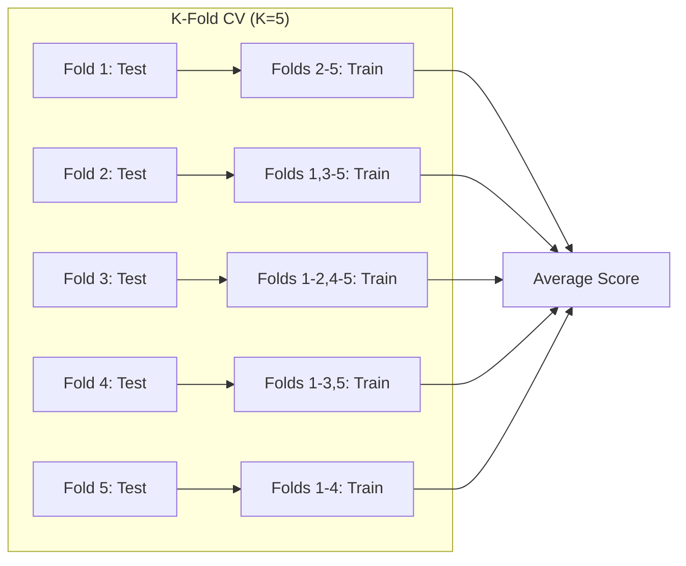
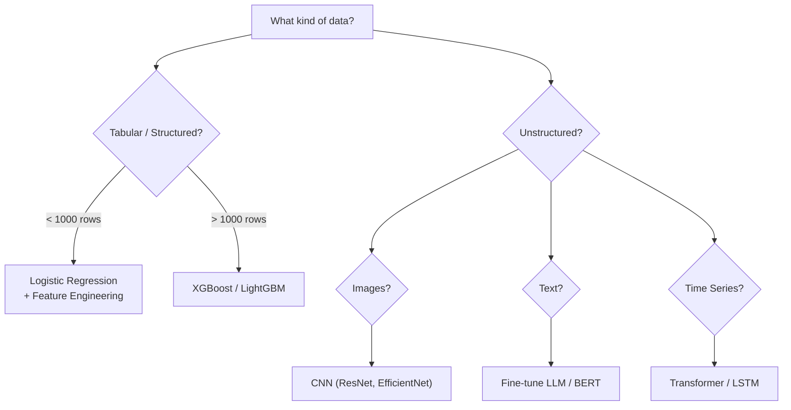

# 1.3 AI Foundations: From Theory to Engineering

!!! quote "The Meta-Narrative"
    This chapter bridges the gap between ML theory and engineering practice. While Chapter 1.1 established the mathematical foundations, here we focus on the **craft** of building ML systems — the decisions engineers make daily: how to frame a problem, design features, select models, validate results, and avoid the subtle pitfalls that separate notebook experiments from production-grade systems.

---

## Feature Engineering: The Art That Refuses to Die

Despite deep learning's promise of automatic feature extraction, **feature engineering remains the most impactful activity** for tabular data, time series, and structured ML problems.

### Why Features Matter More Than Models

!!! abstract "The Internal View"
    A well-engineered feature set with logistic regression will almost always beat a poorly-featured deep network on structured data. Features encode **domain knowledge** — and unlike model parameters, they generalize perfectly because they're based on causal understanding of the problem.

### Feature Engineering Taxonomy

=== "Numerical Features"

    | Technique | Formula | When to Use |
    |-----------|---------|-------------|
    | Standardization | \(x' = \frac{x - \mu}{\sigma}\) | Gradient-based models (SVM, neural nets) |
    | Min-Max Scaling | \(x' = \frac{x - x_{min}}{x_{max} - x_{min}}\) | When bounded range needed |
    | Log Transform | \(x' = \log(1 + x)\) | Right-skewed distributions |
    | Box-Cox | \(x' = \frac{x^\lambda - 1}{\lambda}\) | General skewness correction |
    | Binning | Discretize into ranges | Capture non-linear effects in linear models |

=== "Categorical Features"

    | Technique | Strategy | Caveat |
    |-----------|----------|--------|
    | One-Hot Encoding | Binary column per category | Curse of dimensionality for high-cardinality |
    | Target Encoding | Replace category with mean of target | Causes data leakage without proper CV |
    | Frequency Encoding | Replace category with occurrence count | Loses ordinal information |
    | Embedding | Learned dense vector (neural net) | Requires enough data |

=== "Temporal Features"

    - Day of week, hour of day, month (cyclical encoding: \(\sin/\cos\))
    - Lag features: \(x_{t-1}, x_{t-7}, x_{t-30}\)
    - Rolling statistics: moving average, rolling std
    - Time since event (recency features)

### Cross-Validation: The Right Way



!!! warning "Common Cross-Validation Mistakes"
    - **Leaking test data during preprocessing**: Feature scaling / target encoding must be fit on training fold only
    - **Using K-Fold on time series**: Use `TimeSeriesSplit` — future data must never leak into training
    - **Ignoring group structure**: If multiple samples belong to one entity, use `GroupKFold`

??? example "🚀 Lab: Feature Engineering Pipeline"
    ```python
    import pandas as pd
    import numpy as np
    from sklearn.pipeline import Pipeline
    from sklearn.compose import ColumnTransformer
    from sklearn.preprocessing import StandardScaler, OneHotEncoder
    from sklearn.impute import SimpleImputer
    from sklearn.linear_model import LogisticRegression
    from sklearn.model_selection import cross_val_score

    # Define transformers for different column types
    numeric_features = ['age', 'fare', 'family_size']
    categorical_features = ['sex', 'embarked', 'pclass']

    numeric_transformer = Pipeline([
        ('imputer', SimpleImputer(strategy='median')),
        ('scaler', StandardScaler()),
    ])

    categorical_transformer = Pipeline([
        ('imputer', SimpleImputer(strategy='most_frequent')),
        ('encoder', OneHotEncoder(handle_unknown='ignore')),
    ])

    preprocessor = ColumnTransformer([
        ('num', numeric_transformer, numeric_features),
        ('cat', categorical_transformer, categorical_features),
    ])

    # Full pipeline: preprocessing → model
    pipeline = Pipeline([
        ('preprocessor', preprocessor),
        ('classifier', LogisticRegression(max_iter=1000)),
    ])

    # Cross-validate — preprocessing is fit ONLY on training folds
    # scores = cross_val_score(pipeline, X, y, cv=5, scoring='accuracy')
    ```

---

## Model Selection: Beyond Accuracy

### Choosing the Right Algorithm



### The No Free Lunch Theorem

Wolpert (1996) proved: **no single algorithm is universally best**. Any two algorithms are equally good when averaged over all possible problems. This means:

- There is no shortcut — you must **experiment** on your specific data
- **Domain knowledge** (through features and problem framing) is your real advantage
- "Try XGBoost first" is good engineering heuristic, not a law of nature

---

## References

- Zheng, A. & Casari, A. (2018). *Feature Engineering for Machine Learning*. O'Reilly.
- Wolpert, D. H. (1996). *The Lack of A Priori Distinctions Between Learning Algorithms*. Neural Computation.
- Hastie, T. et al. (2009). *The Elements of Statistical Learning*, Ch. 7 (Model Assessment).
