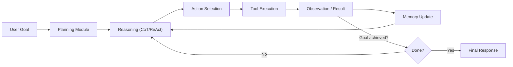
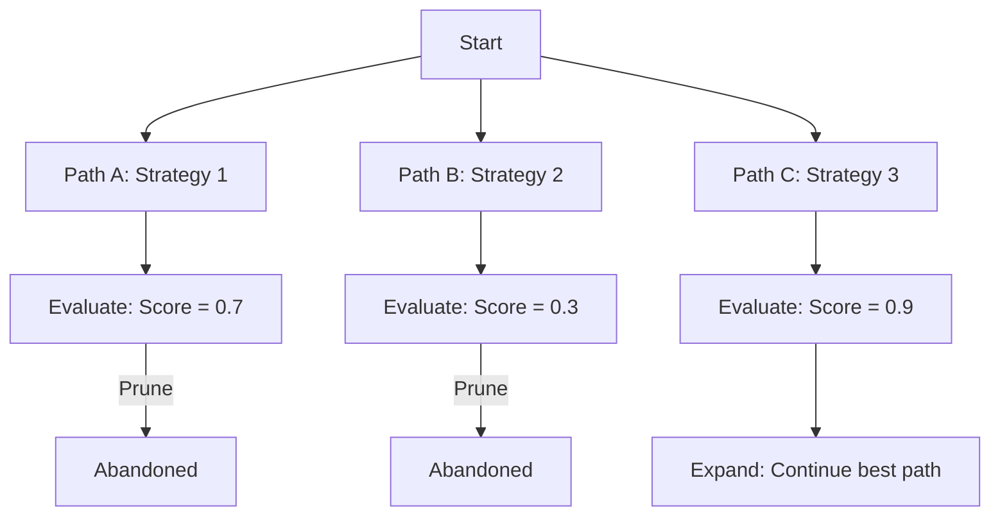
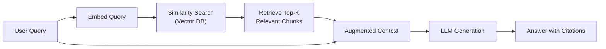
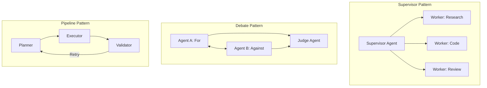

# 5.1 The Agentic Era: Autonomous AI Systems

!!! quote "The Meta-Narrative"
    For years, AI models were **tools**: you prompt, they respond. The Agentic Era marks a fundamental shift — AI systems that **plan**, **reason**, **use tools**, **reflect on failure**, and **take multi-step actions autonomously**. This isn't a single breakthrough; it's the convergence of large language models, in-context learning, tool use, memory systems, and orchestration frameworks. We are witnessing the transition from "AI as autocomplete" to "AI as collaborator" — and the engineering challenges are entirely new.

---

## 5.1.1 What Makes AI "Agentic"?

An **AI Agent** is a system that:

1. Perceives its environment (text, images, APIs, databases)
2. Reasons about goals and plans
3. Takes actions (function calls, code execution, web browsing)
4. Observes outcomes and adjusts behavior
5. Maintains memory across interactions



### The Agent Loop

The core of every agentic system is the **Observe → Think → Act** loop:

```
while not done:
    observation = environment.observe()
    thought = llm.reason(observation, memory, goal)
    action = llm.select_action(thought, available_tools)
    result = environment.execute(action)
    memory.update(observation, action, result)
    done = llm.check_completion(goal, memory)
```

---

## 5.1.2 Reasoning Paradigms

### Chain-of-Thought (CoT) Prompting

Wei et al. (2022) discovered that adding "Let's think step by step" dramatically improves reasoning. But **why** does it work?

!!! abstract "The Internal Mechanism"
    LLMs are autoregressive: each token is conditioned on all previous tokens. CoT works because intermediate reasoning tokens **expand the computation graph**. Without CoT, the model must compress a multi-step reasoning task into a single forward pass. With CoT, each reasoning step generates tokens that **become part of the context** for subsequent steps, effectively giving the model a "scratchpad."

    This is not just a prompting trick — it reflects a fundamental computational limitation: Transformers have bounded depth (number of layers), so complex reasoning that requires more sequential steps than layers must be **externalized as tokens**.

### ReAct: Reasoning + Acting

ReAct (Yao et al., 2023) interleaves **reasoning traces** (Thought) with **actions** (Act) and **observations** (Obs):

```
Thought: I need to find the GDP of France in 2023. Let me search for it.
Act: search("France GDP 2023")
Obs: France's GDP in 2023 was approximately $3.05 trillion.
Thought: Now I need to compare with Germany's GDP.
Act: search("Germany GDP 2023")
Obs: Germany's GDP in 2023 was approximately $4.46 trillion.
Thought: Germany's GDP ($4.46T) is larger than France's ($3.05T) by $1.41T.
Act: finish("Germany's GDP exceeded France's by $1.41 trillion in 2023.")
```

### Tree-of-Thought (ToT)

For problems requiring exploration (puzzles, planning, creative writing), ToT evaluates multiple reasoning paths:



---

## 5.1.3 Tool Use and Function Calling

### The Tool-Use Pattern

Modern LLMs (GPT-4, Claude, Gemini) can **select and invoke tools** via structured function calling:

```json
{
  "name": "search_database",
  "arguments": {
    "query": "monthly revenue Q4 2024",
    "table": "financials"
  }
}
```

The model outputs a structured function call; the orchestrator executes it; the result is injected back into the context.

### Common Tool Categories

| Tool Type | Examples | Use Case |
|-----------|----------|----------|
| **Search** | Web search, RAG retrieval | Knowledge access |
| **Code Execution** | Python REPL, sandboxed runtime | Computation, data analysis |
| **API Calls** | REST APIs, databases | External system interaction |
| **File Operations** | Read/write files, web scraping | Data manipulation |
| **Browser** | Headless browser, screenshots | Web interaction |

---

## 5.1.4 Memory Architectures

### Short-Term Memory: Context Window

The simplest memory is the **conversation history** within the context window. But context windows have limits (128K-1M tokens), and performance degrades with length.

### Long-Term Memory: RAG + Vector Databases

**Retrieval-Augmented Generation** (RAG) supplements the LLM's knowledge with external data:



!!! abstract "RAG Internals: Why It's Harder Than It Looks"
    RAG seems simple (search → retrieve → generate), but production RAG systems face:

    - **Chunking strategy**: How to split documents (fixed-size, semantic, recursive)?
    - **Embedding quality**: Domain-specific embeddings vs. general-purpose?
    - **Retrieval precision**: Top-K often includes irrelevant chunks (reranking helps)
    - **Context window management**: Retrieved chunks compete with conversation history
    - **Hallucination**: The LLM may confidently cite retrieved text incorrectly
    - **Freshness**: How to handle updated documents?

### Episodic Memory: Reflection and Learning

Advanced agents maintain **episodic memory** — records of past interactions, successes, and failures that inform future behavior:

```python
class EpisodicMemory:
    def __init__(self):
        self.episodes = []
    
    def store(self, task, actions, outcome, reflection):
        self.episodes.append({
            "task": task,
            "actions": actions,
            "outcome": outcome,  # success / failure
            "reflection": reflection,  # what to do differently
            "timestamp": time.time()
        })
    
    def retrieve_similar(self, current_task, k=3):
        # Embed current task, find k most similar past episodes
        # Return reflections from those episodes
        ...
```

---

## 5.1.5 Multi-Agent Systems

### Agent Collaboration Patterns



### Real-World Multi-Agent Frameworks

| Framework | Architecture | Key Feature |
|-----------|-------------|-------------|
| **AutoGen** (Microsoft) | Conversable agents | Group chat, code execution |
| **CrewAI** | Role-based agents | Task delegation, tools |
| **LangGraph** | Graph-based workflows | State machines, checkpoints |
| **MetaGPT** | SOP-driven agents | Structured outputs, roles |

---

## 5.1.6 Agentic Engineering Challenges

### The Reliability Problem

Agentic systems face **compound error rates**. If each step has 95% success, a 10-step task succeeds only \(0.95^{10} = 59.9\%\) of the time. Solutions:

- **Retry loops** with exponential backoff
- **Verification steps** between actions
- **Human-in-the-loop** for high-stakes decisions
- **Guardrails** (output validation, content filtering)

### Cost and Latency

| Component | Latency | Cost (per 1K calls) |
|-----------|---------|-------------------|
| LLM inference (GPT-4) | 1-5s | $5-30 |
| Tool execution | 0.1-10s | Variable |
| Vector search | 10-50ms | $0.01-0.10 |
| Memory read/write | 1-10ms | Negligible |

A 10-step agent task with 3 LLM calls per step costs ~$0.15-$0.90 and takes 30-150s. **Optimization techniques**: caching, smaller models for routing, parallel tool calls.

### Safety and Control

!!! warning "The Principal-Agent Problem"
    An autonomous agent acting on behalf of a user can take destructive actions (deleting files, sending emails, making purchases). The field is developing:

    - **Permission systems** (ask before risky actions)
    - **Sandboxing** (restrict file system, network access)
    - **Action budgets** (limit API calls, spending)
    - **Rollback mechanisms** (undo chains of actions)

??? example "🚀 Lab: Building a Simple ReAct Agent"
    ```python
    """Minimal ReAct agent with tool use."""
    import json
    import math

    # Define available tools
    TOOLS = {
        "calculator": lambda expr: str(eval(expr)),
        "search": lambda q: f"[Mock search result for: {q}]",
        "get_weather": lambda city: f"72°F and sunny in {city}",
    }

    TOOL_DESCRIPTIONS = """
    Available tools:
    - calculator(expression): Evaluate a math expression
    - search(query): Search the web for information
    - get_weather(city): Get current weather for a city
    """

    def react_loop(goal, max_steps=5):
        """Simplified ReAct loop (normally powered by an LLM)."""
        print(f"Goal: {goal}\n")
        memory = []
        
        # In production, each step would call an LLM
        # Here we simulate a simple task
        steps = [
            ("I need to calculate the area of a circle with radius 5.",
             "calculator", "3.14159 * 5**2"),
            ("The area is about 78.54. Let me verify with a web search.",
             "search", "area of circle radius 5"),
        ]
        
        for i, (thought, tool_name, tool_input) in enumerate(steps):
            print(f"Step {i+1}:")
            print(f"  Thought: {thought}")
            
            result = TOOLS[tool_name](tool_input)
            print(f"  Action: {tool_name}({tool_input})")
            print(f"  Observation: {result}")
            
            memory.append({
                "thought": thought,
                "action": f"{tool_name}({tool_input})",
                "observation": result,
            })
            print()
        
        print("Final Answer: The area of a circle with radius 5 is approximately 78.54 sq units.")
        return memory

    if __name__ == "__main__":
        react_loop("What is the area of a circle with radius 5?")
    ```

---

## 5.1.7 The Future: From Agents to Autonomous Systems

The trajectory is clear:

1. **2022**: ChatGPT — interactive, single-turn, human-driven
2. **2023**: Function calling — LLMs as tool users
3. **2024**: Agentic frameworks — multi-step, autonomous workflows
4. **2025+**: Autonomous systems — long-running agents with persistent memory, learning from experience, collaborating in teams

!!! abstract "The Key Unsolved Problems"
    - **Reliable planning** in open-ended domains
    - **Long-horizon reasoning** without error accumulation
    - **Grounding** — connecting language to real-world state
    - **Self-improvement** — agents that genuinely learn from experience
    - **Alignment** — ensuring autonomous agents remain aligned as they gain capability

---

## References

- Wei, J. et al. (2022). *Chain-of-Thought Prompting Elicits Reasoning in Large Language Models*. NeurIPS.
- Yao, S. et al. (2023). *ReAct: Synergizing Reasoning and Acting in Language Models*. ICLR.
- Lewis, P. et al. (2020). *Retrieval-Augmented Generation for Knowledge-Intensive NLP Tasks*. NeurIPS.
- Schick, T. et al. (2023). *Toolformer: Language Models Can Teach Themselves to Use Tools*.
- Park, J. S. et al. (2023). *Generative Agents: Interactive Simulacra of Human Behavior*.
- Wu, Q. et al. (2023). *AutoGen: Enabling Next-Gen LLM Applications via Multi-Agent Conversation*.
