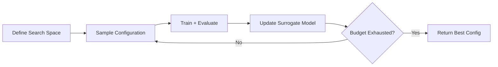

# 1.4 Classical ML Engineering: Algorithms in Production

!!! quote "The Meta-Narrative"
    Classical models — Random Forests, XGBoost, SVMs — are not relics. On **tabular data**, they consistently outperform deep learning. On Kaggle leaderboards, in fraud detection, credit scoring, and recommender systems, gradient boosting dominates. This chapter goes beyond the theory (covered in 1.2) to focus on the **engineering** of classical ML: hyperparameter tuning strategies, interpretability, handling imbalanced data, and deployment patterns.

---

## Hyperparameter Tuning: The Engineering of Search

### Why Default Hyperparameters Are Wrong

Every dataset has a different optimal configuration. The question is: how do you find it efficiently?

=== "Grid Search"

    Exhaustive search over a predefined parameter grid. Simple but scales exponentially: \(k\) parameters with \(n\) values each = \(n^k\) evaluations.

    **Use when**: Small search space, cheap model training.

=== "Random Search"

    Bergstra & Bengio (2012) showed that random search is **more efficient** than grid search. With 60 random trials, you cover 95% of the 1D slices of the search space.

    **Why it works**: Most hyperparameters have a single "important" dimension — random search explores that dimension more densely than a grid along irrelevant dimensions.

=== "Bayesian Optimization"

    Models the objective function \(f(\theta)\) as a Gaussian Process and uses an **acquisition function** to decide where to sample next:

    \[
    \theta_{next} = \arg\max_\theta \; \alpha(\theta) = \arg\max_\theta \; \mathbb{E}[I(\theta)]
    \]

    where \(I(\theta) = \max(0, f(\theta) - f(\theta^*))\) is the expected improvement.

    **Tools**: Optuna, Hyperopt, SMAC.



### Handling Imbalanced Data

When one class is 1% of the dataset (fraud, rare diseases):

| Technique | Mechanism | When to Use |
|-----------|-----------|-------------|
| **Class Weights** | Increase loss for minority class | Built into most classifiers |
| **SMOTE** | Synthetic oversampling of minority | Small datasets |
| **Undersampling** | Reduce majority class | Very large datasets |
| **Focal Loss** | Down-weight easy examples: \(L = -\alpha(1-p_t)^\gamma \log(p_t)\) | Deep learning |
| **Threshold Tuning** | Adjust decision threshold post-training | Any classifier |

!!! abstract "The Deep Insight: Don't Optimize Accuracy"
    On imbalanced data, a model predicting the majority class always achieves 99% "accuracy." Use **PR-AUC** (Precision-Recall Area Under Curve), not ROC-AUC, when the positive class is rare.

### Model Interpretability

| Method | Type | Scope | Strengths |
|--------|------|-------|-----------|
| **Feature Importance** | Model-specific | Global | Built into trees; fast |
| **SHAP** | Model-agnostic | Local + Global | Theoretically grounded (Shapley values) |
| **LIME** | Model-agnostic | Local | Works on any black-box model |
| **PDP / ICE** | Model-agnostic | Global | Visual, intuitive |

??? example "🚀 Lab: Complete ML Pipeline with Optuna Tuning"
    ```python
    import optuna
    from sklearn.datasets import load_breast_cancer
    from sklearn.model_selection import cross_val_score
    from sklearn.ensemble import GradientBoostingClassifier

    X, y = load_breast_cancer(return_X_y=True)

    def objective(trial):
        params = {
            'n_estimators': trial.suggest_int('n_estimators', 50, 500),
            'max_depth': trial.suggest_int('max_depth', 2, 8),
            'learning_rate': trial.suggest_float('learning_rate', 0.01, 0.3, log=True),
            'min_samples_split': trial.suggest_int('min_samples_split', 2, 20),
            'subsample': trial.suggest_float('subsample', 0.6, 1.0),
        }
        model = GradientBoostingClassifier(**params, random_state=42)
        scores = cross_val_score(model, X, y, cv=5, scoring='accuracy')
        return scores.mean()

    study = optuna.create_study(direction='maximize')
    study.optimize(objective, n_trials=50, show_progress_bar=True)

    print(f"Best accuracy: {study.best_value:.4f}")
    print(f"Best params: {study.best_params}")
    ```

---

## References

- Bergstra, J. & Bengio, Y. (2012). *Random Search for Hyper-Parameter Optimization*. JMLR.
- Chawla, N. V. et al. (2002). *SMOTE: Synthetic Minority Over-sampling Technique*. JAIR.
- Lundberg, S. M. & Lee, S.-I. (2017). *A Unified Approach to Interpreting Model Predictions*. NeurIPS.
