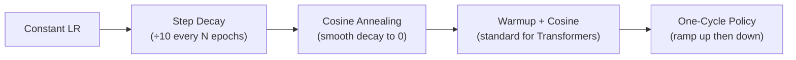
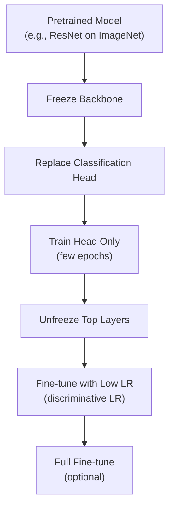

# 2.2 Deep Learning Architecture Internals

!!! quote "The Meta-Narrative"
    Understanding deep learning at the engineering level means knowing what happens between `model = ResNet50()` and `model.fit()`. This chapter dives into **training dynamics**, **initialization strategies**, **normalization techniques**, and the engineering decisions that determine whether a model trains in hours or diverges in minutes.

---

## Initialization: Setting Up for Success

### Why Initialization Matters

If weights start too large, activations explode. Too small, they vanish. Both are fatal.

**Xavier/Glorot Initialization** (for sigmoid/tanh):

\[
W \sim \mathcal{U}\left(-\sqrt{\frac{6}{n_{in} + n_{out}}}, \sqrt{\frac{6}{n_{in} + n_{out}}}\right)
\]

**He Initialization** (for ReLU):

\[
W \sim \mathcal{N}\left(0, \sqrt{\frac{2}{n_{in}}}\right)
\]

!!! abstract "Why He Works for ReLU"
    ReLU zeros out half of the activations (negative values). To maintain variance after this decimation, we need to double the variance of the initial weights — hence the \(\frac{2}{n_{in}}\) instead of \(\frac{1}{n_{in}}\) in Glorot.

---

## Normalization: Taming Internal Covariate Shift

=== "Batch Normalization"

    Normalize over the **batch dimension** for each feature:

    \[
    \hat{x}_i = \frac{x_i - \mu_B}{\sqrt{\sigma_B^2 + \epsilon}}, \quad y_i = \gamma \hat{x}_i + \beta
    \]

    **Pros**: Stabilizes training, allows higher learning rates, acts as mild regularization.
    
    **Cons**: Sensitive to batch size. Fails for batch size < 16.

=== "Layer Normalization"

    Normalize over the **feature dimension** for each sample — independent of batch size:

    \[
    \hat{x} = \frac{x - \mu_L}{\sqrt{\sigma_L^2 + \epsilon}}
    \]

    **Used in**: Transformers (BERT, GPT, T5). Essential for variable-length sequences.

=== "Group Normalization"

    Divide channels into groups and normalize within each group. Robust to small batch sizes.

    **Used in**: Detection/segmentation models (YOLO, Mask R-CNN) where batch size is limited by memory.

---

## Learning Rate Schedules



The **Warmup + Cosine Decay** schedule used by most LLMs:

\[
\eta(t) = \begin{cases} \eta_{max} \cdot \frac{t}{T_{warmup}} & t < T_{warmup} \\ \eta_{min} + \frac{1}{2}(\eta_{max} - \eta_{min})(1 + \cos(\pi \frac{t - T_{warmup}}{T_{total} - T_{warmup}})) & t \geq T_{warmup} \end{cases}
\]

---

## Transfer Learning: The Engineering Workflow



!!! abstract "Discriminative Learning Rates"
    Instead of one learning rate for all layers, use **lower rates for early layers** (which have learned general features) and **higher rates for later layers** (which need to adapt to the new task). ULMFiT (Howard & Ruder, 2018) popularized this as: \(\eta_{layer_l} = \eta_{base} \cdot \alpha^{L-l}\), where \(\alpha \approx 0.3\).

??? example "🚀 Lab: Transfer Learning with Discriminative LR"
    ```python
    import torch
    import torch.nn as nn
    from torchvision import models

    model = models.resnet50(weights='IMAGENET1K_V2')

    # Freeze all layers
    for param in model.parameters():
        param.requires_grad = False

    # Replace head
    model.fc = nn.Sequential(
        nn.Dropout(0.3),
        nn.Linear(2048, 256),
        nn.ReLU(),
        nn.Linear(256, 10),  # 10 classes
    )

    # Discriminative learning rates
    optimizer = torch.optim.AdamW([
        {'params': model.layer3.parameters(), 'lr': 1e-5},
        {'params': model.layer4.parameters(), 'lr': 1e-4},
        {'params': model.fc.parameters(), 'lr': 1e-3},
    ])

    print(f"Trainable params: {sum(p.numel() for p in model.parameters() if p.requires_grad):,}")
    ```

---

## References

- He, K. et al. (2015). *Delving Deep into Rectifiers: Surpassing Human-Level Performance on ImageNet*.
- Ioffe, S. & Szegedy, C. (2015). *Batch Normalization: Accelerating Deep Network Training*.
- Howard, J. & Ruder, S. (2018). *Universal Language Model Fine-tuning for Text Classification*.
