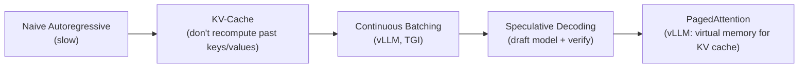
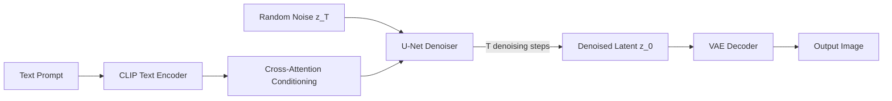

# 2.4 Modern Generative AI Engineering

!!! quote "The Meta-Narrative"
    Generative AI shifted from research curiosity to the most commercially valuable technology in AI. This chapter focuses on the **engineering** of generative systems: how to fine-tune foundation models, build efficient inference pipelines, implement RAG systems, and deploy text-to-image generation at scale.

---

## Large Language Model Engineering

### The Anatomy of an LLM

| Component | GPT-3 | Llama 2-70B | GPT-4 (est.) |
|-----------|-------|-------------|-------------|
| Parameters | 175B | 70B | ~1.8T (MoE) |
| Layers | 96 | 80 | ~120 |
| Hidden size | 12,288 | 8,192 | ~12,288 |
| Attention heads | 96 | 64 | ~96 per expert |
| Context length | 2K | 4K | 128K |
| Training tokens | 300B | 2T | ~13T |

### Fine-Tuning Strategies

=== "Full Fine-Tuning"

    Update all parameters. Maximum flexibility, maximum compute cost.
    
    **Cost**: For Llama-70B: ~300GB VRAM, 128+ A100 GPUs.

=== "LoRA (Low-Rank Adaptation)"

    Freeze the pretrained weights \(W\) and add trainable low-rank decomposition:

    \[
    W' = W + \Delta W = W + BA
    \]

    where \(B \in \mathbb{R}^{d \times r}\), \(A \in \mathbb{R}^{r \times d}\), and \(r \ll d\) (typically 8-64).

    **Cost**: Only \(2 \times r \times d\) trainable params per layer. For Llama-7B with \(r=16\): ~4M trainable params (0.06% of total).

=== "QLoRA"

    Quantize base model to 4-bit, then apply LoRA adapters in FP16.
    
    **Cost**: Fine-tune a 70B model on a single 48GB GPU.

!!! abstract "Why LoRA Works"
    Aghajanyan et al. (2021) showed that pretrained models have a **low intrinsic dimensionality** — the updates during fine-tuning lie in a low-rank subspace. LoRA directly parameterizes this subspace, achieving comparable performance to full fine-tuning with 10,000× fewer trainable parameters.

### Quantization for Deployment

| Method | Bits | Quality Loss | Speedup | Memory Savings |
|--------|------|-------------|---------|---------------|
| FP32 (baseline) | 32 | None | 1× | 1× |
| FP16 / BF16 | 16 | Negligible | ~2× | 2× |
| INT8 (LLM.int8()) | 8 | Minimal | ~2-3× | 4× |
| GPTQ (4-bit) | 4 | Small | ~3-4× | 8× |
| GGUF (llama.cpp) | 2-6 | Variable | CPU inference | 5-16× |

### Inference Optimization



??? example "🚀 Lab: Fine-tuning with LoRA using PEFT"
    ```python
    from peft import LoraConfig, get_peft_model, TaskType
    from transformers import AutoModelForCausalLM, AutoTokenizer, TrainingArguments, Trainer

    # Load base model
    model_name = "meta-llama/Llama-2-7b-hf"  # requires access
    model = AutoModelForCausalLM.from_pretrained(model_name, load_in_8bit=True)
    tokenizer = AutoTokenizer.from_pretrained(model_name)

    # LoRA configuration
    lora_config = LoraConfig(
        task_type=TaskType.CAUSAL_LM,
        r=16,                  # Rank
        lora_alpha=32,         # Scaling factor
        lora_dropout=0.05,
        target_modules=["q_proj", "v_proj"],  # Apply to attention projections
    )

    model = get_peft_model(model, lora_config)
    model.print_trainable_parameters()
    # Output: trainable params: 4,194,304 || all params: 6,742,609,920 || trainable %: 0.06%

    # Train with HuggingFace Trainer
    training_args = TrainingArguments(
        output_dir="./lora-output",
        num_train_epochs=3,
        per_device_train_batch_size=4,
        gradient_accumulation_steps=4,
        learning_rate=2e-4,
        fp16=True,
    )

    # trainer = Trainer(model=model, args=training_args, train_dataset=...)
    # trainer.train()
    ```

---

## Text-to-Image: Diffusion in Production

### Stable Diffusion Architecture



!!! abstract "The Latent Diffusion Trick"
    Instead of denoising in pixel space (expensive), Stable Diffusion operates in a **compressed latent space** (64×64 instead of 512×512). The VAE encoder/decoder handles the compression. This reduces compute by ~48× while maintaining image quality.

---

## References

- Hu, E. J. et al. (2022). *LoRA: Low-Rank Adaptation of Large Language Models*. ICLR.
- Dettmers, T. et al. (2023). *QLoRA: Efficient Finetuning of Quantized Large Language Models*.
- Kwon, W. et al. (2023). *Efficient Memory Management for Large Language Model Serving with PagedAttention*.
- Rombach, R. et al. (2022). *High-Resolution Image Synthesis with Latent Diffusion Models*. CVPR.
