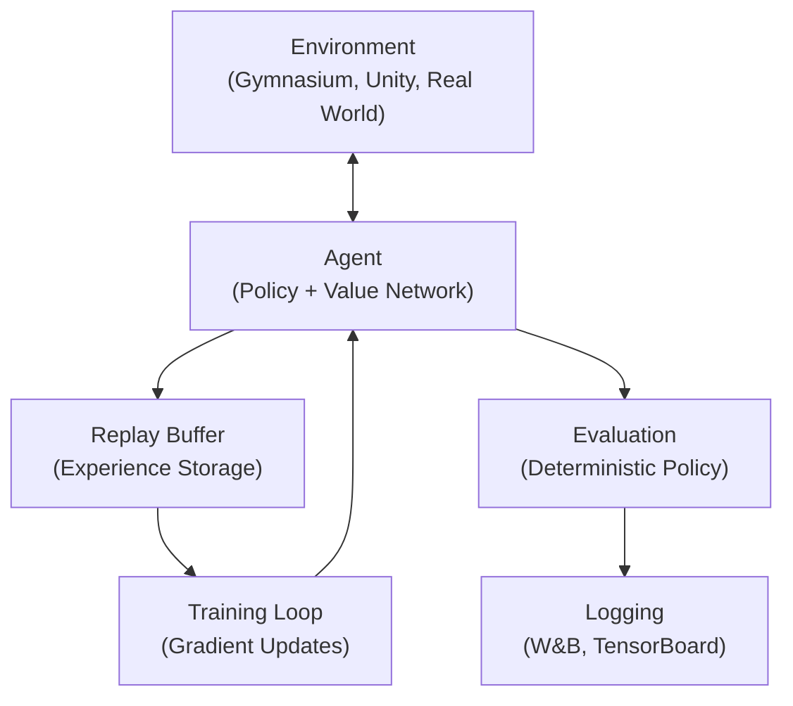

# 2.5 Reinforcement Learning Engineering

!!! quote "The Meta-Narrative"
    RL theory is elegant. RL engineering is brutal. The gap between the Bellman equation on a whiteboard and a working RL agent in production is filled with **hyperparameter sensitivity**, **reward shaping nightmares**, and **sample inefficiency**. This chapter focuses on the practical engineering of RL systems.

---

## The RL Engineering Stack



### Environment Engineering

| Environment Type | Latency | Fidelity | Example |
|-----------------|---------|----------|---------|
| **Grid World** | μs | Very low | FrozenLake, Cliff Walking |
| **Physics Sim** | ms | Medium | MuJoCo, PyBullet |
| **Game Engine** | ms-s | High | Atari, StarCraft II |
| **Photorealistic Sim** | 10ms-1s | Very high | CARLA, Isaac Sim |
| **Real World** | 10ms+ | Perfect | Robotics |

### Reward Engineering: The Hardest Part

!!! warning "Specification Gaming"
    Agents exploit loopholes in reward functions. Famous examples:
    
    - **Coast Runners**: Agent loops collecting points instead of finishing the race
    - **Evolved Creatures**: Tall creatures that fall over to move by "body surfing"
    - **Tetris Agent**: Pauses the game before the last piece to avoid losing

    The lesson: **the reward function is the specification**, and specifications are notoriously hard to get right.

### Practical Algorithm Selection

| Scenario | Algorithm | Why |
|----------|-----------|-----|
| Discrete actions, simple | **DQN** | Straightforward, well-understood |
| Continuous control | **SAC** (Soft Actor-Critic) | Sample-efficient, stable |
| General purpose | **PPO** | Most robust, good defaults |
| RLHF / LLM alignment | **PPO with KL penalty** | Standard for ChatGPT-style training |
| Sample-constrained | **Model-based (Dreamer, MuZero)** | Learn world model, plan internally |

??? example "🚀 Lab: PPO Training with Logging"
    ```python
    import gymnasium as gym
    from stable_baselines3 import PPO
    from stable_baselines3.common.callbacks import EvalCallback
    from stable_baselines3.common.evaluation import evaluate_policy

    # Create environment
    env = gym.make("LunarLander-v3")
    eval_env = gym.make("LunarLander-v3")

    # Evaluation callback: periodically evaluate and save best model
    eval_callback = EvalCallback(
        eval_env,
        best_model_save_path="./best_model/",
        eval_freq=5000,
        n_eval_episodes=10,
        deterministic=True,
    )

    # Train PPO
    model = PPO(
        "MlpPolicy", env,
        learning_rate=3e-4,
        n_steps=2048,
        batch_size=64,
        n_epochs=10,
        gamma=0.99,
        gae_lambda=0.95,
        clip_range=0.2,
        ent_coef=0.01,  # Entropy bonus for exploration
        verbose=1,
    )
    model.learn(total_timesteps=200_000, callback=eval_callback)

    # Final evaluation
    mean_reward, std_reward = evaluate_policy(model, eval_env, n_eval_episodes=50)
    print(f"Final: {mean_reward:.2f} ± {std_reward:.2f}")
    ```

---

## References

- Schulman, J. et al. (2017). *Proximal Policy Optimization Algorithms*. arXiv.
- Haarnoja, T. et al. (2018). *Soft Actor-Critic: Off-Policy Maximum Entropy Deep Reinforcement Learning*.
- Amodei, D. et al. (2016). *Concrete Problems in AI Safety*. arXiv.
