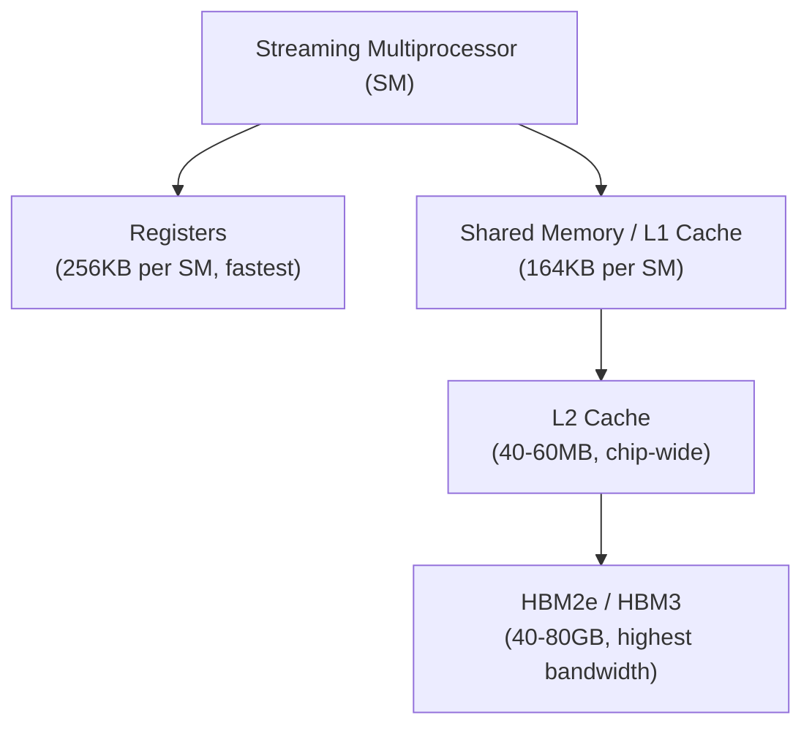
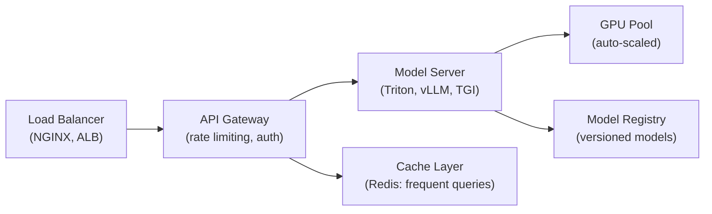

# 3.2 Infrastructure at Scale

!!! quote "The Meta-Narrative"
    Training GPT-4 required an estimated ~$100M in compute. Serving it costs millions per day. At this scale, infrastructure **is** the product. Understanding GPU architectures, networking topologies, and system-level optimizations is as important as understanding Transformers. This chapter covers the engineering of large-scale AI infrastructure.

---

## GPU Architecture Internals

### NVIDIA GPU Memory Hierarchy



### GPU Comparison for AI

| GPU | Year | FLOPS (FP16) | Memory | Memory BW | Use Case |
|-----|------|-------------|--------|-----------|----------|
| V100 | 2017 | 125 TFLOPS | 32GB HBM2 | 900 GB/s | Legacy training |
| A100 | 2020 | 312 TFLOPS | 80GB HBM2e | 2 TB/s | Current workhorse |
| H100 | 2022 | 990 TFLOPS | 80GB HBM3 | 3.35 TB/s | LLM training |
| H200 | 2024 | 990 TFLOPS | 141GB HBM3e | 4.8 TB/s | Larger models in memory |
| B200 | 2024 | 2.2 PFLOPS | 192GB HBM3e | 8 TB/s | Next-gen frontier |

!!! abstract "Roofline Model: Understanding Performance Bottlenecks"
    Every operation is either **compute-bound** or **memory-bound**:

    - **Compute-bound** (matmuls): Performance limited by FLOPS → use Tensor Cores
    - **Memory-bound** (activations, attention): Performance limited by memory bandwidth → use FlashAttention

    The **arithmetic intensity** \(I = \frac{\text{FLOPs}}{\text{Bytes transferred}}\) determines which category an operation falls into.

---

## Networking for Distributed Training

### Communication Patterns

| Pattern | Description | Used In |
|---------|-------------|---------|
| **All-Reduce** | Average gradients across all workers | Data parallelism |
| **All-Gather** | Collect full tensors from all workers | Model parallelism (ZeRO-3) |
| **Reduce-Scatter** | Reduce + redistribute shards | ZeRO optimizer states |
| **Point-to-Point** | Direct GPU-to-GPU transfer | Pipeline parallelism |

### Interconnect Technologies

| Technology | Bandwidth | Latency | Topology |
|-----------|-----------|---------|----------|
| **NVLink 4.0** | 900 GB/s | Very low | Intra-node (GPU↔GPU) |
| **NVSwitch** | 3.6 TB/s | Very low | Full-mesh intra-node |
| **InfiniBand (400G)** | 400 Gb/s | Low | Inter-node (RDMA) |
| **Ethernet (100G)** | 100 Gb/s | Medium | Inter-node |

---

## Model Serving Architecture

### Real-Time Inference Stack



### Serving Optimization Techniques

| Technique | Mechanism | Speedup |
|-----------|-----------|---------|
| **Batching** | Group requests for GPU efficiency | 2-10× throughput |
| **KV-Cache** | Cache attention keys/values from previous tokens | Essential for autoregressive |
| **Quantization** | INT8/INT4 inference | 2-4× speedup |
| **Compilation** | TorchScript, TensorRT, ONNX | 1.5-3× speedup |
| **Speculative Decoding** | Small draft model + large verifier | 2-3× for LLMs |

??? example "🚀 Lab: High-Performance Model Serving"
    ```python
    """FastAPI model server with batching and health checks."""
    from fastapi import FastAPI, HTTPException
    from pydantic import BaseModel
    import torch
    import time
    from collections import deque

    app = FastAPI(title="ML Model Server v2")

    # Load model
    model = torch.jit.load("model.pt")
    model.eval()

    # Request/response schemas
    class PredictRequest(BaseModel):
        features: list[float]

    class PredictResponse(BaseModel):
        prediction: list[float]
        latency_ms: float

    class HealthResponse(BaseModel):
        status: str
        model_loaded: bool
        avg_latency_ms: float

    latency_history = deque(maxlen=100)

    @app.post("/predict", response_model=PredictResponse)
    async def predict(request: PredictRequest):
        start = time.time()
        try:
            input_tensor = torch.FloatTensor([request.features])
            with torch.no_grad():
                output = model(input_tensor)
            latency = (time.time() - start) * 1000
            latency_history.append(latency)
            return PredictResponse(
                prediction=output.numpy().tolist()[0],
                latency_ms=round(latency, 2),
            )
        except Exception as e:
            raise HTTPException(status_code=500, detail=str(e))

    @app.get("/health", response_model=HealthResponse)
    async def health():
        avg_lat = sum(latency_history) / len(latency_history) if latency_history else 0
        return HealthResponse(
            status="healthy", model_loaded=True, avg_latency_ms=round(avg_lat, 2)
        )
    ```

---

## References

- Jia, Z. et al. (2018). *Dissecting the NVIDIA Volta GPU Architecture via Microbenchmarking*.
- Rajbhandari, S. et al. (2020). *ZeRO: Memory Optimizations Toward Training Trillion Parameter Models*.
- Dao, T. et al. (2022). *FlashAttention: Fast and Memory-Efficient Exact Attention with IO-Awareness*.
