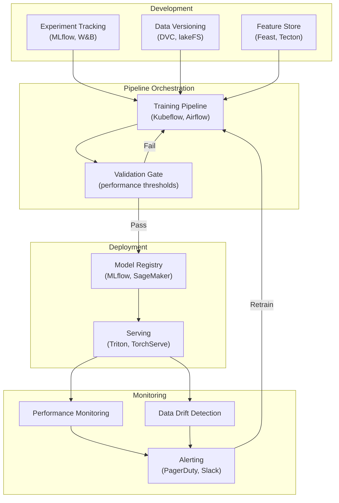
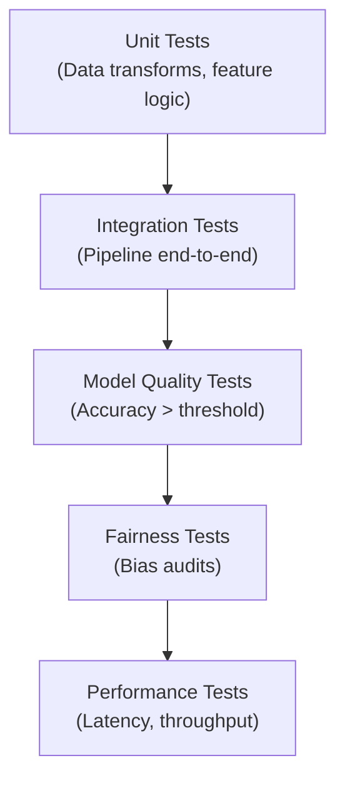

# 3.3 MLOps Engineering

!!! quote "The Meta-Narrative"
    MLOps is where software engineering meets machine learning. It's the discipline of delivering ML models **reliably, repeatedly, and at scale**. Without MLOps, every deployment is a one-off miracle. With it, you have a machine — a system that continuously trains, validates, deploys, and monitors models with minimal human intervention.

---

## The MLOps Stack



### Experiment Tracking: The Foundation

!!! abstract "Why Spreadsheets Kill ML Projects"
    Without experiment tracking, teams cannot:
    
    - Reproduce a model from 3 months ago
    - Compare 50 hyperparameter configurations
    - Roll back to a previous model version
    - Audit which data trained which model

    **MLflow**, **Weights & Biases**, and **Neptune** solve this by logging parameters, metrics, artifacts, and code versions for every run.

??? example "🚀 Lab: MLflow Experiment Tracking"
    ```python
    import mlflow
    import mlflow.sklearn
    from sklearn.ensemble import RandomForestClassifier
    from sklearn.datasets import load_iris
    from sklearn.model_selection import train_test_split
    from sklearn.metrics import accuracy_score, f1_score

    X, y = load_iris(return_X_y=True)
    X_train, X_test, y_train, y_test = train_test_split(X, y, test_size=0.2, random_state=42)

    mlflow.set_experiment("iris-classification")

    for n_est in [50, 100, 200]:
        for max_depth in [3, 5, None]:
            with mlflow.start_run(run_name=f"rf_n{n_est}_d{max_depth}"):
                mlflow.log_param("n_estimators", n_est)
                mlflow.log_param("max_depth", max_depth)

                model = RandomForestClassifier(n_estimators=n_est, max_depth=max_depth, random_state=42)
                model.fit(X_train, y_train)
                y_pred = model.predict(X_test)

                acc = accuracy_score(y_test, y_pred)
                f1 = f1_score(y_test, y_pred, average='macro')
                mlflow.log_metric("accuracy", acc)
                mlflow.log_metric("f1_macro", f1)
                mlflow.sklearn.log_model(model, "model")

                print(f"n={n_est}, d={max_depth}: acc={acc:.4f}, f1={f1:.4f}")
    ```

---

## CI/CD for Machine Learning

### ML-Specific Testing Pyramid



### Quality Gates

| Gate | Metric | Threshold | Action on Failure |
|------|--------|-----------|-------------------|
| Data schema | Column types, ranges | Must match | Block pipeline |
| Data freshness | Max age of data | < 24 hours | Alert team |
| Model accuracy | Test set performance | > baseline | Block deploy |
| Inference latency | p95 latency | < 100ms | Block deploy |
| Fairness | Demographic parity diff | < 0.1 | Block deploy |

---

## References

- Kreuzberger, D. et al. (2023). *Machine Learning Operations (MLOps): Overview, Definition, and Architecture*. IEEE Access.
- Zaharia, M. et al. (2018). *Accelerating the Machine Learning Lifecycle with MLflow*. IEEE Data Eng.
