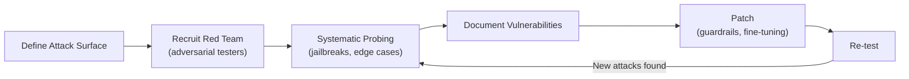

# 4.2 Safety, Regulation, and Alignment Engineering

!!! quote "The Meta-Narrative"
    As AI systems become more powerful and autonomous, the engineering of **safety** becomes as important as the engineering of **capability**. This chapter focuses on the practical engineering of safe AI systems: red-teaming methodologies, content filtering, alignment techniques, and navigating the global regulatory landscape.

---

## Red-Teaming: Engineering Adversarial Oversight

### The Red Team Process

### Common LLM Attack Vectors

| Attack | Description | Mitigation |
|--------|-----------|-----------|
| **Prompt Injection** | Override system prompt via user input | Input sanitization, instruction hierarchy |
| **Jailbreaking** | Bypass safety filters (DAN, roleplay) | Constitutional AI, reinforcement from red team |
| **Data Extraction** | Extract training data via memorization | Differential privacy, deduplication |
| **Hallucination** | Confident fabrication of facts | RAG, citation verification |
| **Toxicity** | Generate harmful content | Output classifiers, reward modeling |

---

## Alignment Engineering

### Techniques Comparison

=== "RLHF"

    Train a reward model on human preferences, then optimize the LM with PPO.
    
    **Pros**: Well-established, used by GPT-4, Claude, Gemini.
    **Cons**: Expensive (human labelers), reward hacking.

=== "Constitutional AI"

    Model critiques and revises its own outputs against a set of principles — no human labelers needed.
    
    **Pros**: Scalable, explicit principles.
    **Cons**: Principles may conflict, harder to evaluate.

=== "DPO (Direct Preference Optimization)"

    Trains directly on preference pairs without a separate reward model:

    \[
    L_{DPO}(\theta) = -\mathbb{E}\left[\log \sigma\left(\beta \log \frac{\pi_\theta(y_w|x)}{\pi_{ref}(y_w|x)} - \beta \log \frac{\pi_\theta(y_l|x)}{\pi_{ref}(y_l|x)}\right)\right]
    \]
    
    **Pros**: Simpler than RLHF (no reward model, no RL training).
    **Cons**: May be less flexible for complex preferences.

---

## Regulatory Compliance Engineering

### EU AI Act: Implementation Checklist

For **high-risk AI systems** (healthcare, finance, HR, law enforcement):

- [ ] **Risk management system**: Continuous, documented risk assessment
- [ ] **Data governance**: Training data quality, bias documentation
- [ ] **Technical documentation**: Architecture, performance, limitations
- [ ] **Record-keeping**: Logging of all decisions and inputs
- [ ] **Transparency**: Users must know they're interacting with AI
- [ ] **Human oversight**: Meaningful human control over decisions
- [ ] **Accuracy and robustness**: Documented performance and failure modes
- [ ] **Conformity assessment**: Third-party audit before deployment

!!! abstract "The Compliance Engineering Challenge"
    Compliance isn't just a legal exercise — it requires **engineering infrastructure**:
    
    - **Audit logs**: Immutable records of model inputs, outputs, and decisions
    - **Model cards**: Standardized documentation of intended use, limitations, and fairness evaluations (Mitchell et al., 2019)
    - **Data sheets**: Documentation of training data provenance, biases, and representativeness
    - **Continuous monitoring**: Automated drift and bias detection in production

---

## References

- Perez, E. et al. (2022). *Red Teaming Language Models with Language Models*. arXiv.
- Rafailov, R. et al. (2023). *Direct Preference Optimization: Your Language Model is Secretly a Reward Model*. NeurIPS.
- Mitchell, M. et al. (2019). *Model Cards for Model Reporting*. FAT*.
