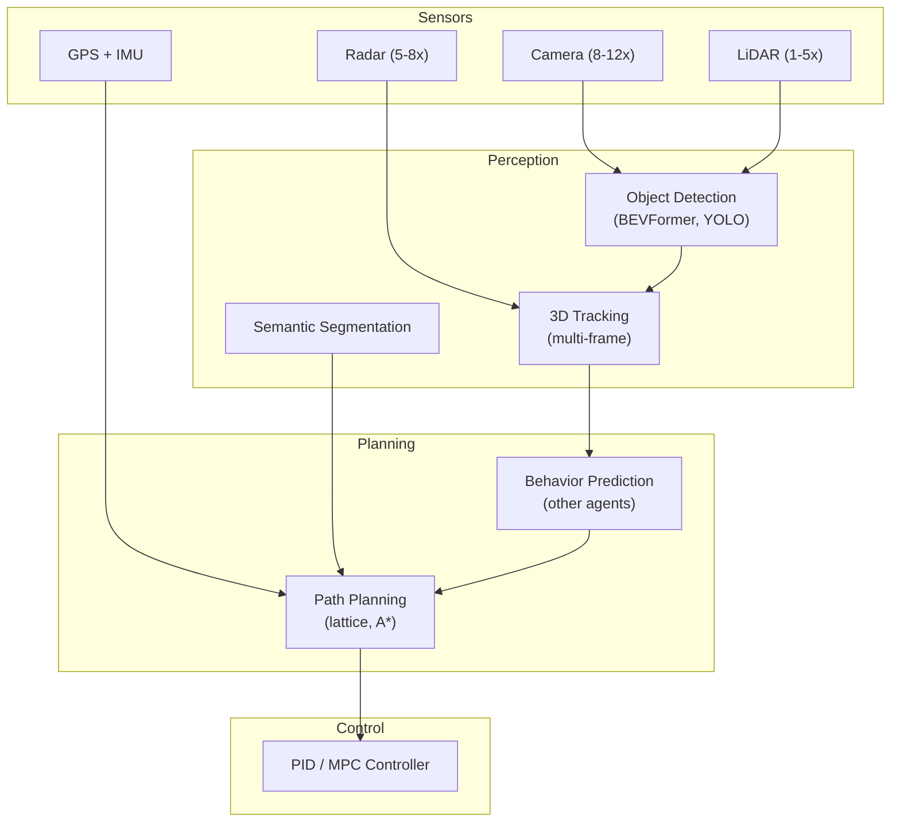

# 3.4 Case Studies, Tools, and the Modern AI Stack

!!! quote "The Meta-Narrative"
    Theory and engineering converge in real-world systems. This chapter examines how leading companies architect their AI systems, surveys the modern tooling landscape, and provides a comprehensive reference for building production ML systems.

---

## Case Study: Large-Scale Recommendation

### Architecture: YouTube Recommendations

!!! abstract "Two-Tower Architecture (Internal Detail)"
    The candidate generation model uses a **two-tower architecture**: one tower encodes the user (history, demographics), another encodes items (title, category, embeddings). At training time, the towers are jointly optimized. At serving time, item embeddings are precomputed and indexed in an **approximate nearest neighbor** (ANN) system (FAISS, ScaNN) for sub-millisecond retrieval.

### Key Engineering Challenges

| Challenge | Solution | Scale |
|-----------|----------|-------|
| Candidate set too large | ANN indexing (FAISS, ScaNN) | Billions of items |
| Cold start (new users) | Content-based fallback | Millions of new users/day |
| Real-time features | Streaming pipeline (Kafka → Flink) | Millions of events/sec |
| Feedback loops | Exploration (epsilon-greedy, Thompson sampling) | Continual |
| A/B testing | Multi-armed bandits, interleaving | Statistical rigor |

---

## Case Study: Autonomous Driving

### Full Perception Stack

### Safety Engineering

!!! warning "The Long Tail Problem"
    Self-driving models perform well on common scenarios (99.9%) but fail on **edge cases** — unusual objects, extreme weather, construction zones. The remaining 0.1% contains the scenarios that cause accidents. This is why:

    - **Tesla** uses a massive fleet (billions of miles) to mine edge cases
    - **Waymo** uses extensive simulation (20 billion simulated miles)
    - **Neither** has fully solved the long-tail safety problem

---

## The Modern AI/ML Tool Landscape

### Data & Feature Engineering

| Tool | Category | Strengths |
|------|----------|-----------|
| **Apache Spark** | Distributed compute | Mature, large-scale ETL |
| **dbt** | Data transformation | SQL-first, version controlled |
| **Great Expectations** | Data validation | Schema + distribution tests |
| **Feast** | Feature store | Open-source, offline + online |
| **DVC** | Data versioning | Git-like for data |

### Training & Experimentation

| Tool | Category | Strengths |
|------|----------|-----------|
| **PyTorch** | DL framework | Research flexibility, dominant |
| **JAX** | DL framework | Functional, TPU-optimized |
| **HuggingFace** | Model hub + libraries | Largest pretrained model ecosystem |
| **Weights & Biases** | Experiment tracking | Best visualization, team features |
| **Lightning** | Training framework | Reduces PyTorch boilerplate |

### Deployment & Serving

| Tool | Category | Strengths |
|------|----------|-----------|
| **vLLM** | LLM serving | PagedAttention, continuous batching |
| **Triton** (NVIDIA) | Multi-framework serving | GPU-optimized, ensemble models |
| **BentoML** | Model packaging | Clean API, containerization |
| **TensorRT** | Inference optimization | NVIDIA GPU kernel optimization |
| **ONNX Runtime** | Cross-platform inference | Framework-agnostic |

### Orchestration & MLOps

| Tool | Category | Strengths |
|------|----------|-----------|
| **Kubeflow** | ML pipelines on K8s | Full lifecycle on Kubernetes |
| **MLflow** | Experiment tracking + registry | Open-source, comprehensive |
| **Airflow** | Workflow orchestration | Mature, large community |
| **Evidently AI** | ML monitoring | Data + model drift detection |

---

## Benchmarks and Evaluation

### LLM Benchmarks

| Benchmark | What It Tests | Notable |
|-----------|--------------|---------|
| **MMLU** | Massive multi-task knowledge (57 subjects) | Standard LLM knowledge test |
| **HumanEval** | Code generation (Python) | Functional correctness |
| **GSM8K** | Grade-school math reasoning | Tests chain-of-thought |
| **ARC** | Science reasoning (challenge set) | Harder than MMLU |
| **MT-Bench** | Multi-turn conversation quality | GPT-4 as judge |
| **LMSYS Chatbot Arena** | Human preference (Elo ratings) | Most trusted ranking |

---

## References

- Covington, P. et al. (2016). *Deep Neural Networks for YouTube Recommendations*. RecSys.
- Bojarski, M. et al. (2016). *End to End Learning for Self-Driving Cars*. arXiv.
- Paleyes, A. et al. (2022). *Challenges in Deploying Machine Learning*. ACM Computing Surveys.
