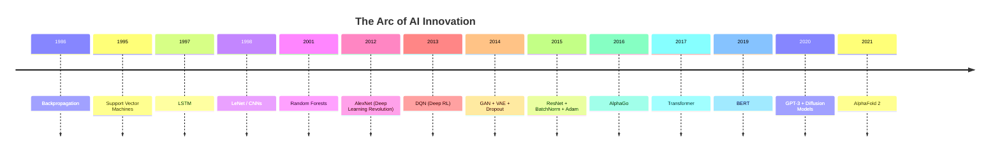

# :trophy: Hall of Fame: Top 20 Most Influential AI/ML Papers

These are the papers that shaped the field — ordered from **most recent to earliest**, tracing the arc of AI innovation from today's frontier back to its mathematical roots.

---

## 1. Highly Accurate Protein Structure Prediction with AlphaFold (2021)
**Authors:** Jumper, Evans, et al. (DeepMind)

Solved the 50-year-old protein folding problem using an attention-based architecture (Evoformer) with evolutionary and structural features. Predicted structures for 200M+ proteins released publicly.

!!! success "Impact"
    Revolutionized structural biology overnight. Won the CASP14 competition with median GDT scores above 90 — accuracy previously thought decades away. The AlphaFold Protein Structure Database now covers nearly all known proteins.

:material-file-document: [Original Paper (Nature)](https://www.nature.com/articles/s41586-021-03819-2)

---

## 2. Denoising Diffusion Probabilistic Models (2020)
**Authors:** Ho, Jain, Abbeel

Showed that iterative denoising with learned noise schedules can generate high-quality images, establishing the **diffusion model** framework that powers Stable Diffusion, DALL·E 2, and Midjourney.

!!! success "Impact"
    Replaced GANs as the dominant generative paradigm. Diffusion models offer superior mode coverage, stable training, and controllable generation via classifier-free guidance.

:material-file-document: [Original Paper (arXiv)](https://arxiv.org/abs/2006.11239)

---

## 3. Language Models are Few-Shot Learners (2020)
**Authors:** Brown, Mann, Ryder, et al. (OpenAI — *GPT-3*)

Demonstrated that scaling to 175B parameters enables remarkable few-shot learning from prompts alone — performing tasks never explicitly trained for.

!!! success "Impact"
    Launched the foundation model era and established prompting as a new programming paradigm. Led directly to ChatGPT and the current LLM revolution.

:material-file-document: [Original Paper (arXiv)](https://arxiv.org/abs/2005.14165)

---

## 4. BERT: Pre-training of Deep Bidirectional Transformers (2019)
**Authors:** Devlin, Chang, Lee, Toutanova (Google)

Introduced masked language modeling for bidirectional pretraining, achieving state-of-the-art on 11 NLP benchmarks simultaneously.

!!! success "Impact"
    Democratized transfer learning in NLP. BERT and its variants (RoBERTa, ALBERT, DeBERTa) became the default starting point for virtually all language tasks.

:material-file-document: [Original Paper (arXiv)](https://arxiv.org/abs/1810.04805)

---

## 5. Attention Is All You Need (2017)
**Authors:** Vaswani, Shazeer, Parmar, Uszkoreit, Jones, Gomez, Kaiser, Polosukhin (Google)

Introduced the **Transformer** architecture — replacing recurrence entirely with multi-head self-attention.

!!! success "Impact"
    Arguably the most influential ML paper of the decade. The Transformer is the backbone of BERT, GPT, T5, Gemini, Llama, and virtually every modern foundation model.

:material-file-document: [Original Paper (arXiv)](https://arxiv.org/abs/1706.03762)

---

## 6. Mastering the Game of Go with Deep Neural Networks (2016)
**Authors:** Silver, Huang, Maddison, et al. (DeepMind — *AlphaGo*)

Combined deep learning with Monte Carlo Tree Search to defeat the world Go champion Lee Sedol 4-1.

!!! success "Impact"
    Demonstrated superhuman strategic reasoning in a domain with \(10^{170}\) possible board positions. Inspired AlphaZero (self-play for chess/shogi) and AlphaFold.

:material-file-document: [Original Paper (Nature)](https://www.nature.com/articles/nature16961)

---

## 7. Deep Residual Learning for Image Recognition (2015)
**Authors:** He, Zhang, Ren, Sun (Microsoft Research — *ResNet*)

Introduced **residual connections** (\(F(x) + x\)) enabling training of networks with 152+ layers, crossing human-level accuracy on ImageNet.

!!! success "Impact"
    Skip connections became a universally adopted building block — used in Transformers, U-Nets, diffusion models, and virtually every deep architecture.

:material-file-document: [Original Paper (arXiv)](https://arxiv.org/abs/1512.03385)

---

## 8. Batch Normalization: Accelerating Deep Network Training (2015)
**Authors:** Ioffe, Szegedy (Google)

Proposed normalizing activations within mini-batches, dramatically stabilizing and accelerating training.

!!! success "Impact"
    Enabled training of much deeper networks and became standard in CNN architectures. Later evolved into Layer Norm (used in Transformers) and Group Norm.

:material-file-document: [Original Paper (arXiv)](https://arxiv.org/abs/1502.03167)

---

## 9. Adam: A Method for Stochastic Optimization (2015)
**Authors:** Kingma, Ba

Combined momentum and adaptive learning rates into the most widely used optimizer in deep learning.

!!! success "Impact"
    Adam (and AdamW) is used in the vast majority of deep learning training today, from small experiments to GPT-4.

:material-file-document: [Original Paper (arXiv)](https://arxiv.org/abs/1412.6980)

---

## 10. Generative Adversarial Nets (2014)
**Authors:** Goodfellow, Pouget-Abadie, Mirza, Xu, Warde-Farley, Ozair, Courville, Bengio

Proposed the adversarial training framework — a generator vs. discriminator minimax game.

!!! success "Impact"
    Spawned thousands of follow-ups (DCGAN, StyleGAN, CycleGAN, Pix2Pix) and enabled photorealistic image synthesis, style transfer, and data augmentation.

:material-file-document: [Original Paper (arXiv)](https://arxiv.org/abs/1406.2661)

---

## 11. Auto-Encoding Variational Bayes (2014)
**Authors:** Kingma, Welling

Introduced the VAE framework with the reparameterization trick for scalable approximate Bayesian inference.

!!! success "Impact"
    Foundation for probabilistic generative models. The ELBO and reparameterization trick are used across VAEs, diffusion models, and Bayesian deep learning.

:material-file-document: [Original Paper (arXiv)](https://arxiv.org/abs/1312.6114)

---

## 12. Dropout: A Simple Way to Prevent Overfitting (2014)
**Authors:** Srivastava, Hinton, Krizhevsky, Sutskever, Salakhutdinov

Randomly zeroing activations during training prevents co-adaptation of neurons.

!!! success "Impact"
    One of the most widely used regularization techniques. Simple, effective, and theoretically connected to Bayesian model averaging.

:material-file-document: [Original Paper (JMLR)](https://jmlr.org/papers/v15/srivastava14a.html)

---

## 13. Playing Atari with Deep Reinforcement Learning (2013)
**Authors:** Mnih, Kavukcuoglu, Silver, et al. (DeepMind — *DQN*)

Combined Q-learning with deep neural networks and experience replay to achieve human-level play on Atari from raw pixels.

!!! success "Impact"
    Launched the deep RL revolution. Inspired AlphaGo, robotics control, and modern RLHF alignment techniques.

:material-file-document: [Original Paper (arXiv)](https://arxiv.org/abs/1312.5602)

---

## 14. ImageNet Classification with Deep CNNs (2012)
**Authors:** Krizhevsky, Sutskever, Hinton (*AlexNet*)

Won ImageNet by a massive margin using ReLU, dropout, and GPU training — triggering the modern deep learning revolution.

!!! success "Impact"
    Proved deep networks could dramatically outperform hand-engineered features. Kickstarted billions of dollars in deep learning investment and research.

:material-file-document: [Original Paper (NeurIPS)](https://papers.nips.cc/paper/2012/hash/c399862d3b9d6b76c8436e924a68c45b-Abstract.html)

---

## 15. A Few Useful Things to Know About Machine Learning (2012)
**Authors:** Pedro Domingos

A practitioner-focused survey distilling key ML insights: overfitting, curse of dimensionality, feature engineering pitfalls.

!!! success "Impact"
    One of the most-read ML papers ever. Provided accessible wisdom that shaped how a generation approached applied ML.

:material-file-document: [Original Paper (ACM)](https://homes.cs.washington.edu/~pedrod/papers/cacm12.pdf)

---

## 16. Random Forests (2001)
**Authors:** Leo Breiman

Bootstrap aggregation with random feature selection at each split, creating powerful ensemble classifiers.

!!! success "Impact"
    Random Forests remain one of the most reliable classifiers for tabular data. Still outperform deep learning on most structured data tasks.

:material-file-document: [Original Paper (Machine Learning)](https://link.springer.com/article/10.1023/A:1010933404324)

---

## 17. Gradient-Based Learning Applied to Document Recognition (1998)
**Authors:** LeCun, Bottou, Bengio, Haffner (*LeNet*)

Demonstrated end-to-end CNN training for handwriting recognition — the foundational CNN paper.

!!! success "Impact"
    LeNet's architecture principles (convolution → pooling → FC) remain the blueprint for modern CNNs 25+ years later.

:material-file-document: [Original Paper (IEEE)](http://yann.lecun.com/exdb/publis/pdf/lecun-01a.pdf)

---

## 18. Long Short-Term Memory (1997)
**Authors:** Hochreiter, Schmidhuber

Introduced gated memory cells to solve vanishing gradients in RNNs, enabling long-range sequence modeling.

!!! success "Impact"
    Dominated sequence modeling for 20 years (speech, translation, time series) until Transformers emerged. The gating mechanism directly inspired GRUs and Transformer gating variants.

:material-file-document: [Original Paper (Neural Computation)](https://www.bioinf.jku.at/publications/older/2604.pdf)

---

## 19. Support-Vector Networks (1995)
**Authors:** Cortes, Vapnik

Introduced the soft-margin SVM with the kernel trick for non-linear classification.

!!! success "Impact"
    SVMs dominated ML for over a decade and established foundational concepts: maximum margin, kernel methods, and VC theory.

:material-file-document: [Original Paper (Machine Learning)](https://link.springer.com/article/10.1007/BF00994018)

---

## 20. Learning Representations by Back-Propagating Errors (1986)
**Authors:** Rumelhart, Hinton, Williams

Popularized the backpropagation algorithm for training multi-layer neural networks.

!!! success "Impact"
    **The foundational algorithm of deep learning.** Without backprop, modern neural networks would not exist. Every model trained today uses this algorithm or a direct descendant.

:material-file-document: [Original Paper (Nature)](https://www.nature.com/articles/323533a0)

---

## Timeline

