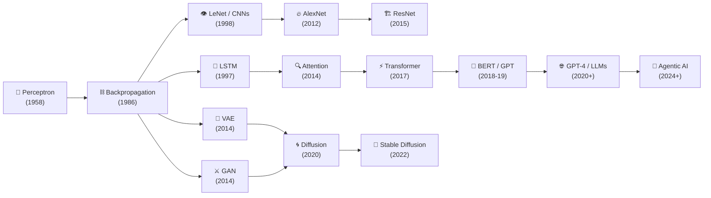

---
hide:
  - toc
---

<div style="text-align: center; padding: 3rem 0 1.5rem;" markdown>

# :material-brain: AI & Machine Learning
## Internals & Engineering

<div class="grid cards" markdown>

-   :material-math-integral-box:{ .lg .middle } **First-Principles Math**

    ---

    Full derivations — gradient descent, Lagrangian duality, ELBO, Bellman equations — not just formulas, but *why* they work.

-   :material-cog:{ .lg .middle } **Internals, Not APIs**

    ---

    What happens inside `model.fit()`, PyTorch autograd graphs, Ring All-Reduce, LSTM gating dynamics, attention scaling.

-   :material-history:{ .lg .middle } **Historical Arcs**

    ---

    Every concept placed in its intellectual lineage — from the Perceptron (1958) to the Agentic Era (2024+).

-   :material-flask:{ .lg .middle } **Production Labs**

    ---

    Runnable Python code: Transformers from scratch, drift detection, LoRA fine-tuning, adversarial attacks, RL agents.

</div>

---

## :material-map-outline: Site Map

The material spans **five parts** across 18 chapters — designed for sequential study or targeted reference.

=== ":material-book-open-variant: Part I — Foundations"

    The mathematical and algorithmic bedrock of machine learning.

    | Chapter | Topics | Key Concepts |
    |---------|--------|-------------|
    | [1.1 The ML Problem](machine-learning/1-foundations.md) | Learning theory, optimization, probability | VC dimension, bias-variance, MLE/MAP, EM algorithm |
    | [1.2 Classical Algorithms](machine-learning/2-algorithms.md) | SVMs, trees, ensembles, boosting | Kernel trick, CART internals, gradient boosting from scratch |
    | [1.3 AI Foundations](ai-engineering/chapter-1-foundations.md) | Feature engineering, model selection | Cross-validation pitfalls, No Free Lunch theorem |
    | [1.4 Classical ML Engineering](ai-engineering/chapter-2-classical-ml.md) | Hyperparameter tuning, imbalanced data | Bayesian optimization, SMOTE, SHAP |

=== ":material-brain: Part II — Deep Learning"

    From single neurons to Transformers to generative AI.

    | Chapter | Topics | Key Concepts |
    |---------|--------|-------------|
    | [2.1 Deep Learning Theory](machine-learning/3-deep-learning.md) | MLPs, CNNs, RNNs, Transformers | Backprop graphs, ResNet gradient proof, attention scaling |
    | [2.2 DL Architecture Internals](ai-engineering/chapter-3-deep-learning.md) | Initialization, normalization, transfer learning | He init, BatchNorm vs LayerNorm, discriminative LRs |
    | [2.3 Generative Models & RL](machine-learning/4-generative-rl.md) | VAEs, GANs, diffusion, policy gradients | ELBO tightness, WGAN, score matching, RLHF |
    | [2.4 Modern Generative AI](ai-engineering/chapter-4-generative-models.md) | LLM engineering, fine-tuning, serving | LoRA/QLoRA, quantization, KV-cache, vLLM |
    | [2.5 RL & Decision Systems](ai-engineering/chapter-5-rl-systems.md) | RL engineering, reward shaping | PPO, SAC, specification gaming, algorithm selection |

=== ":material-server-network: Part III — Systems & Production"

    Engineering ML systems that work at scale.

    | Chapter | Topics | Key Concepts |
    |---------|--------|-------------|
    | [3.1 ML Systems](machine-learning/5-systems-infra.md) | Data pipelines, distributed training | Ring All-Reduce, batch size scaling, drift detection |
    | [3.2 Infrastructure at Scale](ai-engineering/chapter-6-infrastructure.md) | GPU internals, networking, serving | Roofline model, NVLink, FlashAttention |
    | [3.3 MLOps](ai-engineering/chapter-7-mlops.md) | Experiment tracking, CI/CD, monitoring | MLflow, quality gates, testing pyramid |
    | [3.4 Case Studies](ai-engineering/chapter-9-case-studies.md) | Recommendation, autonomous driving, tools | Two-tower architecture, long-tail safety |

=== ":material-shield-check: Part IV — Responsibility"

    Building AI that is fair, private, and accountable.

    | Chapter | Topics | Key Concepts |
    |---------|--------|-------------|
    | [4.1 Ethics & Governance](machine-learning/6-ethics-governance.md) | Bias, privacy, robustness | Impossibility theorem, DP-SGD, FGSM |
    | [4.2 Safety & Regulation](ai-engineering/chapter-8-ethics-safety.md) | Red-teaming, alignment, EU AI Act | Constitutional AI, DPO, compliance engineering |

=== ":material-robot: Part V — The Agentic Era"

    Autonomous AI systems that plan, reason, and act.

    | Chapter | Topics | Key Concepts |
    |---------|--------|-------------|
    | [5.1 Agentic AI](ai-engineering/chapter-10-agentic-ai.md) | Reasoning, tool use, memory, multi-agent | CoT, ReAct, RAG internals, reliability engineering |

---

## :material-format-quote-open: The Meta-Narrative

Machine learning is not a bag of disconnected algorithms. It is a **story of ideas building on ideas** — each breakthrough unlocking the next:



The **Perceptron** begat **backpropagation**, which enabled **CNNs** for vision and **LSTMs** for sequences. The **attention mechanism** freed us from sequential processing, and the **Transformer** unified everything — spawning **BERT**, **GPT**, and the whole foundation model era. Meanwhile, **variational inference** and **adversarial training** opened the generative frontier, culminating in **diffusion models** that power today's image generation. Now, **agentic systems** are combining LLMs with tools, memory, and planning to create the next paradigm shift.

Understanding this lineage isn't optional — it's how you develop the intuition to know *which* tool to reach for and *why*.

---

## :material-trophy: Hall of Fame & Tech Giants

<div class="grid cards" markdown>

-   :material-trophy:{ .lg .middle } **[Top 20 AI/ML Papers →](hall-of-fame.md)**

    ---

    The most influential papers in AI history — from Backpropagation (1986) to AlphaFold (2021) — with impact analysis and links to originals.

-   :material-office-building:{ .lg .middle } **[Tech Giants & AI Frontier →](tech-giants.md)**

    ---

    How Google, OpenAI, Meta, Anthropic, NVIDIA, and Microsoft are shaping the AI landscape — strategies, architectures, and competitive dynamics.

</div>

---

## :material-flask: Hands-On Labs

The `src/labs/` directory contains **runnable Python implementations** of key concepts:

| Lab | File | What You'll Build |
|-----|------|-------------------|
| :material-chart-scatter-plot: **Foundations** | `src/labs/foundations/pca_gmm_knn.py` | PCA, GMM/EM, and KNN from scratch |
| :material-chart-timeline: **Gradient Boosting** | `src/labs/foundations/gradient_boosting.py` | Gradient boosting from scratch + XGBoost comparison |
| :material-transformer: **Transformer** | `src/labs/deep_learning/transformer_from_scratch.py` | Complete multi-head attention and encoder |
| :material-image-auto-adjust: **Generative** | `src/labs/generative/vae_and_diffusion.py` | VAE with reparameterization + DDPM training |
| :material-gamepad: **RL** | `src/labs/rl/q_learning_dqn.py` | Q-Learning + Deep Q-Network agent |
| :material-shield-search: **Systems** | `src/labs/systems/drift_and_fairness.py` | Drift detection (PSI/KS) + fairness auditing |

---

## :material-tools: Quick Start

```bash
# Clone and set up
git clone https://github.com/atulRanaa/machine-learning.git
cd machine-learning

# Create virtual environment
python -m venv .venv
source .venv/bin/activate  # Windows: .venv\Scripts\activate

# Install dependencies
pip install -r requirements.txt

# Serve locally
mkdocs serve
# → http://localhost:8000
```

---

<div style="text-align: center; padding: 1.5rem 0; opacity: 0.7;">
Built with MkDocs Material · Licensed under MIT · Contributions welcome
</div>
