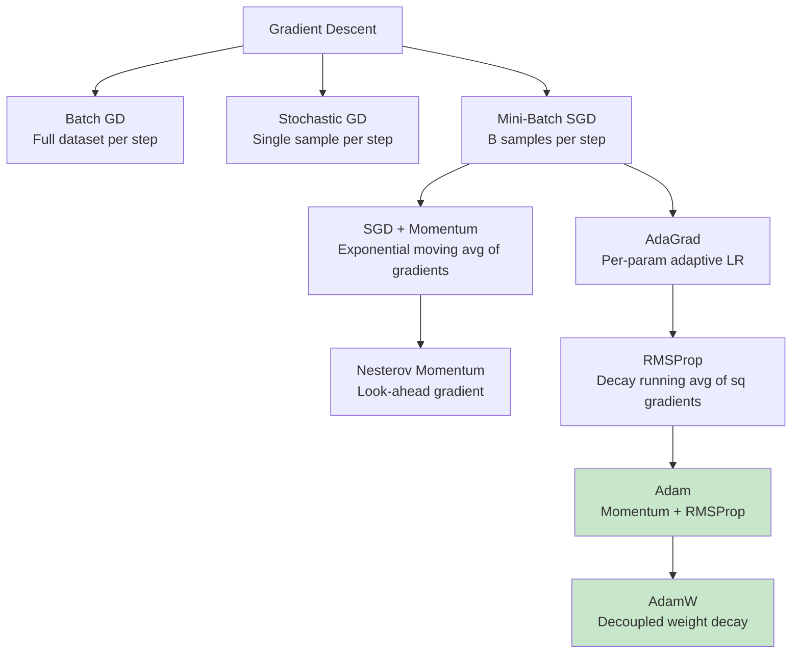
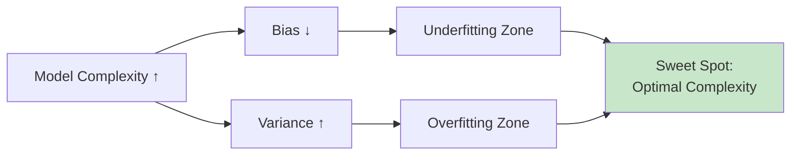

# 1. Foundations of Machine Learning

!!! quote "The Meta-Narrative"
    Machine learning didn't emerge from a vacuum. It sits at the intersection of **statistics** (how do we learn from data?), **optimization** (how do we find the best parameters?), and **computer science** (how do we do it efficiently?). The foundational ideas in this chapter — gradient descent, regularization, the bias-variance tradeoff — are not just historical artifacts. They are the **active ingredients** in every modern system, from a simple logistic regression in production to GPT-4's 1.8 trillion parameters. Understanding them deeply is what separates an engineer who *uses* ML from one who *understands* it.

---

## 1.1 What Is Learning? — A Formal Treatment

### The Learning Problem

Given a dataset \(\mathcal{D} = \{(x_i, y_i)\}_{i=1}^n\) drawn i.i.d. from an unknown joint distribution \(P(X, Y)\), the goal of supervised learning is to find a hypothesis \(h \in \mathcal{H}\) that minimizes the **expected risk**:

\[
R(h) = \mathbb{E}_{(x,y) \sim P}[L(h(x), y)]
\]

Since \(P\) is unknown, we minimize the **empirical risk** as a proxy:

\[
\hat{R}(h) = \frac{1}{n}\sum_{i=1}^{n} L(h(x_i), y_i)
\]

!!! warning "The Fundamental Problem"
    Minimizing \(\hat{R}(h)\) does **not** guarantee minimizing \(R(h)\). The gap between them — the **generalization gap** — is the central concern of statistical learning theory. Understanding this gap is understanding why ML works (and when it doesn't).

### Why Does ERM Work? — Uniform Convergence

The key insight is the **Uniform Law of Large Numbers**: as \(n \to \infty\), the empirical risk converges to the true risk *uniformly* over all \(h \in \mathcal{H}\), provided \(\mathcal{H}\) has bounded complexity.

For a finite hypothesis class \(|\mathcal{H}|\), Hoeffding's inequality gives:

\[
P\left[\sup_{h \in \mathcal{H}} |R(h) - \hat{R}(h)| > \epsilon\right] \leq 2|\mathcal{H}| e^{-2n\epsilon^2}
\]

This tells us: **more data** and **simpler hypothesis classes** lead to better generalization. This tension — expressive models vs. guaranteed generalization — runs through the entire field.

!!! tip "Historical Insight: The Birth of Learning Theory"
    Vladimir Vapnik and Alexei Chervonenkis formalized this in the 1970s through **VC Theory**, introducing the VC dimension as a measure of hypothesis class complexity. Vapnik later used these ideas to invent the Support Vector Machine (1995), one of the most theoretically grounded algorithms in ML. His book *The Nature of Statistical Learning Theory* (1995) remains a masterpiece.

---

## 1.2 Mathematical Foundations — The Internal Machinery

### Linear Algebra: The Language of Data

Every ML algorithm operates on **vectors** (data points) and **matrices** (transformations). The key operations:

| Operation | Notation | What It Does in ML |
|-----------|----------|-------------------|
| Dot product | \(\mathbf{a}^T \mathbf{b}\) | Similarity measure, linear prediction |
| Matrix multiply | \(\mathbf{Ax}\) | Linear transformation of features |
| Eigendecomposition | \(\mathbf{A} = \mathbf{Q\Lambda Q}^T\) | PCA, spectral clustering |
| SVD | \(\mathbf{A} = \mathbf{U\Sigma V}^T\) | Dimensionality reduction, recommender systems |
| Matrix inverse | \(\mathbf{A}^{-1}\) | Closed-form solutions (normal equation) |

### Calculus: Gradient Descent from First Principles

**Why gradients?** The gradient \(\nabla_\theta J(\theta)\) points in the direction of **steepest ascent** of the loss surface. We step in the opposite direction:

\[
\theta_{t+1} = \theta_t - \eta \nabla_\theta J(\theta_t)
\]

**But what is actually happening geometrically?** Gradient descent performs a first-order Taylor approximation of the loss at each step:

\[
J(\theta + \Delta\theta) \approx J(\theta) + \nabla J(\theta)^T \Delta\theta
\]

We choose \(\Delta\theta = -\eta \nabla J(\theta)\) to minimize this linear approximation, subject to \(\|\Delta\theta\| \leq \eta\). This is why gradient descent is a **local** method — it can only see the curvature within a small neighborhood.

!!! abstract "The Deep Insight: Why Learning Rate Matters"
    The learning rate \(\eta\) controls the **trust region** — how far we trust our linear approximation. Too large: we overshoot and diverge. Too small: we converge agonizingly slowly. Adaptive methods (Adam, AdaGrad) solve this by maintaining per-parameter learning rates based on gradient history:

    \[
    m_t = \beta_1 m_{t-1} + (1 - \beta_1) g_t \quad \text{(momentum)}
    \]
    \[
    v_t = \beta_2 v_{t-1} + (1 - \beta_2) g_t^2 \quad \text{(adaptive scaling)}
    \]
    \[
    \theta_{t+1} = \theta_t - \eta \frac{\hat{m}_t}{\sqrt{\hat{v}_t} + \epsilon}
    \]

### SGD Variants: A Taxonomy



### Probability: The Foundation of Uncertainty

Bayes' theorem is the engine of probabilistic ML:

\[
\underbrace{P(\theta | \mathcal{D})}_{\text{posterior}} = \frac{\overbrace{P(\mathcal{D} | \theta)}^{\text{likelihood}} \cdot \overbrace{P(\theta)}^{\text{prior}}}{\underbrace{P(\mathcal{D})}_{\text{evidence}}}
\]

This single equation connects:
- **MLE** = maximize \(P(\mathcal{D}|\theta)\) (no prior)
- **MAP** = maximize \(P(\mathcal{D}|\theta) P(\theta)\) (point estimate with prior)
- **Full Bayesian** = compute entire \(P(\theta|\mathcal{D})\) (intractable for deep models)

---

## 1.3 Supervised Learning: The Internal Mechanics

### Linear Regression: The Closed-Form Solution

For linear regression \(\hat{y} = X\theta\) with MSE loss, the optimal parameters have a **closed-form** solution (the Normal Equation):

\[
\hat{\theta} = (X^T X)^{-1} X^T y
\]

!!! abstract "Why This Matters Internally"
    This is the **only** common ML model with a closed-form solution. Everything else requires iterative optimization. Understanding *why* linear regression has this property (quadratic loss + linear model = convex with unique minimum) helps you understand *why* other problems don't.

    **Computational cost**: \(O(p^3)\) due to matrix inversion, where \(p\) is the number of features. For \(p > 10,000\), this is prohibitive — which is why we use gradient descent even for linear regression on large datasets.

### Regularization: Why, How, and the Deep Connection

**Overfitting** occurs when the model memorizes training noise. Regularization controls model complexity:

=== "L2 (Ridge) Regression"

    \[
    J_{ridge}(\theta) = \frac{1}{2n}\|X\theta - y\|^2 + \lambda\|\theta\|_2^2
    \]

    **Closed-form**: \(\hat{\theta}_{ridge} = (X^TX + \lambda I)^{-1}X^Ty\)

    **Internal mechanism**: Adding \(\lambda I\) to \(X^TX\) makes it **always invertible** (even when features are collinear) and **shrinks** eigenvalues toward zero. Geometrically, it constrains \(\theta\) to lie within a **sphere**.

=== "L1 (Lasso) Regression"

    \[
    J_{lasso}(\theta) = \frac{1}{2n}\|X\theta - y\|^2 + \lambda\|\theta\|_1
    \]

    **No closed-form** (L1 is not differentiable at zero). Solved via coordinate descent or subgradient methods.

    **Internal mechanism**: L1 constrains \(\theta\) to a **diamond** (L1 ball). The corners of the diamond lie on coordinate axes, which is why L1 produces **sparse** solutions — some \(\theta_j\) become exactly zero.

=== "Elastic Net"

    \[
    J_{elastic}(\theta) = \frac{1}{2n}\|X\theta - y\|^2 + \lambda_1\|\theta\|_1 + \lambda_2\|\theta\|_2^2
    \]

    Combines the sparsity of L1 with the stability of L2. Used when features are correlated.

!!! tip "The Bayesian Connection (Deep Insight)"
    Regularization is not ad-hoc — it has a principled Bayesian interpretation:

    - **L2 regularization** = Gaussian prior on weights: \(P(\theta) = \mathcal{N}(0, \frac{1}{2\lambda}I)\)
    - **L1 regularization** = Laplace prior on weights: \(P(\theta) = \text{Laplace}(0, \frac{1}{\lambda})\)

    MAP estimation under these priors recovers Ridge and Lasso respectively. This isn't a coincidence — it's a deep mathematical equivalence that connects frequentist and Bayesian statistics.

### The Bias-Variance Decomposition

For a fixed test point \(x\), the expected prediction error decomposes as:

\[
\mathbb{E}[(y - \hat{f}(x))^2] = \underbrace{\text{Bias}[\hat{f}(x)]^2}_{\text{systematic error}} + \underbrace{\text{Var}[\hat{f}(x)]}_{\text{instability}} + \underbrace{\sigma^2}_{\text{irreducible noise}}
\]



!!! tip "Historical Insight: The Double Descent Phenomenon"
    Classical learning theory predicted a U-shaped test error curve. But Belkin et al. (2019) discovered **double descent**: in modern overparameterized models (deep networks), test error *decreases again* after the interpolation threshold. This challenges the classical bias-variance tradeoff and remains an active area of research — suggesting that something fundamentally different happens in high-dimensional, overparameterized regimes.

---

## 1.4 Probabilistic Modeling: MLE, MAP, and Beyond

### Maximum Likelihood Estimation (MLE) — Derivation

Given i.i.d. data, MLE seeks:

\[
\hat{\theta}_{MLE} = \arg\max_\theta \sum_{i=1}^n \log p(x_i|\theta)
\]

**Example: MLE for Gaussian**. Given \(x_i \sim \mathcal{N}(\mu, \sigma^2)\):

\[
\log p(\mathcal{D}|\mu, \sigma^2) = -\frac{n}{2}\log(2\pi\sigma^2) - \frac{1}{2\sigma^2}\sum_{i=1}^n (x_i - \mu)^2
\]

Taking derivatives and setting to zero:

\[
\hat{\mu}_{MLE} = \frac{1}{n}\sum_{i=1}^n x_i = \bar{x}, \quad \hat{\sigma}^2_{MLE} = \frac{1}{n}\sum_{i=1}^n (x_i - \bar{x})^2
\]

!!! warning "Subtle Issue"
    The MLE for \(\sigma^2\) is **biased** — it divides by \(n\) instead of \(n-1\). The unbiased estimator (Bessel's correction) uses \(n-1\). For large \(n\) this doesn't matter, but it illustrates how MLE can have surprising properties.

### MAP Estimation — The Bridge to Regularization

MAP adds a prior \(P(\theta)\) and finds the mode of the posterior:

\[
\hat{\theta}_{MAP} = \arg\max_\theta \left[\sum_{i=1}^n \log p(x_i|\theta) + \log p(\theta)\right]
\]

The log-prior acts as a **regularizer**. This is not a metaphor — it is mathematically identical.

---

## 1.5 Unsupervised Learning: Discovering Structure

### k-Means: What's Really Happening Inside

The k-Means algorithm alternates between two steps:

1. **Assignment**: Assign each point to the nearest centroid (Voronoi partition)
2. **Update**: Recompute centroids as cluster means

This is actually **coordinate descent** on the objective:

\[
J = \sum_{k=1}^K \sum_{x_i \in C_k} \|x_i - \mu_k\|^2
\]

!!! abstract "Internal Detail: Lloyd's Algorithm Convergence"
    k-Means is guaranteed to converge (J decreases monotonically), but only to a **local minimum**. The quality of the solution depends heavily on initialization. **k-Means++** (Arthur & Vassilvitskii, 2007) provides a principled initialization that is \(O(\log k)\)-competitive with the optimal clustering.

### GMMs and EM: The Elegant Dance

Gaussian Mixture Models assume data is generated from \(K\) Gaussians:

\[
p(x) = \sum_{k=1}^K \pi_k \mathcal{N}(x|\mu_k, \Sigma_k)
\]

The **EM algorithm** handles the chicken-and-egg problem (we don't know which Gaussian generated each point):

=== "E-Step (Expectation)"

    Compute **responsibilities** — the probability that Gaussian \(k\) generated point \(x_i\):

    \[
    \gamma_{ik} = \frac{\pi_k \mathcal{N}(x_i|\mu_k, \Sigma_k)}{\sum_{j=1}^K \pi_j \mathcal{N}(x_i|\mu_j, \Sigma_j)}
    \]

=== "M-Step (Maximization)"

    Update parameters using weighted statistics:

    \[
    \mu_k = \frac{\sum_i \gamma_{ik} x_i}{\sum_i \gamma_{ik}}, \quad
    \Sigma_k = \frac{\sum_i \gamma_{ik}(x_i - \mu_k)(x_i - \mu_k)^T}{\sum_i \gamma_{ik}}, \quad
    \pi_k = \frac{\sum_i \gamma_{ik}}{n}
    \]

!!! abstract "Why EM Works (The Deep Insight)"
    EM maximizes a **lower bound** on the log-likelihood. Specifically, it maximizes the **ELBO** (Evidence Lower Bound):

    \[
    \log p(X|\theta) \geq \mathbb{E}_{q(Z)}[\log p(X, Z|\theta)] - \mathbb{E}_{q(Z)}[\log q(Z)]
    \]

    This is the **same ELBO** that appears in Variational Autoencoders (Chapter 4). The conceptual thread from 1970s EM to 2014 VAEs is direct — VAEs simply replace the E-step with a neural network.

### PCA: Eigenvalues Tell You Everything

PCA finds the orthogonal directions of maximum variance. The covariance matrix \(\Sigma\) encodes all the information:

\[
\Sigma = \frac{1}{n}\sum_{i=1}^n (x_i - \bar{x})(x_i - \bar{x})^T
\]

The eigenvectors of \(\Sigma\) are the principal components; the eigenvalues tell you how much variance each captures. The **scree plot** (eigenvalues sorted by magnitude) shows you the "intrinsic dimensionality" of your data.

??? example "🚀 Lab: Complete PCA Implementation from Scratch"
    ```python
    import numpy as np
    import matplotlib.pyplot as plt
    from sklearn.datasets import load_iris

    class PCAFromScratch:
        def __init__(self, n_components):
            self.n_components = n_components
            
        def fit_transform(self, X):
            # Center the data
            self.mean = X.mean(axis=0)
            X_centered = X - self.mean
            
            # Compute covariance matrix
            cov_matrix = np.cov(X_centered, rowvar=False)
            
            # Eigendecomposition
            eigenvalues, eigenvectors = np.linalg.eigh(cov_matrix)
            
            # Sort by descending eigenvalue
            sorted_idx = np.argsort(eigenvalues)[::-1]
            self.eigenvalues = eigenvalues[sorted_idx]
            self.eigenvectors = eigenvectors[:, sorted_idx]
            
            # Project onto top-k eigenvectors
            self.components = self.eigenvectors[:, :self.n_components]
            return X_centered @ self.components
        
        def explained_variance_ratio(self):
            return self.eigenvalues[:self.n_components] / self.eigenvalues.sum()

    # Usage
    X, y = load_iris(return_X_y=True)
    pca = PCAFromScratch(n_components=2)
    X_proj = pca.fit_transform(X)

    print(f"Explained variance ratios: {pca.explained_variance_ratio()}")
    print(f"Total variance captured: {pca.explained_variance_ratio().sum():.4f}")
    # Typically ~0.9776 — two components capture 97.7% of variance in Iris!
    ```

??? example "🚀 Lab: GMM with EM Algorithm from Scratch"
    ```python
    import numpy as np
    from scipy.stats import multivariate_normal

    class GMMFromScratch:
        def __init__(self, k=3, max_iter=100, tol=1e-6):
            self.k = k
            self.max_iter = max_iter
            self.tol = tol
        
        def fit(self, X):
            n, d = X.shape
            
            # Initialize: random means, identity covariances, uniform weights
            rng = np.random.default_rng(42)
            self.means = X[rng.choice(n, self.k, replace=False)]
            self.covs = [np.eye(d) for _ in range(self.k)]
            self.weights = np.ones(self.k) / self.k
            
            prev_ll = -np.inf
            for iteration in range(self.max_iter):
                # E-step: compute responsibilities
                resp = np.zeros((n, self.k))
                for j in range(self.k):
                    resp[:, j] = self.weights[j] * multivariate_normal.pdf(
                        X, mean=self.means[j], cov=self.covs[j]
                    )
                resp /= resp.sum(axis=1, keepdims=True)
                
                # M-step: update parameters
                Nk = resp.sum(axis=0)
                for j in range(self.k):
                    self.means[j] = (resp[:, j:j+1].T @ X) / Nk[j]
                    diff = X - self.means[j]
                    self.covs[j] = (diff.T @ (diff * resp[:, j:j+1])) / Nk[j]
                    self.covs[j] += 1e-6 * np.eye(d)  # Regularize for stability
                self.weights = Nk / n
                
                # Check convergence via log-likelihood
                ll = np.sum(np.log(sum(
                    self.weights[j] * multivariate_normal.pdf(X, self.means[j], self.covs[j])
                    for j in range(self.k)
                )))
                if abs(ll - prev_ll) < self.tol:
                    print(f"Converged at iteration {iteration}")
                    break
                prev_ll = ll
            
            return resp

    # Usage with synthetic data
    from sklearn.datasets import make_blobs
    X, _ = make_blobs(n_samples=300, centers=3, random_state=42)
    gmm = GMMFromScratch(k=3)
    responsibilities = gmm.fit(X)
    print(f"Cluster weights: {gmm.weights}")
    ```

---

## References

- Hastie, T., Tibshirani, R., & Friedman, J. (2009). *The Elements of Statistical Learning*. Springer.
- Bishop, C. M. (2006). *Pattern Recognition and Machine Learning*. Springer.
- Murphy, K. P. (2012). *Machine Learning: A Probabilistic Perspective*. MIT Press.
- Shalev-Shwartz, S. & Ben-David, S. (2014). *Understanding Machine Learning: From Theory to Algorithms*. Cambridge.
- Vapnik, V. N. (1995). *The Nature of Statistical Learning Theory*. Springer.
- Belkin, M. et al. (2019). *Reconciling Modern ML Practice and the Bias-Variance Tradeoff*. PNAS.
- Arthur, D. & Vassilvitskii, S. (2007). *k-Means++: The Advantages of Careful Seeding*. SODA.
