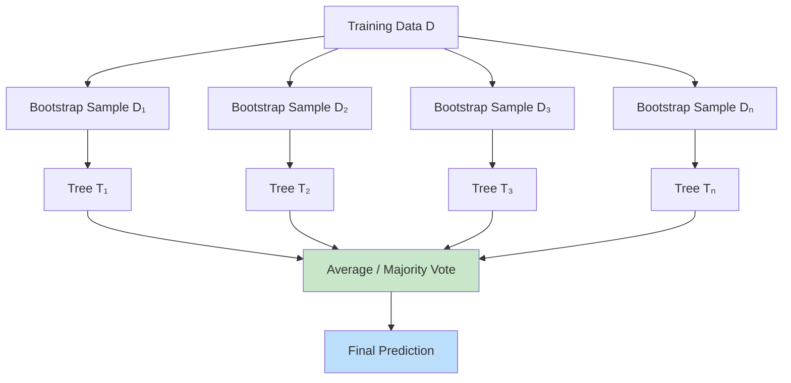

# 2. Classical and Advanced ML Algorithms

!!! quote "The Meta-Narrative"
    Before deep learning conquered computer vision and NLP, classical algorithms ruled. And on **tabular data**, they still do. Random Forests and XGBoost consistently outperform neural networks on structured data in Kaggle competitions and production systems alike. Understanding *why* — and understanding the mathematical machinery inside SVMs, kernels, and boosting — gives you tools that remain indispensable. More importantly, the ideas here (margins, kernels, ensembling, boosting) directly influenced modern deep learning architecture design.

---

## 2.1 Convex Optimization: The Engine Under the Hood

### Why Convexity Matters

A function \(f\) is **convex** if for all \(x, y\) and \(\lambda \in [0,1]\):

\[
f(\lambda x + (1-\lambda)y) \leq \lambda f(x) + (1-\lambda) f(y)
\]

**The killer property**: every local minimum of a convex function is also the **global minimum**. This means gradient descent is guaranteed to find the best solution — no random restarts, no worry about getting stuck.

!!! abstract "Which ML Problems Are Convex?"
    | Problem | Convex? | Implication |
    |---------|---------|-------------|
    | Linear regression (MSE) | ✅ Yes | Global optimum guaranteed |
    | Logistic regression | ✅ Yes | Global optimum guaranteed |
    | SVM (primal, hinge loss) | ✅ Yes | Global optimum guaranteed |
    | Decision trees | ❌ No | Greedy heuristics required |
    | Neural networks | ❌ No | Local minima, saddle points |

### Lagrangian Duality: The Mathematical Trick Behind SVMs

For constrained optimization problems, we form the **Lagrangian**:

\[
\mathcal{L}(x, \alpha, \beta) = f(x) + \sum_i \alpha_i g_i(x) + \sum_j \beta_j h_j(x)
\]

where \(g_i(x) \leq 0\) are inequality constraints and \(h_j(x) = 0\) are equality constraints.

The **dual problem** is:

\[
\max_{\alpha \geq 0, \beta} \min_x \mathcal{L}(x, \alpha, \beta)
\]

**Strong duality** (dual optimal = primal optimal) holds for convex problems satisfying Slater's condition. This lets us solve SVMs in the **dual space**, where the kernel trick becomes possible.

---

## 2.2 Support Vector Machines: Maximum Margin, Inside and Out

### The Geometric Intuition

An SVM finds the hyperplane \(w^T x + b = 0\) that **maximizes the margin** — the distance between the closest points of each class (the **support vectors**) and the decision boundary.

The margin width is \(\frac{2}{\|w\|}\), so maximizing the margin is equivalent to minimizing \(\|w\|^2\):

\[
\min_{w, b} \frac{1}{2}\|w\|^2 \quad \text{s.t. } y_i(w^T x_i + b) \geq 1 \quad \forall i
\]

### Soft-Margin SVM: Handling Non-Separable Data

Real data is rarely linearly separable. Slack variables \(\xi_i \geq 0\) allow misclassification at a cost:

\[
\min_{w, b, \xi} \frac{1}{2}\|w\|^2 + C\sum_{i=1}^n \xi_i
\]
\[
\text{s.t. } y_i(w^T x_i + b) \geq 1 - \xi_i, \quad \xi_i \geq 0
\]

\(C\) controls the tradeoff: large \(C\) penalizes misclassifications heavily (tight margin), small \(C\) allows more slack (wider margin).

### The Kernel Trick: The Most Elegant Idea in Classical ML

The dual formulation of SVM depends on data only through **dot products** \(\langle x_i, x_j \rangle\). The kernel trick replaces these with a kernel function:

\[
K(x_i, x_j) = \langle \phi(x_i), \phi(x_j) \rangle
\]

This implicitly maps data to a **higher-dimensional space** \(\phi(x)\) without ever computing \(\phi\) explicitly.

| Kernel | Formula | Feature Space |
|--------|---------|---------------|
| **Linear** | \(x^T z\) | Original space |
| **Polynomial** | \((x^T z + c)^d\) | All monomials up to degree \(d\) |
| **RBF (Gaussian)** | \(\exp(-\gamma\|x - z\|^2)\) | **Infinite-dimensional** Hilbert space |

!!! tip "Historical Insight: Mercer's Theorem"
    James Mercer proved in 1909 that any continuous, symmetric, positive semi-definite function can be decomposed as an inner product in some (possibly infinite-dimensional) Hilbert space. This theorem, from pure mathematics, was the foundation that made kernel SVMs possible 86 years later. Bernhard Boser, Isabelle Guyon, and Vladimir Vapnik connected these ideas in 1992, creating the nonlinear SVM.

!!! abstract "Why RBF Works (The Deep Insight)"
    The RBF kernel \(K(x,z) = \exp(-\gamma\|x-z\|^2)\) has a remarkable property: it maps data into an **infinite-dimensional** feature space. Taylor-expanding the exponential reveals a sum of Gaussian basis functions centered at each data point. The \(\gamma\) parameter controls the "reach" — small \(\gamma\) means each point influences a large region (smooth boundary), large \(\gamma\) means highly localized influence (complex boundary, potential overfitting).

??? example "🚀 Lab: SVM Decision Boundaries — Linear vs RBF"
    ```python
    import numpy as np
    import matplotlib.pyplot as plt
    from sklearn.svm import SVC
    from sklearn.datasets import make_moons, make_circles
    from sklearn.preprocessing import StandardScaler

    fig, axes = plt.subplots(1, 3, figsize=(18, 5))
    datasets = [
        ("Moons", make_moons(n_samples=200, noise=0.15, random_state=42)),
        ("Circles", make_circles(n_samples=200, noise=0.1, factor=0.5, random_state=42)),
        ("Moons (noisy)", make_moons(n_samples=200, noise=0.35, random_state=42)),
    ]

    for ax, (name, (X, y)) in zip(axes, datasets):
        X = StandardScaler().fit_transform(X)
        
        # Train RBF SVM
        svm = SVC(kernel='rbf', C=1.0, gamma='scale')
        svm.fit(X, y)
        
        # Decision boundary
        xx, yy = np.meshgrid(np.linspace(X[:,0].min()-1, X[:,0].max()+1, 200),
                             np.linspace(X[:,1].min()-1, X[:,1].max()+1, 200))
        Z = svm.decision_function(np.c_[xx.ravel(), yy.ravel()]).reshape(xx.shape)
        
        ax.contourf(xx, yy, Z, levels=50, cmap='RdBu', alpha=0.3)
        ax.contour(xx, yy, Z, levels=[0], colors='black', linewidths=2)
        ax.scatter(X[:,0], X[:,1], c=y, cmap='RdBu', edgecolors='black', s=50)
        ax.scatter(svm.support_vectors_[:,0], svm.support_vectors_[:,1],
                   s=200, facecolors='none', edgecolors='yellow', linewidths=2, label='Support Vectors')
        ax.set_title(f"{name} | SVs: {len(svm.support_vectors_)}")
        ax.legend(fontsize=8)

    plt.tight_layout()
    plt.savefig("svm_boundaries.png", dpi=150)
    plt.show()
    ```

---

## 2.3 Decision Trees: Greedy Recursive Partitioning

### CART Internals: How Splitting Actually Works

At each node \(m\), CART searches over all features \(j\) and all thresholds \(t\) to find the split that maximizes impurity reduction:

\[
\Delta H = H(Q_m) - \frac{|Q_m^L|}{|Q_m|}H(Q_m^L) - \frac{|Q_m^R|}{|Q_m|}H(Q_m^R)
\]

**Impurity measures:**

=== "Gini Index"

    \[
    H_{Gini}(Q_m) = 1 - \sum_{k=1}^K p_{mk}^2
    \]

    Measures the probability of misclassifying a random sample. Maximum at uniform distribution (\(=1 - 1/K\)), minimum at purity (\(=0\)).

=== "Entropy (Information Gain)"

    \[
    H_{entropy}(Q_m) = -\sum_{k=1}^K p_{mk} \log_2 p_{mk}
    \]

    Measures the expected information content. Comes from Shannon's information theory (1948).

=== "MSE (Regression)"

    \[
    H_{MSE}(Q_m) = \frac{1}{|Q_m|}\sum_{i \in Q_m} (y_i - \bar{y}_m)^2
    \]

    Variance of the target variable in the node.

!!! abstract "Why Trees Overfit (The Internal View)"
    A fully grown tree has as many leaves as training points — it memorizes the data perfectly. Each leaf is a tiny region in feature space containing a single point. The model has **zero bias** but **maximal variance**. Pruning (limiting depth, minimum samples per leaf) trades bias for reduced variance.

---

## 2.4 Ensemble Methods: Wisdom of Crowds

### Bagging + Random Forests: Variance Reduction



**Why does averaging reduce variance?** For \(B\) independent estimators with variance \(\sigma^2\), the variance of their average is \(\sigma^2/B\). Trees trained on bootstrap samples are approximately independent (made more so by random feature selection), so the variance shrinks as \(B\) grows.

!!! abstract "Random Forests: The Decorrelation Trick"
    Pure bagging doesn't fully decorrelate trees (they all see similar features). Random Forests additionally sample \(m \approx \sqrt{p}\) features at each split, ensuring trees disagree. The prediction is:

    \[
    \hat{f}_{RF}(x) = \frac{1}{B}\sum_{b=1}^B T_b(x)
    \]

    where each \(T_b\) is trained on a bootstrap sample with random feature subsets.

### Gradient Boosting: Building Experts Sequentially

Unlike bagging (parallel, variance reduction), boosting is **sequential** and reduces **bias**. Each new tree corrects the mistakes of the ensemble so far.

**Step-by-step internals:**

1. Initialize \(F_0(x) = \arg\min_c \sum_i L(y_i, c)\)
2. For \(m = 1, ..., M\):
    - Compute **pseudo-residuals**: \(r_{im} = -\frac{\partial L(y_i, F_{m-1}(x_i))}{\partial F_{m-1}(x_i)}\)
    - Fit tree \(h_m\) to pseudo-residuals \(\{(x_i, r_{im})\}\)
    - Line search: \(\gamma_m = \arg\min_\gamma \sum_i L(y_i, F_{m-1}(x_i) + \gamma h_m(x_i))\)
    - Update: \(F_m(x) = F_{m-1}(x) + \nu \gamma_m h_m(x)\)

where \(\nu \in (0, 1]\) is the **learning rate** (shrinkage).

!!! tip "Historical Insight: The XGBoost Revolution"
    Tianqi Chen's **XGBoost** (2016) didn't just implement gradient boosting — it re-engineered the entire stack. Key innovations:

    - **Regularized objective**: Added L1/L2 penalties on leaf weights
    - **Weighted quantile sketch**: Approximate split finding for distributed data
    - **Sparsity-aware**: Native handling of missing values
    - **Cache-oblivious**: Column block structure for CPU cache efficiency
    - **Histogram binning** (LightGBM extended this further)

    These systems-level optimizations — not algorithmic breakthroughs — made XGBoost the dominant tool for structured data. This is a recurring pattern in ML: **engineering often matters as much as theory**.

??? example "🚀 Lab: Gradient Boosting from Scratch"
    ```python
    import numpy as np
    from sklearn.tree import DecisionTreeRegressor

    class GradientBoostingFromScratch:
        def __init__(self, n_estimators=100, learning_rate=0.1, max_depth=3):
            self.n_estimators = n_estimators
            self.lr = learning_rate
            self.max_depth = max_depth
            self.trees = []
            self.init_pred = None
        
        def fit(self, X, y):
            # Initialize with mean
            self.init_pred = y.mean()
            F = np.full(len(y), self.init_pred)
            
            for m in range(self.n_estimators):
                # Compute pseudo-residuals (negative gradient of MSE)
                residuals = y - F
                
                # Fit tree to residuals
                tree = DecisionTreeRegressor(max_depth=self.max_depth)
                tree.fit(X, residuals)
                self.trees.append(tree)
                
                # Update predictions
                F += self.lr * tree.predict(X)
                
                if m % 20 == 0:
                    mse = np.mean((y - F)**2)
                    print(f"Iteration {m:3d} | MSE: {mse:.6f}")
        
        def predict(self, X):
            F = np.full(X.shape[0], self.init_pred)
            for tree in self.trees:
                F += self.lr * tree.predict(X)
            return F

    # Test on Boston-like data
    from sklearn.datasets import fetch_california_housing
    from sklearn.model_selection import train_test_split
    from sklearn.metrics import mean_squared_error

    X, y = fetch_california_housing(return_X_y=True)
    X_train, X_test, y_train, y_test = train_test_split(X, y, test_size=0.2, random_state=42)

    gb = GradientBoostingFromScratch(n_estimators=200, learning_rate=0.1, max_depth=4)
    gb.fit(X_train, y_train)
    y_pred = gb.predict(X_test)
    print(f"\nTest MSE: {mean_squared_error(y_test, y_pred):.4f}")
    ```

??? example "🚀 Lab: XGBoost with Hyperparameter Tuning"
    ```python
    from xgboost import XGBClassifier
    from sklearn.datasets import load_breast_cancer
    from sklearn.model_selection import cross_val_score, GridSearchCV
    import numpy as np

    X, y = load_breast_cancer(return_X_y=True)

    # Baseline
    base_model = XGBClassifier(n_estimators=100, eval_metric='logloss', random_state=42)
    base_scores = cross_val_score(base_model, X, y, cv=5, scoring='accuracy')
    print(f"Baseline: {base_scores.mean():.4f} ± {base_scores.std():.4f}")

    # Grid search over key hyperparameters
    param_grid = {
        'max_depth': [3, 5, 7],
        'learning_rate': [0.01, 0.1, 0.3],
        'n_estimators': [100, 200],
        'subsample': [0.8, 1.0],
        'colsample_bytree': [0.8, 1.0],
    }

    grid = GridSearchCV(
        XGBClassifier(eval_metric='logloss', random_state=42),
        param_grid, cv=3, scoring='accuracy', n_jobs=-1, verbose=0
    )
    grid.fit(X, y)
    print(f"Best params: {grid.best_params_}")
    print(f"Best score:  {grid.best_score_:.4f}")
    ```

---

## 2.5 Multiclass and Structured Prediction

### Softmax Regression: The Natural Extension

For \(K\) classes, softmax regression assigns:

\[
P(y = k | x; \theta) = \frac{\exp(\theta_k^T x)}{\sum_{j=1}^K \exp(\theta_j^T x)}
\]

The loss is the **cross-entropy** (negative log-likelihood):

\[
\mathcal{L} = -\sum_{i=1}^n \sum_{k=1}^K \mathbb{1}[y_i = k] \log P(y_i = k | x_i)
\]

!!! abstract "The Softmax-CrossEntropy Connection"
    Softmax is not just a "nice" way to get probabilities. It is the **link function** that arises naturally from modeling each class with a multinomial distribution, exactly as sigmoid arises from Bernoulli. Cross-entropy loss is the negative log-likelihood under this model. This connection between probabilistic modeling and loss function design runs through all of ML.

---

## References

- Boyd, S. & Vandenberghe, L. (2004). *Convex Optimization*. Cambridge University Press.
- Vapnik, V. N. (1995). *The Nature of Statistical Learning Theory*. Springer.
- Schölkopf, B. & Smola, A. J. (2002). *Learning with Kernels*. MIT Press.
- Breiman, L. (2001). *Random Forests*. Machine Learning, 45(1), 5-32.
- Friedman, J. H. (2001). *Greedy Function Approximation: A Gradient Boosting Machine*.
- Chen, T. & Guestrin, C. (2016). *XGBoost: A Scalable Tree Boosting System*. KDD.
