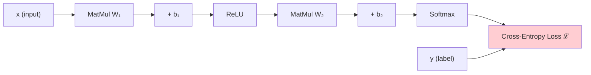
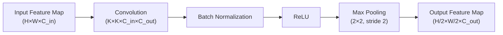
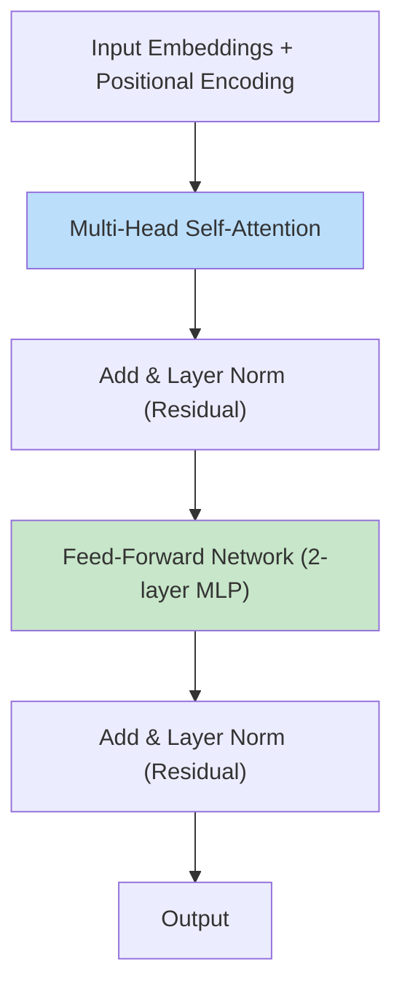

# 3. Deep Learning Foundations

!!! quote "The Meta-Narrative"
    Deep learning is not a new idea — it is an old idea that finally worked. The **perceptron** (1958) could only learn linear functions. **Backpropagation** (1986) enabled multi-layer learning but lacked the data and compute to shine. **AlexNet** (2012) proved that deep CNNs + GPUs + ImageNet = superhuman vision. **Transformers** (2017) replaced recurrence with attention, enabling the foundation model era. Each breakthrough built on a specific mathematical insight. This chapter traces those insights from the inside.

---

## 3.1 Neural Networks: From Perceptrons to Universal Approximation

### The Perceptron: Where It All Began

The perceptron computes:

\[
\hat{y} = \text{sign}(w^T x + b)
\]

The **Perceptron Convergence Theorem** guarantees that if data is linearly separable, the algorithm converges in a finite number of steps.

!!! tip "Historical Insight: The AI Winter"
    In 1969, Marvin Minsky and Seymour Papert published *Perceptrons*, proving that a single-layer perceptron **cannot learn XOR**. This result — that linear models can't capture interactions — devastated neural network research for nearly two decades. The solution was obvious in hindsight: add more layers. But without backpropagation, there was no way to train them.

### Multi-Layer Perceptrons: The Architecture

A feedforward network with \(L\) layers computes:

\[
a^{(0)} = x
\]
\[
z^{(l)} = W^{(l)} a^{(l-1)} + b^{(l)}, \quad a^{(l)} = \sigma(z^{(l)}) \quad \text{for } l = 1, ..., L
\]

### Activation Functions: The Non-Linearity That Makes It Work

Without non-linear activations, a multi-layer network collapses to a single linear transformation: \(W_L \cdots W_2 W_1 x = W' x\). Each activation serves a specific purpose:

=== "ReLU"

    \[
    \sigma(x) = \max(0, x), \quad \sigma'(x) = \begin{cases} 1 & x > 0 \\ 0 & x \leq 0 \end{cases}
    \]

    **Why it works**: Gradient is either 0 or 1 — no vanishing gradient for positive inputs. Computationally trivial.

    **The problem**: "Dying ReLU" — neurons that output 0 for all inputs stop learning permanently.

=== "Leaky ReLU"

    \[
    \sigma(x) = \begin{cases} x & x > 0 \\ \alpha x & x \leq 0 \end{cases}
    \]

    Fixes dying ReLU by allowing a small gradient (\(\alpha = 0.01\)) for negative inputs.

=== "GELU"

    \[
    \sigma(x) = x \cdot \Phi(x) \approx x \cdot \frac{1}{2}\left[1 + \tanh\left(\sqrt{2/\pi}(x + 0.044715x^3)\right)\right]
    \]

    Used in **BERT** and **GPT**. Smooth approximation that stochastically gates inputs.

=== "Sigmoid"

    \[
    \sigma(x) = \frac{1}{1 + e^{-x}}, \quad \sigma'(x) = \sigma(x)(1 - \sigma(x))
    \]

    Maximum gradient of 0.25 at \(x=0\) → vanishing gradients in deep networks. Largely deprecated for hidden layers.

### The Universal Approximation Theorem

**Theorem** (Cybenko, 1989; Hornik, 1991): A feedforward network with a single hidden layer of sufficient width can approximate any continuous function on \(\mathbb{R}^n\) to arbitrary accuracy.

!!! warning "What This Theorem Does NOT Say"
    It guarantees **existence**, not **learnability**. The required width may be exponentially large. It says nothing about whether gradient descent can find the approximation. It's an existence proof, not a construction manual — which is why deep (many-layer) networks work better in practice than wide shallow ones.

---

## 3.2 Backpropagation: The Algorithm That Changed Everything

### Computation Graphs: The Internal Representation

Modern frameworks (PyTorch, TensorFlow) represent neural networks as **Directed Acyclic Graphs** (DAGs) where:
- **Nodes** = operations (matmul, add, activation)
- **Edges** = tensors (intermediate values)



### Forward Pass
Compute the output layer by layer, storing intermediate activations for the backward pass.

### Backward Pass (Backpropagation)
Apply the **chain rule** in reverse through the computation graph:

\[
\frac{\partial \mathcal{L}}{\partial W^{(l)}} = \underbrace{\frac{\partial \mathcal{L}}{\partial z^{(l)}}}_{\delta^{(l)}} \cdot (a^{(l-1)})^T
\]

The error signal \(\delta^{(l)}\) propagates backward:

\[
\delta^{(l)} = \left((W^{(l+1)})^T \delta^{(l+1)}\right) \odot \sigma'(z^{(l)})
\]

!!! abstract "Why Backprop Is \(O(n)\), Not \(O(n^2)\)"
    A naive approach would compute the gradient of each weight independently. Backprop exploits the **graph structure** to share intermediate computations, making the backward pass roughly as expensive as the forward pass. This computational efficiency — not any mathematical insight — is what made training deep networks practical.

### The Vanishing Gradient Problem (And Its Solutions)

With sigmoid activations, the gradient at layer \(l\) contains a product of derivatives:

\[
\frac{\partial \mathcal{L}}{\partial W^{(1)}} \propto \prod_{l=1}^{L} \sigma'(z^{(l)})
\]

Since \(\max(\sigma'_{sigmoid}) = 0.25\), for \(L = 10\) layers: \(0.25^{10} \approx 10^{-6}\). Gradients vanish exponentially.

**Solutions:**

| Solution | Mechanism | Introduced |
|----------|-----------|------------|
| **ReLU activation** | Gradient = 1 for positive inputs | Glorot et al., 2011 |
| **Residual connections** | \(F(x) + x\) — gradient has a "shortcut" | He et al., 2015 |
| **Batch normalization** | Stabilize layer input distributions | Ioffe & Szegedy, 2015 |
| **Careful initialization** | Xavier/He initialization scales weights | Glorot (2010), He (2015) |
| **Gradient clipping** | Prevents exploding gradients | Pascanu et al., 2013 |

---

## 3.3 Convolutional Neural Networks: Vision's Engine

### Why Convolutions? — Inductive Biases

CNNs exploit two key properties of images:

1. **Locality**: Nearby pixels are more related than distant ones → use small filters
2. **Translation invariance**: A cat is a cat regardless of position → share weights across positions

The convolution of input \(I\) with kernel \(K\):

\[
S(i, j) = \sum_{m} \sum_{n} I(i+m, j+n) \cdot K(m, n)
\]

### What's Inside a CNN Layer



**Parameter count**: A \(3\times3\) conv layer with \(C_{in}\) input channels and \(C_{out}\) output channels has \(3 \times 3 \times C_{in} \times C_{out} + C_{out}\) parameters. This is **far fewer** than a fully-connected layer (\(H \times W \times C_{in} \times H \times W \times C_{out}\)), which is why CNNs can go deep without overfitting.

### ResNet: The Skip Connection Revolution

The key insight: make the layer learn a **residual** \(F(x)\), not the full mapping:

\[
\text{output} = F(x) + x
\]

**Why this works (the gradient view)**: During backpropagation, the gradient through a residual block is:

\[
\frac{\partial \mathcal{L}}{\partial x} = \frac{\partial \mathcal{L}}{\partial \text{output}} \cdot \left(\frac{\partial F(x)}{\partial x} + I\right)
\]

The \(+I\) term ensures the gradient is **at least 1** along the identity path — the vanishing gradient problem is solved by construction.

!!! tip "Historical Insight: The ImageNet Revolution"
    | Year | Model | Top-5 Error | Layers | Key Innovation |
    |------|-------|-------------|--------|---------------|
    | 2012 | AlexNet | 16.4% | 8 | ReLU + Dropout + GPU |
    | 2014 | VGG-16 | 7.3% | 16 | Depth with 3×3 filters |
    | 2014 | GoogLeNet | 6.7% | 22 | Inception modules |
    | 2015 | **ResNet** | **3.6%** | **152** | Skip connections |
    | 2017 | SENet | 2.3% | 152 | Channel attention |
    | Human | — | ~5.1% | — | — |

    ResNet crossed the "human-level" threshold on ImageNet. This milestone — December 2015 — is often cited as the moment deep learning proved itself undeniably superior.

---

## 3.4 Sequence Models: RNNs, LSTMs, and the Attention Mechanism

### RNN: The Temporal Architecture

\[
h_t = \tanh(W_{xh} x_t + W_{hh} h_{t-1} + b_h)
\]

The hidden state \(h_t\) is a compressed representation of the entire sequence \(x_1, ..., x_t\). But this compression is **lossy** — RNNs struggle with long-range dependencies.

### LSTM: Gated Memory

LSTMs introduce a **cell state** \(c_t\) — a conveyor belt that information flows along, modified by gates:

\[
f_t = \sigma(W_f [h_{t-1}, x_t] + b_f) \quad \text{(forget gate: what to erase)}
\]
\[
i_t = \sigma(W_i [h_{t-1}, x_t] + b_i) \quad \text{(input gate: what to write)}
\]
\[
\tilde{c}_t = \tanh(W_c [h_{t-1}, x_t] + b_c) \quad \text{(candidate value)}
\]
\[
c_t = f_t \odot c_{t-1} + i_t \odot \tilde{c}_t \quad \text{(cell update)}
\]
\[
o_t = \sigma(W_o [h_{t-1}, x_t] + b_o) \quad \text{(output gate)}
\]
\[
h_t = o_t \odot \tanh(c_t)
\]

!!! abstract "Why LSTM Solves Vanishing Gradients"
    The gradient through the cell state is:

    \[
    \frac{\partial c_t}{\partial c_{t-1}} = f_t
    \]

    When \(f_t \approx 1\) (forget gate open), the gradient flows **unchanged** through time. This is the "constant error carousel" — Hochreiter & Schmidhuber's key insight from 1997. The LSTM can maintain a signal over hundreds of timesteps where vanilla RNNs fail at ~10.

---

## 3.5 The Transformer: Attention Is All You Need

### Scaled Dot-Product Attention

\[
\text{Attention}(Q, K, V) = \text{softmax}\left(\frac{QK^T}{\sqrt{d_k}}\right) V
\]

**Why \(\sqrt{d_k}\)?** Without scaling, dot products grow proportionally to \(d_k\), pushing softmax into saturation (near-0/near-1 outputs), which kills gradients. Dividing by \(\sqrt{d_k}\) keeps the variance of the logits at ~1 regardless of dimension.

### Multi-Head Attention: Attending to Different Subspaces

\[
\text{MultiHead}(Q, K, V) = \text{Concat}(\text{head}_1, ..., \text{head}_h) W^O
\]
\[
\text{head}_i = \text{Attention}(QW_i^Q, KW_i^K, VW_i^V)
\]

Each head learns to attend to **different types of relationships** — one head might capture syntax, another semantics, another positional patterns.

### Positional Encoding: Injecting Order

\[
PE_{(pos, 2i)} = \sin\left(\frac{pos}{10000^{2i/d}}\right), \quad PE_{(pos, 2i+1)} = \cos\left(\frac{pos}{10000^{2i/d}}\right)
\]

!!! abstract "Why Sinusoidal? (The Deep Insight)"
    The sinusoidal encoding has a remarkable property: for any fixed offset \(k\), \(PE_{pos+k}\) can be expressed as a **linear transformation** of \(PE_{pos}\). This means the model can learn to attend to relative positions using simple linear projections — without needing to see every possible absolute position during training.

### The Complete Transformer Block



### Transformer Computational Cost

| Operation | Time Complexity | Space Complexity |
|-----------|----------------|-----------------|
| Self-attention | \(O(n^2 d)\) | \(O(n^2 + nd)\) |
| Feed-forward | \(O(nd^2)\) | \(O(nd)\) |
| Total per layer | \(O(n^2 d + nd^2)\) | \(O(n^2 + nd)\) |

The \(O(n^2)\) attention cost limits context length. Research into **linear attention** (Performer), **sparse attention** (Longformer), and **Flash Attention** (Dao et al.) addresses this bottleneck.

??? example "🚀 Lab: Implementing Scaled Dot-Product Attention from Scratch"
    ```python
    import torch
    import torch.nn as nn
    import torch.nn.functional as F
    import math

    class ScaledDotProductAttention(nn.Module):
        def __init__(self, d_k):
            super().__init__()
            self.d_k = d_k
        
        def forward(self, Q, K, V, mask=None):
            # Q, K, V shape: (batch, seq_len, d_k)
            scores = torch.matmul(Q, K.transpose(-2, -1)) / math.sqrt(self.d_k)
            
            if mask is not None:
                scores = scores.masked_fill(mask == 0, float('-inf'))
            
            attention_weights = F.softmax(scores, dim=-1)
            output = torch.matmul(attention_weights, V)
            return output, attention_weights

    class MultiHeadAttention(nn.Module):
        def __init__(self, d_model, num_heads):
            super().__init__()
            assert d_model % num_heads == 0
            self.d_k = d_model // num_heads
            self.num_heads = num_heads
            
            self.W_q = nn.Linear(d_model, d_model)
            self.W_k = nn.Linear(d_model, d_model)
            self.W_v = nn.Linear(d_model, d_model)
            self.W_o = nn.Linear(d_model, d_model)
            self.attention = ScaledDotProductAttention(self.d_k)
        
        def forward(self, Q, K, V, mask=None):
            batch_size = Q.size(0)
            
            # Project and reshape: (batch, seq, d_model) → (batch, heads, seq, d_k)
            Q = self.W_q(Q).view(batch_size, -1, self.num_heads, self.d_k).transpose(1, 2)
            K = self.W_k(K).view(batch_size, -1, self.num_heads, self.d_k).transpose(1, 2)
            V = self.W_v(V).view(batch_size, -1, self.num_heads, self.d_k).transpose(1, 2)
            
            output, weights = self.attention(Q, K, V, mask)
            
            # Concat heads: (batch, heads, seq, d_k) → (batch, seq, d_model)
            output = output.transpose(1, 2).contiguous().view(batch_size, -1, self.num_heads * self.d_k)
            return self.W_o(output), weights

    # Test
    mha = MultiHeadAttention(d_model=512, num_heads=8)
    x = torch.randn(2, 10, 512)  # batch=2, seq_len=10, d_model=512
    output, attn_weights = mha(x, x, x)
    print(f"Output shape: {output.shape}")          # (2, 10, 512)
    print(f"Attention shape: {attn_weights.shape}")  # (2, 8, 10, 10)
    ```

---

## References

- Rosenblatt, F. (1958). *The Perceptron: A Probabilistic Model for Information Storage*.
- Rumelhart, D. E. et al. (1986). *Learning Representations by Back-Propagating Errors*. Nature.
- Cybenko, G. (1989). *Approximation by Superpositions of a Sigmoidal Function*.
- Hochreiter, S. & Schmidhuber, J. (1997). *Long Short-Term Memory*. Neural Computation.
- He, K. et al. (2015). *Deep Residual Learning for Image Recognition*. CVPR.
- Vaswani, A. et al. (2017). *Attention Is All You Need*. NeurIPS.
- Dao, T. et al. (2022). *FlashAttention: Fast and Memory-Efficient Exact Attention*. NeurIPS.
