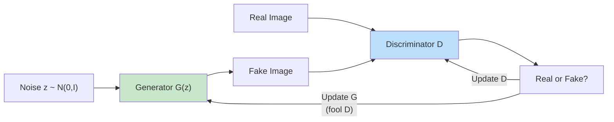

# 4. Generative Models and Reinforcement Learning

!!! quote "The Meta-Narrative"
    For decades, ML was about **discriminating** — classifying, predicting, ranking. Generative models flipped the script: can we teach machines to **create**? The journey from Boltzmann Machines (1985) through VAEs and GANs (2014) to Diffusion Models (2020) is a story of finding better ways to model complex, high-dimensional probability distributions. Meanwhile, reinforcement learning addresses a different frontier: agents that **act** in the world, learning from consequences rather than labels. Together, these paradigms power the most visible AI of today — ChatGPT (RLHF), Stable Diffusion (diffusion models), and AlphaFold (RL + structure prediction).

---

## 4.1 Variational Autoencoders: Probabilistic Generation

### The Generative Model

A VAE posits a latent variable model:

\[
p_\theta(x) = \int p_\theta(x|z) p(z) \, dz
\]

where \(p(z) = \mathcal{N}(0, I)\) is the prior and \(p_\theta(x|z)\) is a neural decoder. The integral is **intractable** — we can't compute it or its gradient.

### The Variational Trick

Introduce an approximate posterior \(q_\phi(z|x)\) (encoder) and derive a tractable objective — the **Evidence Lower Bound (ELBO)**:

\[
\log p_\theta(x) \geq \underbrace{\mathbb{E}_{q_\phi(z|x)}[\log p_\theta(x|z)]}_{\text{Reconstruction quality}} - \underbrace{D_{KL}(q_\phi(z|x) \| p(z))}_{\text{Regularization toward prior}} = \text{ELBO}
\]

!!! abstract "Why The ELBO is Tight (The Deep Insight)"
    The gap between \(\log p(x)\) and the ELBO is exactly \(D_{KL}(q_\phi(z|x) \| p_\theta(z|x))\) — how well our encoder approximates the true posterior. As \(q_\phi\) gets better, the bound tightens. This is why more expressive encoders (normalizing flows, autoregressive posteriors) improve VAE performance.

### The Reparameterization Trick

We can't backpropagate through sampling \(z \sim q_\phi(z|x)\). The solution: reparameterize as a deterministic function of a noise variable:

\[
z = \mu_\phi(x) + \sigma_\phi(x) \odot \epsilon, \quad \epsilon \sim \mathcal{N}(0, I)
\]

Now gradients flow through \(\mu_\phi\) and \(\sigma_\phi\) while \(\epsilon\) is treated as input.

---

## 4.2 Generative Adversarial Networks: Learning by Deception

### The Minimax Game

\[
\min_G \max_D \; V(D, G) = \mathbb{E}_{x \sim p_{data}}[\log D(x)] + \mathbb{E}_{z \sim p_z}[\log(1 - D(G(z)))]
\]

!!! abstract "Nash Equilibrium (The Internal View)"
    At the Nash equilibrium: \(p_G = p_{data}\) and \(D^*(x) = \frac{1}{2}\) everywhere. But in practice, GANs rarely reach this equilibrium. The generator and discriminator engage in a non-stationary, non-convex game. Training dynamics include:

    - **Mode collapse**: Generator produces only a few types of outputs
    - **Oscillation**: G and D alternate "winning" without convergence
    - **Vanishing generator gradient**: When D is too strong, G receives near-zero gradients

    These are not bugs — they are fundamental properties of minimax optimization in non-convex settings. Solutions include **Wasserstein GAN** (WGAN), **spectral normalization**, and **progressive growing**.

### GAN Training Instability: A Deeper Look



The **Wasserstein distance** (Earth Mover's Distance) provides a smoother loss landscape:

\[
W(p_r, p_g) = \inf_{\gamma \in \Pi(p_r, p_g)} \mathbb{E}_{(x,y) \sim \gamma}[\|x - y\|]
\]

WGAN replaces the discriminator with a **critic** (no sigmoid) and enforces a Lipschitz constraint.

---

## 4.3 Diffusion Models: From Noise to Images

### The Forward Process (Noising)

Gradually corrupt data \(x_0\) by adding Gaussian noise over \(T\) timesteps:

\[
q(x_t | x_{t-1}) = \mathcal{N}(x_t; \sqrt{1 - \beta_t} \, x_{t-1}, \, \beta_t I)
\]

Using the reparameterization trick, we can sample \(x_t\) directly from \(x_0\):

\[
q(x_t | x_0) = \mathcal{N}(x_t; \sqrt{\bar{\alpha}_t} \, x_0, \, (1 - \bar{\alpha}_t) I)
\]

where \(\bar{\alpha}_t = \prod_{s=1}^t (1 - \beta_s)\).

### The Reverse Process (Denoising)

A neural network \(\epsilon_\theta\) learns to predict the noise added at each step:

\[
\mathcal{L}_{simple} = \mathbb{E}_{t, x_0, \epsilon}\left[\|\epsilon - \epsilon_\theta(x_t, t)\|^2\right]
\]

This is equivalent to **score matching** — learning the gradient of the log-density \(\nabla_x \log p(x_t)\).

!!! tip "Historical Insight: The Score Matching Connection"
    Hyvärinen (2005) introduced score matching: estimating \(\nabla_x \log p(x)\) without knowing the normalizing constant. Song & Ermon (2019) connected this to Langevin dynamics for sampling. Ho et al. (2020) showed that diffusion models implement iterative score-based sampling with a learned noise schedule. These three threads — spanning 15 years — converged to create the technology behind Stable Diffusion.

### Why Diffusion Models Beat GANs

| Property | GANs | Diffusion Models |
|----------|------|-----------------|
| Training stability | Unstable (minimax game) | Stable (regression loss) |
| Mode coverage | Mode collapse risk | Full distribution coverage |
| Sample quality | High (sharp images) | Very high (state-of-the-art) |
| Inference speed | Fast (single forward pass) | Slow (hundreds of steps) |
| Likelihood | Not available | Can compute bounds |

---

## 4.4 Reinforcement Learning: Learning from Consequences

### The Bellman Equation: The Recursive Structure of Value

\[
V^*(s) = \max_a \left[R(s,a) + \gamma \sum_{s'} P(s'|s,a) V^*(s')\right]
\]

!!! abstract "Why Bellman Matters (The Deep Insight)"
    The Bellman equation converts a **sequential decision problem** (choosing actions over many timesteps) into a **recursive** one (choosing the best action now, assuming future optimality). Dynamic programming algorithms (value iteration, policy iteration) solve this for small MDPs. For large state spaces, we need function approximation — enter Deep RL.

### Deep Q-Networks: When Bellman Meets Neural Networks

DQN's **target** for training:

\[
y_i = r_i + \gamma \max_{a'} Q_{\theta^-}(s_i', a')
\]

Where \(\theta^-\) is the **target network** (a slowly-updated copy). This prevents the "moving target" problem where the bootstrap target \(\max Q\) shifts as we update \(Q\).

### Policy Gradients: REINFORCE to PPO

**REINFORCE** (Williams, 1992):

\[
\nabla_\theta J = \mathbb{E}_\pi\left[\sum_{t=0}^T \nabla_\theta \log \pi_\theta(a_t|s_t) \cdot G_t\right]
\]

**Problem**: High variance. **Solution**: Subtract a baseline \(b(s_t)\):

\[
\nabla_\theta J \approx \mathbb{E}\left[\nabla_\theta \log \pi_\theta(a_t|s_t) \cdot (G_t - b(s_t))\right]
\]

When \(b(s_t) = V(s_t)\), this becomes the **advantage** \(A(s,a) = Q(s,a) - V(s)\).

**PPO** clips the policy ratio to prevent destructive updates:

\[
L^{CLIP}(\theta) = \mathbb{E}\left[\min\left(r_t(\theta) \hat{A}_t, \; \text{clip}(r_t(\theta), 1-\epsilon, 1+\epsilon) \hat{A}_t\right)\right]
\]

!!! abstract "RLHF: The Engine Behind ChatGPT"
    Reinforcement Learning from Human Feedback (RLHF) uses RL to align language models with human preferences:

    1. **Supervised fine-tuning**: Train LM on demonstration data
    2. **Reward modeling**: Train a reward model on human comparisons (\(A > B\))
    3. **RL optimization**: Use PPO to maximize the reward while staying close to the SFT model (KL penalty)

    This three-stage pipeline (Christiano et al., 2017; Ouyang et al., 2022) is what makes ChatGPT helpful and safe rather than merely fluent.

??? example "🚀 Lab: PPO Agent with Stable-Baselines3"
    ```python
    import gymnasium as gym
    from stable_baselines3 import PPO
    from stable_baselines3.common.evaluation import evaluate_policy

    # Create environment
    env = gym.make("CartPole-v1")

    # Train PPO agent
    model = PPO(
        "MlpPolicy", env,
        learning_rate=3e-4,
        n_steps=2048,
        batch_size=64,
        n_epochs=10,
        gamma=0.99,
        gae_lambda=0.95,
        clip_range=0.2,
        verbose=1
    )
    model.learn(total_timesteps=50_000)

    # Evaluate
    mean_reward, std_reward = evaluate_policy(model, env, n_eval_episodes=20)
    print(f"Mean reward: {mean_reward:.2f} ± {std_reward:.2f}")

    # Watch the agent
    obs, _ = env.reset()
    for _ in range(500):
        action, _ = model.predict(obs, deterministic=True)
        obs, reward, terminated, truncated, _ = env.step(action)
        if terminated or truncated:
            obs, _ = env.reset()
    ```

---

## References

- Kingma, D. P. & Welling, M. (2014). *Auto-Encoding Variational Bayes*. ICLR.
- Goodfellow, I. J. et al. (2014). *Generative Adversarial Nets*. NeurIPS.
- Ho, J. et al. (2020). *Denoising Diffusion Probabilistic Models*. NeurIPS.
- Song, Y. & Ermon, S. (2019). *Generative Modeling by Estimating Gradients of the Data Distribution*. NeurIPS.
- Arjovsky, M. et al. (2017). *Wasserstein GAN*. ICML.
- Ouyang, L. et al. (2022). *Training Language Models to Follow Instructions with Human Feedback*. NeurIPS.
