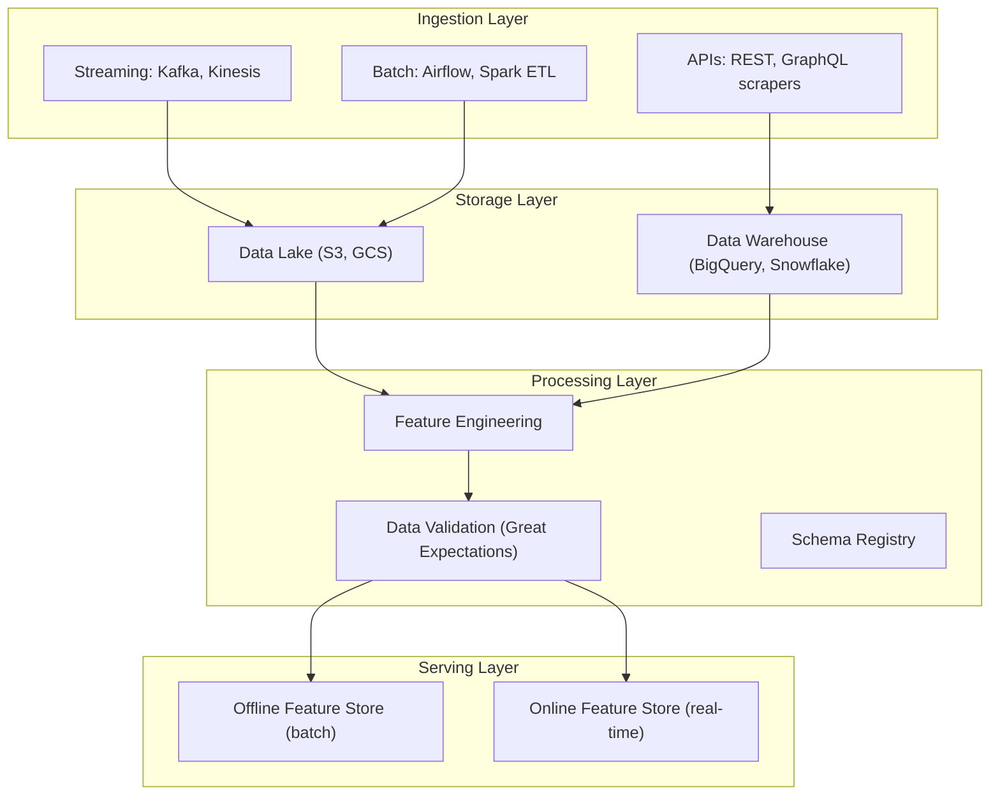
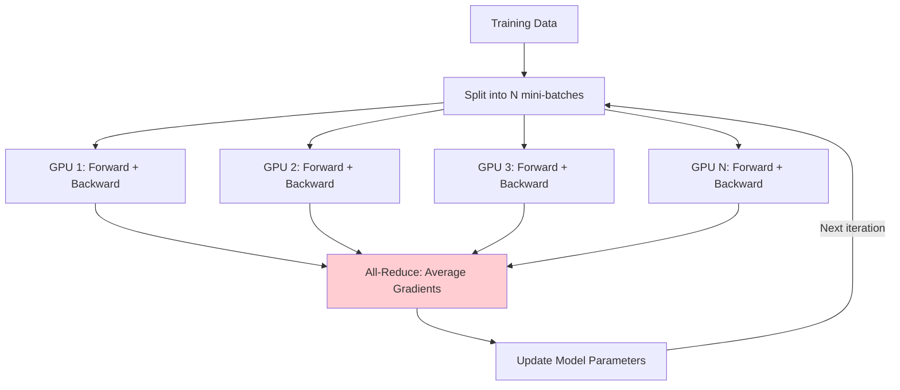
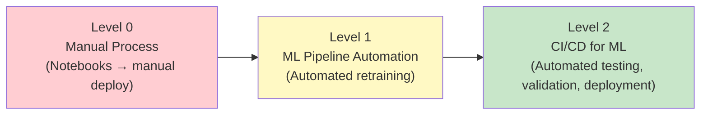

# 5. Machine Learning Systems and Infrastructure

!!! quote "The Meta-Narrative"
    A model that works in a Jupyter notebook is not a product. The distance from `model.fit()` to "millions of users served reliably at 50ms latency" is enormous — and it's where most ML projects fail. Sculley et al. (2015) showed that ML code is a **tiny fraction** of a real ML system. The rest is data pipelines, feature stores, serving infrastructure, monitoring, and the glue that holds it together. This chapter is about that 95% of the iceberg you don't see. Understanding it is what separates a data scientist from an ML Engineer.

---

## 5.1 Data Engineering: The Foundation You Can't Skip

### The Data Pipeline Architecture



### Feature Stores: The Unsung Hero

!!! abstract "Why Feature Stores Exist (The Deep Problem)"
    The #1 cause of ML production failures is **training-serving skew** — the features computed during training differ from those at serving time due to:

    - Different code paths (Python offline vs Java online)
    - Different timestamps (feature leakage during training)
    - Missing value handling discrepancies

    A feature store solves this by providing a **single source of truth** for feature computation, with consistent offline (training) and online (serving) views.

### Data Versioning: Why Git Isn't Enough

Code is small. Data is large. You can't put 100GB of training data in Git. **DVC** (Data Version Control) solves this:

- Stores data in remote storage (S3, GCS)
- Tracks metadata (hashes) in Git
- Enables `dvc checkout` to reproduce any historical dataset state
- Integrates with ML pipelines for full experiment reproducibility

---

## 5.2 Distributed Training: Scaling Beyond One GPU

### Data Parallelism: The Most Common Approach



**All-Reduce** synchronizes gradients across all GPUs. The **Ring All-Reduce** algorithm achieves this in \(O(p \cdot \frac{n}{p})\) communication cost (independent of number of GPUs).

### The Batch Size Problem

When using \(N\) GPUs, the effective batch size is \(N \times B_{local}\). Larger batches:

- ✅ More gradient parallelism → faster wall-clock training
- ❌ Generalization degradation (large-batch training problem)
- ❌ Learning rate must scale (linear scaling rule: \(\eta' = \eta \times N\))

!!! abstract "The Linear Scaling Rule (and When It Breaks)"
    Goyal et al. (2017) at Facebook showed: when multiplying batch size by \(k\), multiply learning rate by \(k\) with a **warmup period**. This works up to batch sizes of ~8K for ResNet on ImageNet. Beyond that, more sophisticated techniques are needed (LARS, LAMB optimizers).

### Model Parallelism: When the Model Is Too Large

| Strategy | How It Works | When to Use |
|----------|-------------|-------------|
| **Pipeline Parallelism** | Split layers across GPUs; micro-batching | Models with many sequential layers |
| **Tensor Parallelism** | Split individual layers (e.g., attention heads) | Very wide layers (LLMs) |
| **Expert Parallelism** | Different experts on different GPUs (MoE) | Mixture-of-Experts models |
| **ZeRO** (DeepSpeed) | Shard optimizer states, gradients, parameters | Any model too large for one GPU |

---

## 5.3 Frameworks: What's Under the Hood

### PyTorch Autograd: Dynamic Computation Graphs

Every tensor operation in PyTorch creates a node in a **dynamic computation graph**. When you call `.backward()`, PyTorch traverses this graph in reverse (topological sort) to compute gradients.

!!! abstract "Static vs Dynamic Graphs (The Engineering Tradeoff)"
    | | Static (TF 1.x, XLA) | Dynamic (PyTorch, TF 2 eager) |
    |--|---|---|
    | **Graph built** | Before execution (compile-then-run) | During execution (define-by-run) |
    | **Debugging** | Hard (graph is opaque) | Easy (standard Python debugging) |
    | **Optimization** | Extensive (operator fusion, constant folding) | Limited (but JIT helps) |
    | **Control flow** | Special ops (tf.cond, tf.while_loop) | Native Python (if/for/while) |

    JAX takes a third path: **functional transformations**. You write pure Python functions and compose them with `jit`, `grad`, `vmap`, `pmap`. This gives you both the flexibility of dynamic graphs and the optimization potential of compilation.

---

## 5.4 MLOps: The Production Lifecycle

### MLOps Maturity Model



### Monitoring: Catching Problems Before Users Do

**Types of drift:**

=== "Data Drift"

    Input features shift (e.g., user demographics change). Detected via statistical tests:

    - **KL Divergence**: \(D_{KL}(P_{train} \| P_{prod}) = \sum P_{train}(x) \log \frac{P_{train}(x)}{P_{prod}(x)}\)
    - **Population Stability Index (PSI)**: A symmetric, binned version of KL
    - **Kolmogorov-Smirnov test**: Non-parametric, distribution-free

=== "Concept Drift"

    The relationship \(P(Y|X)\) changes. The model's predictions become stale. Example: user preferences shift during a pandemic.

=== "Model Decay"

    Prediction quality degrades gradually as the world changes. Requires **continuous evaluation** against ground truth (which may arrive with a delay).

??? example "🚀 Lab: Building an ML Monitoring Dashboard"
    ```python
    import numpy as np
    from scipy import stats

    def psi(expected, actual, bins=10):
        """Population Stability Index for detecting data drift."""
        breakpoints = np.linspace(
            min(expected.min(), actual.min()),
            max(expected.max(), actual.max()),
            bins + 1
        )
        expected_pcts = np.histogram(expected, breakpoints)[0] / len(expected)
        actual_pcts = np.histogram(actual, breakpoints)[0] / len(actual)
        
        # Avoid division by zero
        expected_pcts = np.clip(expected_pcts, 1e-4, None)
        actual_pcts = np.clip(actual_pcts, 1e-4, None)
        
        psi_value = np.sum((actual_pcts - expected_pcts) * np.log(actual_pcts / expected_pcts))
        return psi_value

    def detect_drift(reference, production, alpha=0.05):
        """Kolmogorov-Smirnov test for distribution change."""
        ks_stat, p_value = stats.ks_2samp(reference, production)
        drift_detected = p_value < alpha
        return {
            'ks_statistic': ks_stat,
            'p_value': p_value,
            'drift_detected': drift_detected,
            'psi': psi(reference, production),
        }

    # Simulate drift
    np.random.seed(42)
    reference_data = np.random.normal(0, 1, 1000)
    production_no_drift = np.random.normal(0, 1, 1000)
    production_with_drift = np.random.normal(0.5, 1.2, 1000)  # Mean and variance shifted

    print("No drift:", detect_drift(reference_data, production_no_drift))
    print("With drift:", detect_drift(reference_data, production_with_drift))
    ```

??? example "🚀 Lab: Model Serving with FastAPI and Docker"
    ```python
    # app.py
    from fastapi import FastAPI
    from pydantic import BaseModel
    import torch
    import numpy as np

    app = FastAPI(title="ML Model Server")

    # Load model at startup
    model = torch.jit.load("model_scripted.pt")
    model.eval()

    class PredictionRequest(BaseModel):
        features: list[float]

    class PredictionResponse(BaseModel):
        prediction: list[float]
        confidence: float

    @app.post("/predict", response_model=PredictionResponse)
    async def predict(request: PredictionRequest):
        input_tensor = torch.FloatTensor([request.features])
        with torch.no_grad():
            output = torch.softmax(model(input_tensor), dim=1)
            prediction = output.numpy().tolist()[0]
            confidence = float(max(prediction))
        return PredictionResponse(prediction=prediction, confidence=confidence)

    @app.get("/health")
    async def health():
        return {"status": "healthy", "model_loaded": True}

    # Dockerfile:
    # FROM python:3.10-slim
    # COPY requirements.txt .
    # RUN pip install -r requirements.txt
    # COPY app.py model_scripted.pt ./
    # CMD ["uvicorn", "app:app", "--host", "0.0.0.0", "--port", "8000"]
    ```

---

## References

- Sculley, D. et al. (2015). *Hidden Technical Debt in Machine Learning Systems*. NeurIPS.
- Goyal, P. et al. (2017). *Accurate, Large Minibatch SGD: Training ImageNet in 1 Hour*. arXiv.
- Rajbhandari, S. et al. (2020). *ZeRO: Memory Optimizations Toward Training Trillion Parameter Models*. SC.
- Paleyes, A. et al. (2022). *Challenges in Deploying Machine Learning*. ACM Computing Surveys.
