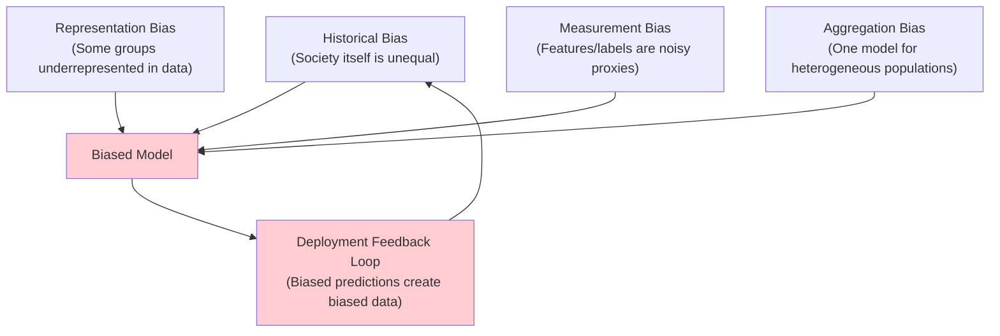
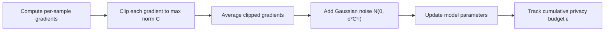
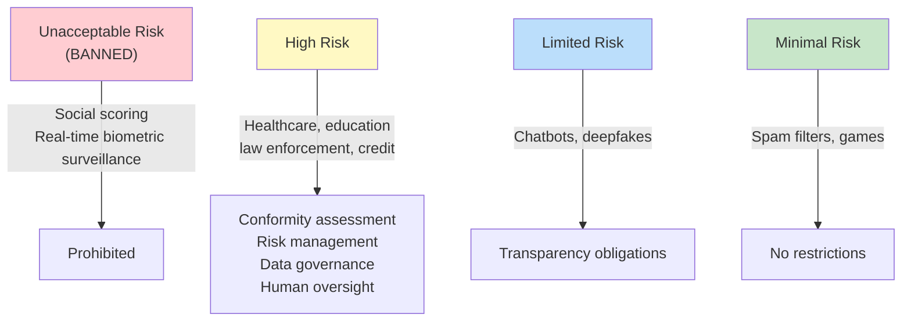

# 6. Ethics, Safety, and Governance

!!! quote "The Meta-Narrative"
    The question is no longer *can we build powerful AI?* but *should we, and how do we do it responsibly?* Every major AI deployment decision involves tradeoffs between utility, fairness, privacy, and safety. These aren't philosophical abstractions — they're engineering constraints. A credit scoring model that discriminates by race will face regulatory action. A language model that leaks training data violates GDPR. A recommendation system that maximizes engagement may also maximize radicalization. This chapter provides the mathematical tools and regulatory knowledge to navigate these tradeoffs rigorously.

---

## 6.1 Bias and Fairness: Mathematical Definitions

### Sources of Bias: A Taxonomy



### Formal Fairness Criteria

=== "Demographic Parity"

    Predictions are independent of the sensitive attribute \(A\):

    \[
    P(\hat{Y} = 1 | A = 0) = P(\hat{Y} = 1 | A = 1)
    \]

    **Problem**: Ignores actual base rates. If group A has genuinely higher risk, this forces equal prediction rates, reducing accuracy.

=== "Equalized Odds"

    True positive and false positive rates are equal across groups:

    \[
    P(\hat{Y} = 1 | Y = y, A = 0) = P(\hat{Y} = 1 | Y = y, A = 1) \quad \forall y \in \{0, 1\}
    \]

    **Advantage**: Conditions on the true label, allowing different prediction rates if justified by different base rates.

=== "Calibration"

    Among all individuals predicted \(\hat{Y} = p\), the actual positive rate should be \(p\), regardless of group:

    \[
    P(Y = 1 | \hat{Y} = p, A = a) = p \quad \forall a, p
    \]

=== "Individual Fairness"

    Similar individuals should receive similar predictions:

    \[
    d(\hat{f}(x_i), \hat{f}(x_j)) \leq L \cdot d(x_i, x_j)
    \]

    **The hard part**: Defining the "similarity metric" \(d\) requires domain knowledge and is inherently subjective.

!!! danger "The Impossibility Theorem"
    Chouldechova (2017) and Kleinberg et al. (2016) proved that **when base rates differ between groups, it is mathematically impossible to simultaneously satisfy calibration, equal false positive rates, and equal false negative rates** (except in trivial cases). This forces practitioners to make explicit value judgments — there is no "fair by default" option.

---

## 6.2 Privacy: Differential Privacy Internals

### The Core Definition

A randomized mechanism \(\mathcal{M}\) is \((\epsilon, \delta)\)-differentially private if for all subsets \(S\) and neighboring datasets \(D, D'\) (differing in one record):

\[
P[\mathcal{M}(D) \in S] \leq e^\epsilon P[\mathcal{M}(D') \in S] + \delta
\]

\(\epsilon\) controls the **privacy budget**: smaller \(\epsilon\) = stronger privacy.

### DP-SGD: How It Works Internally



The noise scale \(\sigma\) is calibrated to the sensitivity (controlled by the clipping norm \(C\)):

\[
\text{Noise} \sim \mathcal{N}(0, \sigma^2 C^2 I), \quad \sigma = \frac{\sqrt{2 \ln(1.25/\delta)}}{\epsilon}
\]

!!! abstract "The Privacy-Utility Tradeoff"
    | \(\epsilon\) | Privacy Level | Typical Accuracy Impact |
    |-------------|---------------|----------------------|
    | 0.1 | Very strong | 10-30% accuracy drop |
    | 1.0 | Strong | 3-10% accuracy drop |
    | 10.0 | Moderate | <3% accuracy drop |
    | ∞ | None (standard training) | Baseline |

    The art of DP-SGD is choosing \(\epsilon\) that provides meaningful privacy guarantees while retaining useful model performance.

---

## 6.3 Adversarial Robustness: When Models Break

### FGSM: The Simplest Attack

\[
x_{adv} = x + \epsilon \cdot \text{sign}(\nabla_x L(\theta, x, y))
\]

!!! abstract "Why Neural Networks Are Vulnerable (The Deep Insight)"
    Goodfellow et al. (2015) showed that adversarial vulnerability is not a bug of specific architectures — it's a **consequence of linearity in high dimensions**. Even linear models are vulnerable: for an input \(x \in \mathbb{R}^n\), a perturbation of magnitude \(\epsilon\) in each dimension causes a prediction change of \(\epsilon \cdot \|w\|_1\), which grows with dimensionality. Deep networks, which are largely piecewise linear (ReLU), inherit this vulnerability.

### The Robustness-Accuracy Tradeoff

Tsipras et al. (2019) showed that **robustness and accuracy may be fundamentally at odds** — robust models learn qualitatively different features (more semantically meaningful but less discriminative). This creates a genuine engineering tradeoff.

??? example "🚀 Lab: FGSM Attack and Adversarial Training"
    ```python
    import torch
    import torch.nn as nn
    import torch.nn.functional as F
    from torchvision import datasets, transforms, models
    from torch.utils.data import DataLoader

    def fgsm_attack(model, images, labels, epsilon):
        images.requires_grad = True
        outputs = model(images)
        loss = F.cross_entropy(outputs, labels)
        model.zero_grad()
        loss.backward()
        
        perturbed = images + epsilon * images.grad.sign()
        perturbed = torch.clamp(perturbed, 0, 1)
        return perturbed

    def evaluate_robustness(model, test_loader, epsilons=[0, 0.01, 0.05, 0.1, 0.3]):
        model.eval()
        for eps in epsilons:
            correct = 0
            total = 0
            for images, labels in test_loader:
                if eps > 0:
                    images = fgsm_attack(model, images, labels, eps)
                outputs = model(images)
                _, predicted = torch.max(outputs, 1)
                total += labels.size(0)
                correct += (predicted == labels).sum().item()
            print(f"ε = {eps:.2f} | Accuracy: {100 * correct / total:.1f}%")

    # A typical result shows dramatic accuracy drops:
    # ε = 0.00 | Accuracy: 95.2%
    # ε = 0.01 | Accuracy: 82.4%
    # ε = 0.05 | Accuracy: 43.1%
    # ε = 0.10 | Accuracy: 12.7%
    # ε = 0.30 | Accuracy: 1.3%
    ```

---

## 6.4 Explainability: Opening the Black Box

### SHAP: Game-Theoretic Feature Attribution

SHAP values are the unique attribution method satisfying three axioms (efficiency, symmetry, dummy):

\[
\phi_i(f, x) = \sum_{S \subseteq N \setminus \{i\}} \frac{|S|!(|N| - |S| - 1)!}{|N|!}\left[f(S \cup \{i\}) - f(S)\right]
\]

!!! abstract "The Computational Challenge"
    Exact Shapley values require \(2^n\) model evaluations (\(n\) = number of features). **TreeSHAP** (Lundberg et al., 2020) computes them in \(O(TLD^2)\) for tree ensembles (where \(T\) = trees, \(L\) = leaves, \(D\) = depth). **KernelSHAP** approximates them for any model using weighted linear regression on sampled coalitions.

---

## 6.5 AI Governance and the Regulatory Landscape

### The EU AI Act: Risk-Based Classification



### The Alignment Problem

!!! warning "Long-Term Safety"
    As AI systems become more capable, **alignment** — ensuring AI objectives match human values — becomes critical. Key concerns:

    - **Reward hacking**: Agents optimize proxy rewards in unintended ways
    - **Specification gaming**: Satisfying the letter but not spirit of objectives
    - **Distributional shift**: Models deployed outside their training distribution
    - **Power-seeking**: Theoretical concern that sufficiently capable agents might resist shutdown

    Current approaches include RLHF, constitutional AI, debate, and scaled oversight. None are considered sufficient for superhuman AI systems.

---

## References

- Chouldechova, A. (2017). *Fair Prediction with Disparate Impact: A Study of Bias in Recidivism Prediction Instruments*.
- Kleinberg, J. et al. (2016). *Inherent Trade-Offs in the Fair Determination of Risk Scores*. ITCS.
- Abadi, M. et al. (2016). *Deep Learning with Differential Privacy*. CCS.
- Goodfellow, I. J. et al. (2015). *Explaining and Harnessing Adversarial Examples*. ICLR.
- Tsipras, D. et al. (2019). *Robustness May Be at Odds with Accuracy*. ICLR.
- Lundberg, S. M. et al. (2020). *From Local Explanations to Global Understanding with Explainable AI for Trees*. Nature MI.
