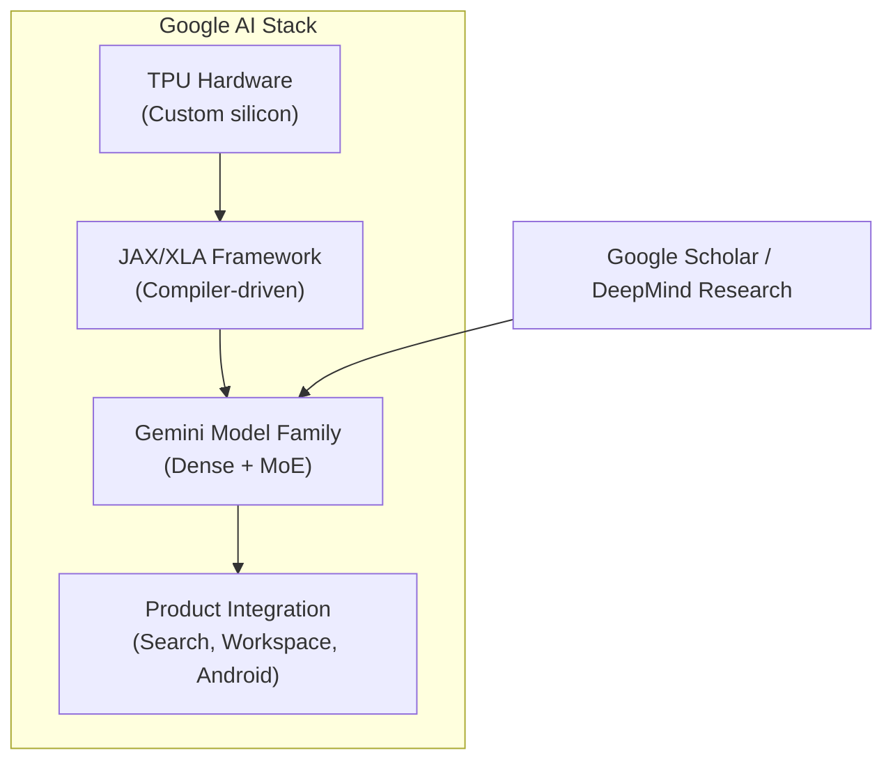
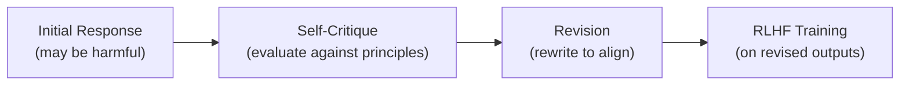
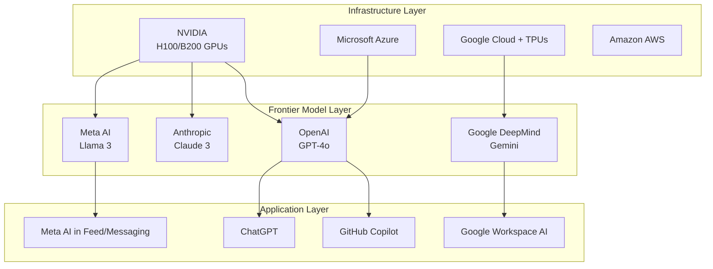

# :material-office-building: Tech Giants & the AI Frontier

!!! quote "The Meta-Narrative"
    The AI revolution is not just a story of algorithms — it's a story of **organizations**. A handful of companies control the compute, data, and talent that drive frontier AI research. Understanding their strategies, architectures, and competitive dynamics is essential for anyone working in AI engineering. This page deconstructs how the tech giants are shaping the AI landscape.

---

## Google DeepMind

### Strategy: AI-First, Vertically Integrated

Google's AI strategy spans the entire stack: custom hardware (TPUs), foundational research (Transformers, AlphaFold), and product integration (Search, Gmail, Android).

**Key Innovations:**

| Innovation | Year | Impact |
|-----------|------|--------|
| **Transformer** ("Attention Is All You Need") | 2017 | Foundation of all modern LLMs |
| **BERT** | 2018 | Revolutionized NLP transfer learning |
| **AlphaGo / AlphaZero** | 2016-17 | Superhuman game-playing via self-play RL |
| **AlphaFold 2** | 2021 | Solved 50-year protein folding problem |
| **Gemini** | 2023-24 | Multimodal frontier model family |
| **TPU v5** | 2023 | Custom AI accelerator at scale |

**Architectural Approach:**

!!! abstract "The DeepMind Merger"
    In 2023, Google merged Google Brain and DeepMind into **Google DeepMind**, consolidating two of the world's strongest AI labs. Brain brought engineering scale (Transformers, TensorFlow, TPUs); DeepMind brought research depth (AlphaGo, AlphaFold, game-playing agents). The merger signals a shift from fundamental research toward applied, productized AI.

---

## OpenAI

### Strategy: Scaling Laws + Alignment + API Monetization

OpenAI's thesis: **scale is all you need** (at least for now). Their approach bets on scaling compute, data, and parameters to unlock emergent capabilities.

**Key Innovations:**

| Innovation | Year | Impact |
|-----------|------|--------|
| **GPT-2** | 2019 | Demonstrated unsupervised multitask learning |
| **GPT-3** (175B params) | 2020 | Few-shot learning via prompting |
| **DALL·E / DALL·E 2** | 2021-22 | Text-to-image generation |
| **ChatGPT** (RLHF) | 2022 | Consumer AI product, 100M users in 2 months |
| **GPT-4** | 2023 | Multimodal, near-expert reasoning |
| **GPT-4o** | 2024 | Omni-modal (text, image, audio, video) |

**The Scaling Hypothesis:**

OpenAI's internal research (Kaplan et al., 2020) showed that LLM performance follows **power laws** in compute, data, and parameters:

$$
L(C) \propto C^{-\alpha}
$$

where \(L\) is loss and \(C\) is compute budget. This motivated the massive scale-up from GPT-2 (1.5B) → GPT-3 (175B) → GPT-4 (rumored 1.8T MoE).

!!! abstract "RLHF: The Secret Sauce"
    What made ChatGPT feel different wasn't just scale — it was **RLHF** (Reinforcement Learning from Human Feedback). The three-stage pipeline:

    1. **SFT**: Supervised fine-tuning on demonstrations
    2. **Reward Model**: Train on human preference rankings (A > B)
    3. **PPO**: Optimize the LLM to maximize reward while staying close to SFT model

    This transformed a fluent-but-unhelpful language model into a helpful, safe, conversational assistant.

---

## Meta AI (FAIR)

### Strategy: Open-Source + Social Integration

Meta's approach is unique: **release frontier models openly** (LLaMA, SAM, Llama 2/3) while integrating AI into social products.

**Key Innovations:**

| Innovation | Year | Impact |
|-----------|------|--------|
| **FastText** | 2016 | Efficient word embeddings |
| **PyTorch** | 2016 | Dominant deep learning framework |
| **Segment Anything (SAM)** | 2023 | Universal image segmentation |
| **LLaMA / Llama 2** | 2023 | Open-weight foundation models |
| **Llama 3** | 2024 | Competitive with GPT-4 class, open weights |
| **Code Llama** | 2023 | State-of-the-art open code generation |

**The Open Source Bet:**

!!! abstract "Why Open Source?"
    Yann LeCun (Chief AI Scientist) argues that keeping AI proprietary is:
    
    1. **Futile** — the research community will catch up
    2. **Dangerous** — concentrating power in few companies
    3. **Strategically wrong** — commoditizing the model layer forces competition to Meta's product layer (social networks)
    
    By releasing Llama openly, Meta ensures the AI ecosystem develops on **their architecture**, with their training recipes and tool integrations, making PyTorch + Meta's stack the default platform.

---

## Anthropic

### Strategy: Safety-First Frontier Models

Founded by ex-OpenAI researchers (Dario & Daniela Amodei), Anthropic focuses on making frontier AI **safe and steerable**.

**Key Innovations:**

| Innovation | Year | Impact |
|-----------|------|--------|
| **Constitutional AI (CAI)** | 2022 | Self-supervised alignment without human labels |
| **Claude** | 2023 | Safety-focused conversational AI |
| **Claude 3 (Opus, Sonnet, Haiku)** | 2024 | Tiered model family, strong reasoning |
| **Interpretability research** | Ongoing | Mechanistic understanding of neural nets |

**Constitutional AI (CAI):**

CAI replaces human labelers with a set of **constitutional principles** (e.g., "be helpful, harmless, and honest"). The model critiques and revises its own outputs, then these revised outputs are used for RLHF training.

---

## NVIDIA

### Strategy: The "Picks and Shovels" of AI

NVIDIA doesn't build AI models — they build the **infrastructure** everyone else uses.

**The NVIDIA AI Stack:**

| Layer | Products | Market Position |
|-------|----------|----------------|
| **Hardware** | A100, H100, H200, B200 GPUs | ~90% of AI training compute |
| **Software** | CUDA, cuDNN, TensorRT | De facto standard for GPU compute |
| **Platforms** | DGX, NeMo, Triton | Enterprise AI infrastructure |
| **Cloud** | DGX Cloud, partnerships with AWS/Azure/GCP | GPU-as-a-service |

!!! abstract "The CUDA Moat"
    NVIDIA's true competitive advantage isn't hardware — it's the **CUDA ecosystem**. Every deep learning framework (PyTorch, TensorFlow, JAX), every library (cuBLAS, cuDNN, NCCL), and every researcher's workflow is built on CUDA. This creates an enormous switching cost: even if AMD or Intel produce competitive hardware, the software ecosystem lag is measured in years. The H100's success is as much about CUDA 12 as it is about the Hopper architecture.

---

## Microsoft

### Strategy: Enterprise AI + OpenAI Partnership

Microsoft's AI strategy is multi-pronged: invest in OpenAI, integrate AI into every Microsoft product, and dominate enterprise AI deployment.

**Key Moves:**

| Move | Year | Impact |
|------|------|--------|
| **$13B OpenAI investment** | 2019-23 | Exclusive API provider, Azure integration |
| **GitHub Copilot** | 2021 | AI-powered code completion (10M+ users) |
| **Microsoft 365 Copilot** | 2023 | AI in Word, Excel, PowerPoint, Outlook |
| **Azure OpenAI Service** | 2023 | Enterprise access to GPT-4, DALL·E, Whisper |
| **Phi models** | 2023-24 | Small language models for edge/mobile |

---

## Emerging Players

### :material-rocket-launch: Key Challengers

| Company | Focus | Key Model | Notable For |
|---------|-------|-----------|-------------|
| **Mistral AI** (France) | Efficient open models | Mixtral 8x7B (MoE) | European AI champion |
| **xAI** (Elon Musk) | Reasoning-focused AI | Grok | Real-time X/Twitter data |
| **Cohere** | Enterprise NLP | Command R+ | RAG-optimized, multilingual |
| **Stability AI** | Open-source generation | Stable Diffusion | Democratized image generation |
| **Inflection AI** | Conversational AI | Pi | Emotional intelligence focus |
| **DeepSeek** (China) | Open-source research | DeepSeek-V3, R1 | Reasoning, cost-efficiency |

---

## The Competitive Landscape

---

## References

- Kaplan, J. et al. (2020). *Scaling Laws for Neural Language Models*. arXiv.
- Bai, Y. et al. (2022). *Constitutional AI: Harmlessness from AI Feedback*. arXiv.
- Touvron, H. et al. (2023). *LLaMA: Open and Efficient Foundation Language Models*. arXiv.
- Patterson, D. et al. (2021). *Carbon Emissions and Large Neural Network Training*. arXiv.
