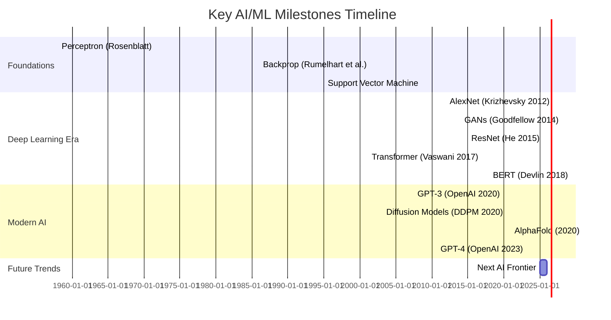

# AI Engineering and Architecture: A Comprehensive Study Resource

## Executive Summary 

This resource provides an in-depth, **analytical guide** to AI engineering and architecture, covering fundamentals through cutting-edge topics.  It is organized like a textbook or website, with chapters on **mathematical foundations**, **classical ML**, **deep learning**, **generative models**, **reinforcement learning**, **systems & infrastructure**, **MLOps**, and **AI safety/ethics**.  Each section lists **learning objectives**, **prerequisites**, **hands-on labs/projects**, **key references**, **implementation notes**, **pitfalls**, **scalability issues**, and **open research questions**.  Comparative tables contrast frameworks (TensorFlow/PyTorch/JAX/etc.), model families (CNN/RNN/Transformer/classical), and infrastructure options (GPUs/TPUs/cloud/on-prem).  Mermaid diagrams illustrate architectures, timelines (e.g. major ML breakthroughs), and topic relationships.  A suggested course/module sequence with time estimates guides learners.  We prioritize **recent innovations (last 5 years)** such as Transformers, large language models, diffusion models, self-supervised learning, and distributed training, alongside **seminal works** (e.g. AlexNet, BERT, VAE, etc.). Primary sources (conference papers, arXiv, vendor docs) are cited throughout for further study. 

## Chapter 1: Foundations of AI and Machine Learning

This chapter covers the **core math, theory, and supervised learning basics** underlying AI.  

- **Learning Objectives:** Understand supervised vs. unsupervised learning; formulate regression/classification tasks; grasp loss functions and generalization (bias–variance). Be able to implement basic models (linear/logistic regression) and evaluation metrics (accuracy, MSE).  
- **Prerequisite Knowledge:** High-school algebra; calculus (derivatives, chain rule); basic probability/statistics; introductory programming (preferably Python)【48†L2365-L2370】【50†L223-L231】.  
- **Hands-on Labs/Projects:**  
  - *Linear Regression From Scratch:* Implement least-squares linear regression on a simple dataset (e.g. housing prices). **Outcome:** Compute parameter estimates manually and via `numpy.linalg`. Observe overfitting when features are collinear or data is noisy.  
  - *Logistic Regression with Gradient Descent:* Classify binary data (e.g. breast cancer dataset) by coding logistic regression and performing gradient descent. **Outcome:** Plot decision boundary; practice train/validation split and compute accuracy/AUC.  
  - *Feature Engineering Exercise:* Use a dataset (e.g. Titanic) to create features (one-hot encode categorical, normalize). **Outcome:** Show how feature choices affect model performance.  
- **Key Resources:** *“Deep Learning”* by Goodfellow et al. (Ch1-2) for broad introduction【48†L2365-L2370】; *Murphy, “Machine Learning: A Probabilistic Perspective”* for statistical foundations; *Hastie et al., “The Elements of Statistical Learning”* (Ch2).  
- **Practical Notes:** Use `scikit-learn` for baseline implementations. Employ vectorized libraries (NumPy/Pandas) to handle data efficiently. Emphasize reproducibility: fix random seeds, and use version control (e.g. Git) for code/data【50†L241-L248】.  
- **Common Pitfalls/Failure Modes:** Overfitting on training data (watch out for high-dimensional features). Data leakage (e.g. using future information in training) leads to inflated performance. Failing to normalize features can slow convergence.  
- **Scalability Considerations:** For very large datasets, use **stochastic/mini-batch algorithms**. Example: implement **online SGD** for logistic regression to handle streaming data. Ensure data pipeline can handle scale (e.g. chunk CSVs or use a database). Utilize simple cloud tools (AWS Sagemaker notebooks or Google Colab) for initially small-scale experiments.  
- **Open Research Questions:** How to guarantee model generalization beyond held-out test data? Better theoretical understanding of deep model generalization (beyond VC theory). Learning under distribution shift (covariate shift).

## Chapter 2: Classical Machine Learning Algorithms

This chapter delves into advanced algorithms developed before the deep learning era, focusing on **decision trees, ensemble methods, support vector machines (SVMs), kernels, and unsupervised clustering**.  

- **Learning Objectives:** Learn to build and tune decision trees, random forests, and boosting (XGBoost/LightGBM) for tabular data; formulate and solve SVM problems (including kernels); apply clustering (k-means, GMM).  
- **Prerequisite Knowledge:** Chapter 1 concepts; linear algebra (matrix ops, eigenvalues); convex optimization basics (Lagrange duality)【50†L323-L331】; probability theory.  
- **Hands-on Labs/Projects:**  
  - *Decision Tree and Random Forest:* Train a CART decision tree on a dataset (e.g. UCI Adult income). Use ensemble (random forest) to improve accuracy. **Outcome:** Observe how bootstrapping and feature bagging reduce variance【10†L752-L761】. Plot feature importance.  
  - *Gradient Boosted Trees:* Use XGBoost or LightGBM on a regression/classification task (e.g. credit scoring). **Outcome:** Tune number of trees and learning rate; compare to random forest performance【10†L783-L793】.  
  - *SVM Classification:* Apply a linear SVM and an RBF-kernel SVM on a dataset (e.g. MNIST digits vs. fashion). **Outcome:** Visualize support vectors; demonstrate the effect of the C parameter (regularization) and kernel bandwidth.  
  - *Clustering and EM:* Perform k-means clustering on unlabeled data (e.g. Iris features) and Gaussian Mixture Model (using Expectation-Maximization) on a synthetic mixture dataset. **Outcome:** Compare hard clustering (k-means) vs. soft assignments (GMM responsibilities)【11†L893-L902】【11†L925-L933】.  
- **Key Resources:** Breiman et al. *“Classification and Regression Trees”* (CART); Friedman et al. *“Greedy Function Approximation: A Gradient Boosting Machine”* (J. Stat. Soc. 2001)【10†L828-L832】; Cortes & Vapnik (1995) SVM paper; Hastie *ESL* Ch8-10; scikit-learn documentation and examples.  
- **Practical Notes:** Use libraries (scikit-learn, XGBoost). Always use cross-validation for hyperparameter tuning (grid search or Bayesian optimization). Normalize or scale data as needed for SVMs. For boosting, be aware that tree depth is a key parameter.  
- **Common Pitfalls:** Over-deep trees overfit easily. Boosting can overfit if learning rate is too high or too many iterations. SVMs scale poorly to very large N (consider linear SVM for big data). k-means is sensitive to initialization; run multiple times.  
- **Scalability/Infra:** Many tree libraries support parallelism (e.g. XGBoost uses multi-threading). For extremely large datasets, use distributed frameworks (Spark MLlib) or approximate methods (subsampling). Use distributed computing for big GMMs (e.g. Spark’s GaussianMixture).  
- **Open Research Questions:** Automated feature extraction for tabular data (beyond manual). Better understanding of boosting generalization in the presence of noise. Scalable kernel methods (e.g. random features, Nyström).

| **Framework/Tool**       | **Strengths**                                   | **Weaknesses**                                |
|--------------------------|-------------------------------------------------|-----------------------------------------------|
| scikit-learn             | Easy APIs for classical ML (trees, SVM, etc.)   | Single-machine, not for deep learning         |
| XGBoost/LightGBM         | State-of-art speed for gradient boosting        | Domain-specific (tree ensembles only)         |
| TensorFlow / PyTorch     | Deep learning frameworks (see Chapter 6)        | More complex setup for classical models       |
| Spark MLlib              | Distributed ML library for big data             | Limited model range; overhead for small data  |

## Chapter 3: Deep Learning Fundamentals

This chapter explores **neural networks** (non-linear models) and the algorithms to train them.  

- **Learning Objectives:** Understand perceptrons, multi-layer perceptrons (MLPs), backpropagation; build convolutional and recurrent networks; apply modern architectures (CNN, RNN/LSTM, Transformer).  
- **Prerequisite Knowledge:** Chapters 1–2; multivariate calculus (for gradients); basic understanding of graphs/trees (for computation graphs).  
- **Hands-on Labs/Projects:**  
  - *MLP from Scratch:* Code a simple neural network (one hidden layer, ReLU activation) using NumPy. **Outcome:** Learn backprop by comparing manual gradients to numerical difference. Train on a simple task (e.g. MNIST digits) and plot loss curves.  
  - *Convolutional Neural Network:* Use PyTorch or TensorFlow to build a CNN (e.g. LeNet-like) for image classification on MNIST or CIFAR-10. **Outcome:** Visualize learned filters; measure accuracy improvements over MLP.  
  - *Transfer Learning:* Take a pretrained CNN (e.g. ResNet50) and fine-tune on a new dataset (e.g. Cats vs Dogs). **Outcome:** Compare fine-tuning speed to training from scratch, and accuracy gains.  
  - *Sequence Model:* Implement an LSTM-based classifier on text (e.g. sentiment analysis on IMDB). **Outcome:** Compare to a simple bag-of-words logistic model; observe how sequence order matters.  
  - *Transformer Demo:* Use an off-the-shelf Transformer (HuggingFace) to do translation or summarization. **Outcome:** Explore how changing context length or fine-tuning data affects output quality.  
- **Key Resources:** Goodfellow et al. *“Deep Learning”* (esp. chapters 5–7)【48†L2562-L2570】; LeCun et al. *Convolutional Networks* (1998); Hochreiter & Schmidhuber *LSTM* (1997); Vaswani et al. *“Attention Is All You Need”* (2017)【25†L192-L201】.  
- **Practical Notes:** Use GPU acceleration for all deep learning experiments. Leverage high-level libraries: TensorFlow/Keras and PyTorch make prototyping easy. Carefully choose activation (ReLU, GELU) and output layers (softmax for classification). Implement regularization: dropout, data augmentation, batch normalization.  
- **Common Pitfalls:** Vanishing/exploding gradients in deep nets (especially with sigmoid/tanh). Mismatch between batch stats and global stats if not using BN correctly. Overfitting on small data: address with augmentation and early stopping.  
- **Scalability/Infra:** Training deep nets often requires GPUs/TPUs. Use mixed precision (FP16) if supported to speed up (tensor cores on recent NVIDIA GPUs). For large batches or models, distribute across multiple GPUs (see Chapter 6). Cloud GPU instances (AWS EC2 G4/G5, GCP A100) are widely available; on-prem GPU clusters (with Slurm/Kubernetes) are alternatives.  
- **Open Research Questions:** Why do deep networks generalize so well? Techniques to better interpret internal representations. Architectures beyond Transformers (e.g. spiking networks, neural ODEs).

## Chapter 4: Modern Advancements and Generative Models

This chapter covers **recent innovations** (~last 5 years) including generative models, self-supervised learning, and advanced architectures.  

- **Learning Objectives:** Explore state-of-art topics: transformers in vision and language, generative adversarial networks (GANs), variational autoencoders (VAEs), diffusion models, self-supervised (contrastive) learning, and large-scale pretraining.  
- **Prerequisite Knowledge:** Chapters 1–3. Familiarity with backprop, probability models, and neural network basics.  
- **Hands-on Labs/Projects:**  
  - *Variational Autoencoder:* Train a VAE on image data (e.g. MNIST or CelebA). **Outcome:** Generate new samples from learned latent space; visualize interpolation between latent vectors.  
  - *GAN Training:* Implement a simple DCGAN for image generation (e.g. MNIST or Fashion-MNIST). **Outcome:** Tackle issues like mode collapse; compare generated samples qualitatively.  
  - *Diffusion Model:* Use an open-source library (e.g. HuggingFace Diffusers) to generate images (like CIFAR-10 or even text-to-image on prompts). **Outcome:** Understand denoising steps; compare to GAN output quality and diversity.  
  - *Self-Supervised Learning:* Use SimCLR or MoCo framework on unlabeled data, then fine-tune a small labeled set. **Outcome:** Compare features learned with vs. without contrastive pretraining.  
  - *Transformer LM Fine-tuning:* Fine-tune a pre-trained language model (BERT/GPT) on a custom NLP task. **Outcome:** Evaluate few-shot vs. fine-tuning performance. Examine biases or mistakes in model output【25†L212-L221】.  
- **Key Resources:** Goodfellow *Deep Learning* (GANs chapter); Kingma & Welling *VAE* (2014); Ho et al. *DDPM* (2020) for diffusion; Radford et al. *GPT-2* (2019), Devlin et al. *BERT* (2018) for transformers; recent surveys (e.g. “Transformers in Vision” 2021).  
- **Practical Notes:** High-level libraries often offer implementations (e.g. `torchvision.models`, HuggingFace Transformers). Pay attention to pretrained model licenses (e.g. some only for research use). Ensure you have enough compute – large models (hundreds of millions of params) can require days on a single GPU, so use cloud TPUs or GPU clusters if available.  
- **Common Pitfalls:** GANs can be unstable (use learning rate schedules, gradient clipping). Pretrained models can inherit biases from training data【25†L212-L221】 – evaluate for fairness. Fine-tuning huge LMs can overfit small datasets (use regularization or freeze layers).  
- **Scalability/Infra:** Generative models with large parameter counts need distributed training or model parallelism. Recent advances: pipeline parallelism (GPipe), tensor parallelism (Megatron). Cloud TPU pods (GCP) and AWS Sagemaker training clusters can expedite large model training. Use multi-cloud solutions (AWS/GCP/Azure) depending on existing tools.  
- **Open Research Questions:** Efficient training for very large models (learned optimizers, sparse models). Reducing data/hardware footprint (Green AI). Generality vs. specialization in large pretrained models (alignment research, continual learning). 

## Chapter 5: Reinforcement Learning and Decision-Making Systems

This chapter covers **reinforcement learning (RL)** and decision-making frameworks, including both traditional algorithms and modern deep RL.  

- **Learning Objectives:** Formulate reinforcement tasks as Markov Decision Processes (MDPs); implement value-based (Q-learning, DQN) and policy-based (REINFORCE, Actor-Critic, PPO) methods; understand exploration strategies; apply RL to simple games/environments.  
- **Prerequisite Knowledge:** Probability theory; Chapters 1–4; basic dynamic programming concepts.  
- **Hands-on Labs/Projects:**  
  - *Classic RL:* Implement tabular Q-learning on a grid-world or FrozenLake. **Outcome:** Visualize learned policy; see effect of learning rate and exploration (ε-greedy) on convergence.  
  - *Deep Q-Network (DQN):* Use a library (Stable Baselines3 or custom) to train on an Atari game (e.g. Pong). **Outcome:** Plot training reward; observe how replay buffer stabilizes training.  
  - *Policy Gradient:* Train a policy-gradient agent (e.g. REINFORCE or PPO) on CartPole or LunarLander. **Outcome:** Compare sample efficiency vs. DQN.  
  - *Simulated RL Deployment:* Deploy a trained agent via an API (Flask or FastAPI) and test in a simulated loop. **Outcome:** Understand integration of RL model in a service.  
- **Key Resources:** Sutton & Barto *“Reinforcement Learning: An Introduction”* (2018); Mnih et al. *“Human-level control through deep RL”* (Nature, 2015, DQN); Schulman et al. *PPO* (2017).  
- **Implementation Notes:** Use OpenAI Gym or Unity ML-Agents for environments. For deep RL, ensure fast GPU or consider cloud instances with GPUs (some RL tasks can use CPUs if networks are small). Manage randomness (set seeds) for reproducibility.  
- **Common Pitfalls:** Reward shaping can inadvertently make the task trivial or impossible. High variance in policy gradients (use baselines). Non-stationarity (due to moving policy).  
- **Scalability/Infra:** RL training is sample-inefficient – consider parallel simulation (vectorized envs, distributed rollout). AWS/GCP offer specialized RL services (SageMaker RL, Google TRFL). Cloud TPUs can accelerate only certain operations (mostly for TensorFlow). Use MPI or Ray for distributed rollouts.  
- **Open Research Questions:** Safe exploration (avoiding catastrophic actions); multi-agent RL coordination; transfer learning across tasks; real-world RL (robots, finance) challenges.

## Chapter 6: Systems, Infrastructure, and Deployment 

This chapter focuses on the **engineering** of ML systems at scale: data pipelines, hardware, frameworks, model serving, and real-world architecture patterns.

【34†embed_image】 *Figure: A typical ML system architecture (“Hidden Technical Debt” diagram) shows data sources, feature extraction, model training pipelines, serving infrastructure, and monitoring【34†】.*  

- **Learning Objectives:** Design end-to-end ML systems: from data ingestion to model serving and feedback. Understand hardware choices (GPU/TPU/CPU) and framework ecosystems. Learn deployment strategies (batch vs. online inference, microservices).  
- **Prerequisite Knowledge:** Chapters 1–5; basic software engineering (Linux, Docker, REST APIs).  
- **Key Topics & Components:**  
  - **Data Pipeline:** Continuous data collection (logs, sensors, databases); ETL/ELT with tools like Apache Airflow/Kubernetes Jobs. Storage (SQL/NoSQL, data lakes). Data versioning (e.g. DVC, lakeFS)【50†L205-L214】.  
  - **Feature Store:** Centralized serving of processed features (online/offline store). Example open-source: Feast. Ensures consistency between training and serving【50†L205-L214】.  
  - **Model Training Infrastructure:** Single-node vs distributed. GPU clusters (on-prem or cloud). Frameworks: TensorFlow Serving, TorchServe for distributed training/inference. Batch training (e.g. AWS Batch, Azure ML) vs real-time (Horovod, SageMaker).  
  - **Serving and Microservices:** Expose model predictions via REST/gRPC APIs, using Docker/Kubernetes. Tools: TensorFlow Serving, NVIDIA Triton Inference Server. Use caching for repeated queries.  
  - **Monitoring and Logging:** Track data drift, model performance (latency, accuracy) using Prometheus/Grafana or cloud monitoring (CloudWatch, Azure Monitor). Set up alerts for anomalies.  
  - **Security and Compliance:** Secure data (encryption at rest/in transit), authenticate services. Follow GDPR/CCPA for user data. Consider MLSecOps practices for adversarial/security threats【13†L562-L570】.  
- **Practical Notes:** Containerize model and dependencies (Docker). Use Infrastructure as Code (Terraform, AWS CloudFormation) to provision reproducible environments. Automate deployment pipelines (GitHub Actions, Jenkins, or cloud-native CI/CD like AWS CodePipeline) for continuous delivery. Utilize A/B testing frameworks for new model versions.  
- **Common Pitfalls:** Deployment drift (code or data differences between dev and prod). Poor logging (lack of traceability for predictions). Assuming lab performance holds in production. Under-provisioning (leading to latency issues) or over-provisioning (waste of cost).  
- **Scalability/Infra:** For high-volume inference, use autoscaling policies (Kubernetes HPA, AWS Auto Scaling). Employ GPU inference for heavy models when latency is critical (e.g. vision). Compare cloud vs on-prem: cloud offers elasticity (pay-as-you-go) vs on-prem may reduce cost at scale (if continuously used). Hybrid: edge devices for pre-processing (e.g. IoT gateways) with cloud training.  
- **Architecture Patterns (Mermaid diagram):** 
```mermaid
flowchart LR
    subgraph DataFlow
      A[Raw Data Sources] --> B[Data Lake/Warehouse]
      B --> C[Feature Processing Pipelines]
    end
    C --> D[Model Training (GPU Cluster)]
    D --> E[Model Registry / Versioning]
    E --> F[Deployment (API/Microservice)]
    F --> G[Online Inference / User Queries]
    G --> H[Monitoring & Feedback Loop]
    H --> B
```  
- **Open Research Questions:** Hardware-aware model design (optimizing for specific chipsets); energy-efficient ML (Green AI). Auto-scaling policies for ML workflows. Balancing data locality vs cloud transfer costs. Real-time ML (low-latency inference architectures).

## Chapter 7: Machine Learning Operations (MLOps)

MLOps extends DevOps to the AI lifecycle, ensuring models are production-ready, maintainable, and continuously improved.

- **Learning Objectives:** Set up reproducible ML pipelines (Data → Train → Deploy). Use MLOps tools for experiment tracking, versioning, and CI/CD. Implement monitoring and governance for models in production.  
- **Prerequisite Knowledge:** Chapter 6; DevOps fundamentals (CI/CD, containers, version control).  
- **Key Components:**  
  - **Data and Model Versioning:** Track datasets and model code. Tools like DVC or git-LFS for data; MLflow or ModelDB for model artifacts.  
  - **Continuous Training and Deployment:** On new data arrival, automatically retrain/validate model. Use platforms like Kubeflow Pipelines, Argo, or cloud services (Azure ML Pipelines, AWS SageMaker Pipelines).  
  - **Experiment Tracking:** Log hyperparameters and metrics (e.g. Weights & Biases, Neptune.ai) to compare runs.  
  - **Quality Gates:** Add automated tests for models (unit tests on data processing, integration tests on model output) and data schema checks.  
  - **Monitoring & Alerting:** Use dashboards (e.g. Grafana) for model accuracy drift, feature drift, and system health. Implement retraining triggers based on drift detection.  
  - **Security/MLSecOps:** Incorporate security checks (vulnerability scanning of packages, data access controls). Follow shared-responsibility models for AI services【13†L562-L570】.  
- **Hands-on Labs/Projects:**  
  - *End-to-End MLOps Pipeline:* Build a CI/CD pipeline that triggers when new data is merged in Git. Use GitHub Actions or Jenkins to run a training script, package the model into Docker, and deploy to a cloud endpoint. **Outcome:** Every commit or scheduled run produces an updated model in production seamlessly.  
  - *Drift Monitoring:* After deploying a model, simulate data drift (by changing input distribution) and implement alerts. **Outcome:** Set up anomaly detection (e.g. KL divergence test) on input features to notify if data changes significantly.  
- **Key Resources:** DevOps literature (Docker/K8s tutorials); Microsoft *“Hello World”* MLOps architectures; blog series on Kubeflow/Keras pipelines; OpenSSF *MLOps Security Guide*【13†L562-L570】; *Full Stack Deep Learning* MLOps lectures【50†L205-L214】.  
- **Common Pitfalls:** Treating models like static code; not planning for retraining. Ignoring data versioning results in irreproducible results. Overlooking drift and model staleness. Relying solely on unit tests (need end-to-end ML tests).  
- **Scalability/Infra:** Automate on scalable platforms: cloud-managed ML services (e.g. AWS SageMaker or Azure ML) offer built-in pipelines. On-premise: use Kubeflow on Kubernetes. For real-time CI/CD, consider tools like Flyte or Metaflow. Scaling MLFlow/Weights&Biases for enterprise requires dedicated servers or managed services.  
- **Open Research Questions:** Automated MLOps (AutoML for pipelines); standardization of ML metadata (MLMD, ONNX Metadata); compliance auditing (keeping lineage for regulations).

| **MLOps Aspect**          | **Tools/Frameworks**            | **Use Cases / Notes**                           |
|--------------------------|-------------------------------|-----------------------------------------------|
| Data Versioning          | DVC, lakeFS                    | Track dataset snapshots for reproducibility   |
| Experiment Tracking      | MLflow, Weights&Biases, Neptune | Record hyperparams/metrics across runs       |
| Pipeline Orchestration   | Kubeflow, Airflow, Argo       | Schedule training workflows (batch/real-time) |
| Model Serving            | TensorFlow Serving, TorchServe | Host models with high throughput             |
| Monitoring               | Prometheus, Grafana            | Visualize latency, accuracy, drift           |
| CI/CD Integration        | GitHub Actions, Jenkins        | Automate retraining/deployment on changes    |

## Chapter 8: Ethics, Safety, and Responsible AI

AI systems carry social and ethical implications. This chapter addresses bias, fairness, privacy, and safety concerns.

- **Learning Objectives:** Understand definitions of fairness (demographic parity, equalized odds, etc.) and privacy (differential privacy). Learn techniques to mitigate bias and preserve privacy. Discuss governance frameworks and safety challenges.  
- **Prerequisite Knowledge:** All previous chapters; basic social context understanding.  
- **Topics Covered:**  
  - **Bias and Fairness:** Evaluate bias by group and individual metrics (e.g. false positive rate differences). Example: large language models trained on web text often reproduce societal biases (gender, race)【25†L212-L221】【23†L430-L438】.  
  - **Privacy:** Concepts of differential privacy (adding noise to gradient or outputs); federated learning for decentralized data. Case study: *Apple’s DP-SGD iOS keyboard suggestions*.  
  - **Transparency/Explainability:** Use LIME/SHAP to interpret black-box models. Distinguish local vs global explanations. Caution: explanations can be misleading.  
  - **Security/Adversarial Attacks:** Understand that neural networks are vulnerable to adversarial examples. Introduce adversarial training and robust optimization.  
  - **AI Governance and Ethics:** Regulations (GDPR’s “right to explanation”, EU AI Act). Ethical guidelines (fairness, accountability, transparency). Safety: discussion of AI alignment (superintelligence) and short-term concerns (misinformation by LLMs).  
- **Hands-on Labs/Projects:**  
  - *Bias Audit:* On an open dataset with a sensitive attribute (e.g. UCI Adult), train a model then measure group fairness (e.g. disparity in accuracy between genders). Try mitigation (reweighing or adversarial debiasing). **Outcome:** Compute fairness metrics before/after mitigation.  
  - *Differential Privacy:* Use TensorFlow Privacy to train a small model with DP. **Outcome:** Show trade-off: private model (ε small) loses some accuracy vs non-private model.  
  - *Adversarial Examples:* Generate FGSM adversarial images on a CNN and measure impact. **Outcome:** Observe how small noise fools the model; optionally implement simple adversarial defense (e.g. input preprocessing).  
- **Key Resources:** Barocas & Selbst *“Big Data’s Disparate Impact”*; Mehrabi et al. *“Fairness and Bias in ML”* survey; Dwork & Roth *“The Algorithmic Foundations of Differential Privacy”*; papers on LLM safety (OpenAI alignment publications).  
- **Common Pitfalls:** “Fairness through unawareness” (simply omitting protected attribute) is insufficient because other features may proxy it【23†L430-L438】. Privacy: adding noise without accounting for utility can cripple model. Chasing one fairness metric may worsen another (the “impossibility theorem” in fairness).  
- **Scalability/Infra:** Fairness toolkits (AIF360, Fairlearn) can scale to big models. Privacy: DP training scales with GPU (though slower due to noise computation). Federated learning frameworks (TensorFlow Federated, PySyft) help scale across clients.  
- **Open Research Questions:** Provable fairness/safety guarantees; robust ML (proofs of robustness); legal standards for AI accountability; minimizing carbon footprint of large AI. 

## Chapter 9: AI Engineering Case Studies and Tools

This chapter surveys real-world **case studies** and tools to consolidate learning.

- **Case Studies:**  
  - *Recommendation Systems:* Netflix/YouTube pipelines for recommender training and real-time serving.  
  - *Autonomous Vehicles:* Real-time perception & decision stacks (with sensor fusion and on-edge inference).  
  - *Industrial IoT:* Predictive maintenance using time-series models and streaming analytics.  
  - Each case includes architecture diagrams, challenges (e.g. latency, safety), and lessons learned from public sources.  
- **Tools and Frameworks:**  
  - **Data Processing:** Apache Spark, Flink, Airflow.  
  - **ML Libraries:** scikit-learn, TensorFlow, PyTorch, JAX. Cloud ML services (AWS SageMaker, Google Vertex AI, Azure ML).  
  - **Versioning & Collaboration:** Git, DVC, MLflow. Notebook vs script trade-offs【50†L241-L250】.  
  - **Deployment:** Docker, Kubernetes (with custom CRDs for ML), serverless (AWS Lambda for lightweight models). ONNX for model interoperability.  
- **Community and Open Source:** Key projects: TensorFlow Extended (TFX) for pipelines, Ray/RLlib for scalable RL, Kubeflow, MLflow, HuggingFace ecosystems.  
- **Appendix: Datasets & Tools:**  
  - *Datasets:* MNIST, CIFAR, ImageNet, COCO, GLUE (NLP), OpenAI Gym environments, Kaggle competitions.  
  - *Toolchain Quickstart:* Conda/venv setup, CUDA/cuDNN installation, Docker basics.  
  - *Reading List:* Classic texts (Goodfellow Deep Learning; Bishop PRML; Sutton RL), plus top recent papers (listed by topic with URLs).  
  - *Glossary:* Definitions of common terms (LR, SGD, overfitting, epochs, TPU, etc.) 

## Course/Module Sequence and Time Estimates

We suggest a **modular learning path**. Example sequence (self-paced hours per module): 

1. **ML Fundamentals** (4 weeks, 20–30 hours): Chapters 1–2 topics (linear models, evaluation, trees).  
2. **Neural Networks & Deep Learning** (4 weeks, 30–40 hours): Chapter 3 (MLPs, CNNs, RNNs).  
3. **Advanced Architectures** (3 weeks, 20–30 hours): Chapter 4 (Transformers, GANs, diffusion).  
4. **Reinforcement Learning** (2 weeks, 15–20 hours): Chapter 5.  
5. **Systems & Infrastructure** (3 weeks, 20–30 hours): Chapter 6 topics (data pipelines, hardware, serving).  
6. **MLOps & Deployment** (2 weeks, 15–20 hours): Chapter 7 workflows and tools.  
7. **AI Ethics & Safety** (1 week, 10 hours): Chapter 8.  

Within each module, allocate time to lectures, readings, hands-on labs, and project work. For example, a 4-week module might include 8 lectures (1-2 hours each), weekly lab assignments (5 hours), and a capstone project (10 hours). Time estimates can vary by depth of coverage and prior background.

## Appendix: Additional Resources

- **Mathematical Background:** Linear algebra (Eigen decomposition); convex optimization (dual problems); probability distributions.  
- **Community & Events:** Major conferences (NeurIPS, ICML, ICLR, CVPR), open courses (CS231n, DeepMind x UCL RL course).  
- **Tools Quickstart:** Conda environments, Jupyter notebooks best practices【50†L241-L250】, VSCode/PyCharm, Git, Docker basics.  
- **Dataset Catalog:** Links to public datasets (UCI ML Repository, Kaggle).  
- **Further Reading:**  
  - Mitchell, *“Machine Learning”* (1997) for classic intro.  
  - LeCun, Bengio, Hinton (2015) *“Deep Learning”* (Nature review) for overview.  
  - Recent survey papers (e.g. *Nature* “Deep Learning” 2023).  
  - Key arXiv links (e.g. Vaswani et al. *Transformer*, Brown et al. *GPT-3*).  

## Timeline of Milestones (Mermaid Gantt Chart)



## Diagrams and Tables

- *Architecture Flowchart:* (above) shows a generic ML pipeline (Data→Train→Serve→Monitor).  
- *Comparison Tables:* (in-text tables) contrast frameworks and tools (see Chapter 2 and 7).  
- *Datasets and Tools Appendix:* Reference list of popular datasets and software. 

This document is designed to be comprehensive yet practical, guiding learners through AI/ML concepts, hands-on skills, and system-level thinking. Citations are provided to authoritative sources for deeper exploration.  

