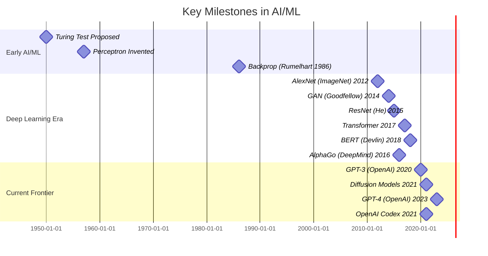

# **Executive Summary**

This comprehensive *Ultimate Machine Learning Study Resource* outlines a full curriculum spanning **fundamentals through cutting-edge topics**, with practical exercises, implementation notes, and research direction for each.  It is structured like a multi-chapter text or website, covering (1) **Mathematical and Statistical Foundations**, (2) **Supervised and Unsupervised Learning**, (3) **Advanced Models and Deep Learning**, (4) **Generative and Reinforcement Learning**, (5) **Systems, Infrastructure, and MLOps**, and (6) **Ethics, Safety, and Responsible AI**.  Each topic is presented with **learning objectives, prerequisites, hands-on labs, key references, implementation insights, common pitfalls, scalability considerations,** and **open research questions**.  Comparison tables highlight trade-offs among frameworks (e.g. TensorFlow vs. PyTorch vs. JAX), model families (CNN vs. Transformer vs. classical models), and infrastructure (GPUs vs. TPUs vs. CPU, cloud vs. on-prem).  Sequence recommendations and estimated times for modules are given to guide course or study planning.  Diagrams and mermaid charts illustrate system architectures, innovation timelines, and topic relationships.  Emphasis is placed on the **last 5 years of research** (e.g. Transformers, diffusion models, self-supervised learning) as well as *seminal works* that form the foundation.  Sources are cited throughout to primary texts and research (e.g. Goodfellow *Deep Learning*, Vaswani’s *Transformer*, Sculley’s *Hidden Technical Debt*, etc.) for rigor and further reading. 

The following structured content is presented as chapters and sections:

# **1. Foundations of Machine Learning**

Machine learning (ML) is underpinned by statistics, linear algebra, optimization, and probability.  This chapter covers core theory and simple models. 

## 1.1 Introduction to Machine Learning

**Topics:** Definitions of learning (supervised, unsupervised, reinforcement), data-driven modeling, **inputs, outputs, hypothesis spaces**. Basic workflow: data collection, feature engineering, model training, evaluation, and deployment【25†L184-L193】【36†L170-L179】. 

- **Learning Objectives:** Understand the ML problem formulation, difference between regression/classification/clustering, and the end-to-end pipeline.  
- **Prerequisites:** High school math (algebra, probability basics), programming (Python).
- **Key Resources:** *The Elements of Statistical Learning* (Hastie et al.), *Machine Learning: A Probabilistic Perspective* (Bishop), lecture notes【5†L68-L76】【25†L192-L201】.
- **Implementation Notes:** Use Python libraries (scikit-learn, pandas) to load data and perform simple modeling. Maintain data version control (e.g. DVC) as you preprocess and iterate【36†L199-L208】.
- **Common Pitfalls:** Confusing training vs test data, ignoring data leakage, over-relying on default parameters. Ensure cross-validation or hold-out sets.
- **Labs/Projects:** *Lab:* Implement k-nearest neighbors and linear regression from scratch on toy data. *Expected Outcome:* Fit models manually and compare to library implementations (e.g. `sklearn`). Learn data splitting and basic error metrics (MAE, accuracy).
- **Scalability:** At this stage, scale is small; but learn about memory and compute: using vectorized operations (NumPy) and efficient data formats. 
- **Open Questions:** How to formalize when statistical assumptions (IID, linearity) are violated by real data? (Research area: learning under concept drift, covariate shift.)

## 1.2 Mathematical Prerequisites

**Topics:** Linear algebra (vectors, matrices, eigenvalues); calculus (gradients, chain rule); probability (random variables, distributions, expectation); statistics (hypothesis testing, confidence intervals)【25†L192-L201】.

- **Learning Objectives:** Be able to derive gradients of loss, manipulate matrices, and compute basic probability/statistics for ML.
- **Prerequisites:** High-school math and calculus; if weak, study *Bishop*’s and *Goodfellow*’s recommended chapters.
- **Key Resources:** Goodfellow *Deep Learning* Ch2-4 (linear algebra, probability)【3†L45-L53】; Khan Academy linear algebra/calculus; *Probability Theory: The Logic of Science* (Jaynes).
- **Labs/Projects:** *Lab:* Implement matrix operations and gradients for logistic regression manually (NumPy). *Expected Outcome:* Understand backprop by coding chain rule on paper and code.
- **Pitfalls:** Numerical stability (e.g. overflow in `exp()`). Use log-sum-exp trick for log-likelihoods.
- **Scalability:** Use optimized BLAS (NumPy, PyTorch) for large matrix ops; ensure avoiding unnecessary loops.

## 1.3 Supervised Learning Foundations

**Topics:** Linear models (regression, logistic), loss functions (MSE, cross-entropy, hinge), **bias-variance tradeoff**, **overfitting and regularization** (L1, L2)【7†L274-L283】【7†L339-L347】. Performance metrics: accuracy, precision, recall, ROC/AUC, F1【8†L498-L508】.

- **Learning Objectives:** Build and evaluate basic classifiers and regressors; understand generalization theory (empirical vs expected risk)【6†L85-L93】.
- **Prerequisites:** 1.1, 1.2.
- **Key Resources:** Shalev-Shwartz & Ben-David *Understanding Machine Learning*; *An Introduction to Statistical Learning* (James et al.)【6†L85-L93】.
- **Labs/Projects:** 
  1. *Linear Regression:* Fit housing price data with least squares; add L2 regularization (Ridge). *Outcome:* Visualize under/overfitting by varying regularization strength.  
  2. *Logistic Regression:* Train on Iris dataset; inspect decision boundary. *Outcome:* Compute accuracy, precision/recall tradeoffs by adjusting threshold【7†L274-L283】.
- **Implementation Notes:** Use scikit-learn as baseline; then reimplement gradient descent for linear models. Explore solvers (closed-form vs SGD for large data).
- **Pitfalls:** Forgetting to scale features leads to bad SGD behavior. Not shuffling data can bias SGD.
- **Scalability:** Use mini-batch SGD or coordinate descent for huge data. For streaming data, use online algorithms.
- **Open Questions:** Better understanding of when L1 vs L2 is preferable; automated hyperparameter search (AutoML) for regularization strength.

## 1.4 Probabilistic Modeling and Bayesian Methods

**Topics:** Likelihood and Bayesian inference. Maximum likelihood estimation, priors and posteriors. Bayesian linear regression (MAP vs MLE)【9†L649-L658】. Generative vs discriminative models.

- **Learning Objectives:** Derive MLE for Gaussian, Bernoulli models; understand conjugate priors; connect MAP to regularization【9†L649-L658】.
- **Prerequisites:** 1.2, 1.3.
- **Key Resources:** Bishop *Pattern Recognition and Machine Learning* Ch3; Murphy *Machine Learning: A Probabilistic Perspective*. 
- **Labs/Projects:** *Bayesian Coin-flip:* Given coin flip data, compute posterior on bias with Beta prior. *Outcome:* Visualize how more data sharpens posterior. 
- **Implementation Notes:** For continuous features, consider Bayesian ridge regression. Compare with frequentist ridge (MAP).
- **Pitfalls:** Priors must be chosen carefully; overconfident priors bias the model. 
- **Scalability:** Use variational Bayes or Monte Carlo (MCMC) for larger models.
- **Open Questions:** Scalable Bayesian deep learning (Bayesian neural networks), nonparametric Bayes for flexible models.

## 1.5 Unsupervised Learning

**Topics:** Clustering (k-means, hierarchical); density estimation (Gaussian Mixture Models, EM algorithm)【11†L893-L902】【11†L925-L933】; Dimensionality Reduction (PCA, t-SNE, UMAP); representation learning. Principal Component Analysis (PCA); Autoencoders basics.

- **Learning Objectives:** Implement k-means and GMM+EM; visualize clusters; reduce dimensions with PCA.
- **Prerequisites:** 1.2, 1.3.
- **Key Resources:** Hastie *ESL* Ch14; Murphy PRML Ch9. 
- **Labs/Projects:** 
  1. *k-Means:* Cluster the Iris or MNIST data; vary k. *Outcome:* Cluster centroids, silhouette score.  
  2. *GMM/EM:* Fit a 2D GMM; observe responsibilities. *Outcome:* Compare soft (GMM) vs hard (k-means) clustering performance【11†L893-L902】【11†L925-L933】.
  3. *PCA for visualization:* Reduce high-D data (e.g. CIFAR-10) to 2D. *Outcome:* Plot and interpret principal components.
- **Implementation Notes:** Initialize k-means with multiple seeds to avoid local minima. Use batch GMM for moderate data, streaming for more.
- **Pitfalls:** k-means: poor scaling with dimensionality; many local minima. EM: risk of singular covariances if components collapse.
- **Scalability:** For very large data, use mini-batch k-means or streaming PCA (randomized SVD).
- **Open Questions:** Better unsupervised feature learning for complex data; clustering in non-Euclidean spaces; theoretical guarantees for deep clustering.

# **2. Classical and Advanced ML Algorithms**

This chapter dives into powerful learning algorithms beyond linear models, covering **Convex optimization**, **Support Vector Machines**, **Tree-based methods**, and **Ensembles**.

## 2.1 Convex Optimization & Learning Theory

**Topics:** Loss function choice and effect (hinge loss, logistic, squared error)【7†L274-L283】; Convex optimization basics; Lagrangian duality【7†L302-L310】; generalization: bias–variance, VC-dimension (informal)【7†L317-L324】.

- **Learning Objectives:** Choose appropriate loss for task; solve convex optimization problems (e.g. SVM dual)【7†L302-L310】; understand overfitting via risk decomposition【6†L145-L152】.
- **Prerequisites:** 1.2, 1.3.
- **Key Resources:** Boyd & Vandenberghe *Convex Optimization*; Schölkopf & Smola *Learning with Kernels* (Ch. on SVM duality).
- **Labs/Projects:** *Lab:* Implement hinge-loss optimization via subgradient descent and via CVX/SLO (for toy SVM). Compare with scikit-learn’s SVM. *Outcome:* Understand sparsity of support vectors【7†L339-L347】.
- **Implementation Notes:** Use CVX or QP solvers for small SVM dual problems; for large data, use stochastic gradient on primal.
- **Pitfalls:** Hard-margin SVM unrealistic for noisy data (requires slack variables)【7†L346-L354】. Non-differentiability at hinge loss requires subgradient methods【7†L382-L390】.
- **Scalability:** Kernel methods scale poorly (O(n^2) for kernel matrix). Use approximate kernels (e.g. random Fourier features) or switch to linear models for large data.
- **Open Questions:** How to efficiently train SVMs on billions of points? Kernel learning (choose best kernel) remains an open research area.

## 2.2 Support Vector Machines (SVMs)

**Topics:** Linear SVMs (soft-margin), kernel trick for nonlinear decision boundaries【8†L461-L470】; Sparsity and support vectors【7†L338-L347】; multi-class SVM extensions.

- **Learning Objectives:** Formulate SVM as regularized hinge-loss minimization; derive dual; use kernels for non-linear separation【8†L461-L470】.
- **Prerequisites:** 2.1.
- **Key Resources:** Vapnik’s *The Nature of Statistical Learning Theory*, Scholkopf & Smola *Learning with Kernels*. Mercer’s theorem.
- **Labs/Projects:** *Kernel SVM:* Apply RBF-kernel SVM on a UCI dataset (e.g. digits) with `sklearn`. *Outcome:* Plot decision boundaries vs. linear SVM.
- **Implementation Notes:** Tune kernel bandwidth; scale features before RBF kernel. Use `scikit-learn` for reference; experiments with `libSVM`.
- **Pitfalls:** SVMs do not scale well to many classes or very large datasets. Kernel SVM has high memory overhead for Gram matrix.
- **Scalability:** Consider approximate kernel methods (e.g. Nyström), or linear SVM with feature mappings for big data (e.g. linear classifiers with hashing trick).
- **Open Questions:** Online and streaming SVM algorithms; combining SVMs with deep features.

## 2.3 Decision Trees and Ensembles

**Topics:** Decision trees (CART), splitting criteria, pruning. **Random Forests** and **Bagging** (reduce variance by ensembling)【10†L736-L744】. **Gradient Boosting Machines** (boosting as stagewise additive models)【10†L783-L793】 (XGBoost, LightGBM). 

- **Learning Objectives:** Construct decision trees with greedy splitting; ensemble trees via bagging/boosting; tune hyperparameters (depth, num trees)【10†L752-L761】【10†L783-L793】.
- **Prerequisites:** 1.3, 1.4 (understand bias/variance).
- **Key Resources:** Breiman et al. *Classification and Regression Trees*; Friedman’s GBM paper (1999)【10†L828-L832】.
- **Labs/Projects:** 
  1. *Random Forest:* Train RF on UCI data. *Outcome:* Observe variance reduction vs single tree; measure out-of-bag error.  
  2. *Gradient Boosting:* Build a small GBM regressor via `xgboost` or `sklearn.GradientBoosting`. Compare to Random Forest. *Outcome:* Explore overfitting with many trees.
- **Implementation Notes:** Use scikit-learn or XGBoost for experiments; watch out for overfitting by limiting tree depth. For balanced data, scale sample weights.
- **Pitfalls:** Boosting sensitive to noisy labels (can overfit). Very deep trees (even ensembles) may overfit small data.
- **Scalability:** Many tree libraries support parallel or distributed training. Gradient boosting can be slower due to sequential nature, but XGBoost/LightGBM optimize for large scale via histogram binning.
- **Open Questions:** Theory of boosting on deep trees; gradient boosting for non-traditional loss functions (e.g. ranking, survival).

| **Framework**            | **Strengths**                                          | **Weaknesses**                                         |
|--------------------------|--------------------------------------------------------|--------------------------------------------------------|
| Scikit-Learn (classical) | Easy-to-use APIs; good for small/medium data (Non-DL)  | Not optimized for deep learning; CPU-bound             |
| TensorFlow              | Scalable, C++ backend, production-ready (TensorRT); TPU support | More verbose API (TF1.x), though TF2 is easier; less Pythonic historically |
| PyTorch                 | Pythonic dynamic graph, research-friendly; strong community | Historically less support for mobile deployment (now improving)    |
| JAX (w/ Flax)           | High performance on accelerators; composable (autograd + XLA) | Steeper learning curve; smaller ecosystem (though growing)    |

## 2.4 Multiclass and Structured Prediction

**Topics:** Extending binary classifiers to multiclass (one-vs-all, one-vs-one, softmax regression)【10†L833-L842】; introduction to structured outputs (CRFs, structured SVM). 

- **Learning Objectives:** Build multi-class classifiers; understand when to use reductions vs joint modeling【10†L833-L842】.
- **Prerequisites:** 2.1, 2.3.
- **Key Resources:** Murphy PRML Ch8; *Learning with Structured Outputs* (Taskar et al. tutorial).
- **Labs/Projects:** *Multiclass SVM:* Use one-vs-all SVM on handwritten digits. *Outcome:* Compare one-vs-one vs softmax logistic regression.
- **Pitfalls:** Reductions like one-vs-all assume balanced classes; may be inefficient if many classes. Structured prediction requires custom inference.
- **Open Questions:** Efficient inference for structured models at scale (e.g. graph or sequence labeling in massive settings).

# **3. Deep Learning Foundations**

Deep learning uses neural networks to learn complex representations. This chapter covers basic architectures and training techniques.

## 3.1 Multilayer Perceptrons (MLPs) and Backpropagation

**Topics:** Neural network structure (layers, activations). **Universal approximation** (sufficiently wide network can approximate any function【11†L953-L962】). Backpropagation (chain rule for gradients)【11†L979-L990】.

- **Learning Objectives:** Implement a simple MLP; derive and code backprop for weight updates【11†L979-L990】.
- **Prerequisites:** 1.2 (calculus).
- **Key Resources:** Goodfellow et al. *Deep Learning* Ch6; Nielsen’s *Neural Networks and Deep Learning* Chapter on universality【11†L975-L984】.
- **Labs/Projects:** *Lab:* Code a 2-layer neural net from scratch (NumPy) for binary classification. *Outcome:* Train on XOR or MNIST subset; verify backprop by checking gradient numerically.
- **Implementation Notes:** Use vectorized operations; initialize weights (e.g. Xavier) to avoid symmetry and vanishing/exploding gradients.
- **Pitfalls:** Vanishing/exploding gradients in deep nets with naive activation (sigmoid). Always use non-linear activations (ReLU).
- **Scalability:** Leverage GPU libraries (e.g. PyTorch) for speed. As dataset grows, switch to batch learning.
- **Open Questions:** Theory of why deep nets generalize so well; better optimization algorithms beyond SGD.

## 3.2 Convolutional Neural Networks (CNNs)

**Topics:** Convolution layers, pooling, translation invariance, receptive fields. Modern CNN architectures (LeNet, AlexNet, VGG, ResNet). Residual connections to enable very deep nets.

- **Learning Objectives:** Understand how convolutions extract local features; design simple CNN for images; comprehend batch normalization and dropout.
- **Prerequisites:** 3.1.
- **Key Resources:** AlexNet (Krizhevsky et al. 2012), ResNet (He et al. 2015) for motivation; Goodfellow *Deep Learning* Ch9.
- **Labs/Projects:** *CNN Image Classifier:* Build a CNN in PyTorch/TensorFlow to classify CIFAR-10. *Outcome:* Achieve >70% accuracy; visualize learned filters/activations.
- **Implementation Notes:** Use frameworks’ convolution modules. Experiment with data augmentation (flips, crops) to improve generalization.
- **Pitfalls:** Overfitting small image sets with large CNN. Always validate on separate test set.
- **Scalability:** Use pretrained models or multi-GPU training for large CNNs. Consider mixed-precision to speed up (Tensor Cores).
- **Open Questions:** CNNs beyond grid data (graphs, manifolds); theoretical understanding of convolution weight sharing.

## 3.3 Sequence Models: RNNs, LSTMs, and Transformers

**Topics:** Recurrent Neural Networks (RNNs), Long Short-Term Memory (LSTM) and GRU architectures for sequential data. Sequence-to-sequence models. **Transformers** (self-attention mechanism)【25†L192-L201】. BERT, GPT, and modern language models.

- **Learning Objectives:** Implement RNN/LSTM for language or time-series; implement Transformer’s encoder or decoder block; understand attention mechanism【25†L192-L201】.
- **Prerequisites:** 3.1, understanding of backprop.
- **Key Resources:** Hochreiter & Schmidhuber (LSTM 1997); “Attention Is All You Need” (Vaswani et al., 2017)【25†L192-L201】; tutorial on Transformers.
- **Labs/Projects:** 
  1. *Sentiment Analysis:* Train an LSTM on IMDB reviews. *Outcome:* Use word embeddings and achieve reasonable accuracy.  
  2. *Transformer Translation:* Use a small Transformer (from PyTorch or TensorFlow tutorials) to translate English-French on a subset. *Outcome:* Observe how self-attention weights behave.
- **Implementation Notes:** Use built-in layers (e.g. `nn.Transformer`) or `keras.layers.MultiHeadAttention`. Manage sequence lengths via padding and masking.
- **Pitfalls:** RNNs suffer from vanishing gradients on long sequences; Transformers require large compute. The quadratic cost of self-attention can be high for very long sequences.
- **Scalability:** Use hardware-accelerated libraries for attention (TPU matrix units). For very long inputs, look into sparse or linear-time attention (e.g. Performer, Longformer).
- **Open Questions:** Making Transformers more efficient for long contexts; learning dynamic or adaptive computation time in RNNs; interpretability of attention.

## 3.4 Modern Developments in Neural Architectures

**Topics:** **Residual Networks (ResNet)**, **DenseNets**, **Capsule Networks**. **Graph Neural Networks (GNNs)** for graph-structured data. **Attention beyond Transformers** (self-attention in vision – ViT). **Neural Architecture Search (NAS)** and AutoML trends【17†L1010-L1018】. 

- **Learning Objectives:** Survey how architecture innovations (residual/skip connections, depth) improved deep learning; understand message-passing in GNNs.
- **Prerequisites:** 3.2, 3.3.
- **Key Resources:** ResNet (He et al., 2015); GCN (Kipf & Welling, 2016). Surveys: “Advances in Neural Info Processing” reviews.
- **Labs/Projects:** *Image Classifier Upgrade:* Take previous CNN and add residual blocks. *Outcome:* Compare training speed/stability.  
- *Graph Classification:* Use PyTorch Geometric or DGL to classify chemical compounds or social networks. *Outcome:* Learn GNN layers (GCN, GAT).
- **Pitfalls:** Very deep nets may overfit if data small. GNNs suffer from over-smoothing with too many layers.
- **Scalability:** Training extremely deep nets (hundreds of layers) requires careful initialization (e.g. FixUp init). GNNs can be scaled with neighbor sampling (GraphSAGE).
- **Open Questions:** Automated architecture design (beyond handcrafted NAS), integrating geometry/symmetry into networks (equivariant networks).

# **4. Generative Models and Reinforcement Learning**

Modern ML includes models that *generate* data or *make decisions*. This chapter covers unsupervised generative modeling and reinforcement learning.

## 4.1 Generative Models

**Topics:** **Autoencoders (AE)** and **Variational Autoencoders (VAE)** for learned representations; **Generative Adversarial Networks (GANs)**; **Normalizing Flows**; **Diffusion Models** (DDPM, score-based models) as the state-of-the-art in image/video generation; **Transformers for generation** (GPT-family for text, diffusion in latent space for images). 

- **Learning Objectives:** Train VAE/GAN on small image dataset (e.g. MNIST) to generate samples; understand likelihood vs adversarial training. Explore how diffusion models gradually denoise noise to generate images.
- **Prerequisites:** 3.1, probability.
- **Key Resources:** 
  - *Autoencoding Variational Bayes* (Kingma & Welling, 2014); 
  - *Generative Adversarial Nets* (Goodfellow et al., 2014); 
  - *DDPM: Denoising Diffusion Probabilistic Models* (Ho et al., 2020); 
  - *StyleGAN*, *GLIDE*, *Stable Diffusion* papers.
- **Labs/Projects:** 
  1. *VAE:* Implement or use a VAE to compress and reconstruct MNIST digits. *Outcome:* Latent space interpolation.
  2. *GAN:* Train DCGAN on fashion images. *Outcome:* Observe generated images; learn mode collapse issues.
  3. *Diffusion:* Use an open-source implementation (e.g. guided DDPM) to generate CIFAR-10. *Outcome:* Compare quality vs GAN.
- **Implementation Notes:** GANs require careful balancing of generator/discriminator. Use instance noise or label smoothing to stabilize. VAEs often produce blurrier images. Diffusion models need many steps (use pretrained checkpoints if needed).
- **Pitfalls:** GAN training can collapse or oscillate. VAEs may underutilize latent space. Diffusion is slow at inference (hundreds of sampling steps, though research into faster samplers is active).
- **Scalability:** Modern generative models use vast compute (e.g. GPT-3 used thousands of GPUs). For practical use, fine-tuning smaller models or distillation is common. Diffusion can be accelerated via fewer timesteps (DDIM).
- **Open Questions:** Learning more sample-efficient generative models; better evaluation metrics; controllability of generation (text-to-image prompts, style control). Theoretical understanding of adversarial training dynamics is still lacking.

## 4.2 Self-Supervised and Contrastive Learning

**Topics:** Pretext tasks (e.g. rotation prediction, colorization) and contrastive learning (SimCLR, MoCo) to learn representations without labels. Transformers as unsupervised learners via masked language/modeling (BERT, ViT)【23†L430-L438】.

- **Learning Objectives:** Understand self-supervised tasks; apply contrastive loss (NT-Xent) to image patches; fine-tune pretrained models on tasks.
- **Prerequisites:** 3.3, 4.1.
- **Key Resources:** *A Simple Framework for Contrastive Learning (SimCLR)*; *Masked Autoencoders (MAE)* for images; *BERT* (Devlin et al.)【23†L430-L438】.
- **Labs/Projects:** *Pretraining:* Take a CNN, do SimCLR on unlabeled data, then fine-tune a linear probe. *Outcome:* See improved accuracy vs training from scratch.
- **Pitfalls:** Contrastive methods need large batches or memory banks to work well. Masked modeling requires significant compute (though pre-trained models exist).
- **Open Questions:** Best pretext tasks for various domains; scaling to multi-modal (vision+language); avoiding collapse without negatives (BYOL approaches).

## 4.3 Reinforcement Learning (RL)

**Topics:** Markov Decision Processes (MDP), value functions, policy gradients. **Deep Q-Networks (DQN)**, **Policy Gradient** (REINFORCE), **Actor-Critic** (A3C, PPO). AlphaGo, AlphaStar, MuZero. Exploration-exploitation tradeoff.

- **Learning Objectives:** Formulate an RL problem; implement Q-learning on simple gym environment; understand policy gradient updates.
- **Prerequisites:** Probability, dynamic programming basics.
- **Key Resources:** Sutton & Barto *Reinforcement Learning: An Introduction*; *Playing Atari with Deep Reinforcement Learning* (Mnih et al., 2013); *Proximal Policy Optimization* (Schulman et al., 2017).
- **Labs/Projects:** *CartPole:* Implement DQN or Dueling DQN to solve CartPole. *Outcome:* Visualize training curves; play with reward shaping.  
  *Atari:* Use a stable-baselines3 agent to train on Pong. *Outcome:* Evaluate policies, watch agent gameplay.
- **Implementation Notes:** Use OpenAI Gym and RL libraries (RLlib, stable-baselines3). For value-based methods, use replay buffers and target networks. For policy gradients, normalize rewards and use baselines to reduce variance.
- **Pitfalls:** RL is sensitive to hyperparameters; may not converge. Ensure enough training steps and proper exploration (ε-greedy or entropy regularization).
- **Scalability:** Distributed RL (IMPALA, Ape-X) for faster sampling; multi-agent RL requires careful coordination.
- **Open Questions:** Sample efficiency (reduce need for millions of interactions), safe exploration (avoid catastrophic actions), off-policy evaluation. RL in real-world (robots, finance) still challenging.

# **5. Machine Learning Systems and Infrastructure**

Real-world ML requires robust system design, hardware, and MLOps. This chapter covers system architecture, frameworks, and scaling.

【34†embed_image】 *Figure: Typical ML system architecture (data sources, feature pipeline, training infrastructure, model serving) from Sculley et al.’s analysis【34†】.*

## 5.1 Data Engineering and Pipelines

**Topics:** Data collection/ingestion (batch vs streaming), cleaning, feature extraction, feature stores【33†L182-L191】【36†L252-L261】. Data versioning (DVC, Pachyderm), experiment tracking (MLflow, Weights & Biases). Monitoring data drift.

- **Learning Objectives:** Build ETL pipelines; use tools for data version control; set up a feature store.
- **Prerequisites:** Basic programming, SQL, Linux.
- **Key Resources:** AWS/GCP tutorials on data pipelines; *Hidden Technical Debt* (Sculley et al.) for pitfalls【34†】; lakeFS blog on ML architecture【33†L182-L191】.
- **Labs/Projects:** *Data Pipeline:* Use Apache Airflow or Prefect to schedule an end-to-end job: fetch raw data (e.g. NYC taxi), preprocess, store features in a database, train a model on schedule. *Outcome:* Automated retraining on new data.
- **Implementation Notes:** Use chunked processing for big data (e.g. Spark). Containerize steps with Docker; orchestrate with Kubernetes or cloud ML pipeline services (AWS SageMaker Pipelines).
- **Pitfalls:** Data leakage through improper joins or temporally mixing train/test data. Untracked schema changes causing pipeline failures.
- **Scalability:** Use distributed storage (HDFS, S3), distributed compute (Spark, Beam). Consider message queues (Kafka) for real-time streaming.
- **Open Questions:** Automated data quality anomaly detection; unifying workflow for heterogeneous data sources.

## 5.2 Distributed Training and Hardware

**Topics:** Training at scale: data parallelism (splitting batches across GPUs/nodes), model parallelism (splitting model itself). **Parameter servers** vs **All-Reduce** strategies. Hardware accelerators: GPUs, TPUs, FPGAs (e.g. Google TPU pods). Mixed-precision and quantization for efficiency.

- **Learning Objectives:** Set up multi-GPU training (using PyTorch DDP or TensorFlow MirroredStrategy); understand memory vs compute trade-offs.
- **Prerequisites:** 3.2, familiarity with Linux and bash.
- **Key Resources:** Google’s papers on distributed TensorFlow; NVIDIA DeepLearning examples; Horovod tutorial. The Full Stack DL lecture on infrastructure【40†L223-L231】【40†L241-L249】.
- **Labs/Projects:** *Multi-GPU Training:* Take the CIFAR-10 CNN and train using 2 GPUs in parallel. *Outcome:* Measure speedup and learn about batch-size scaling.
- **Implementation Notes:** Manage synchronization (Sync vs Async SGD). Use gradient accumulation if GPU memory limits small batch size. Apply mixed-precision (FP16) to speed up on modern GPUs【17†L952-L959】.
- **Pitfalls:** “Straggler” GPUs slowing down synchronous training (one slow node holds back iteration)【17†L965-L974】; gradient staleness in async training【17†L973-L982】.
- **Scalability:** Use cloud auto-scaling (AWS, GCP) or Kubernetes clusters. For extremely large models, model parallelism (e.g. pipeline parallelism in GPipe or Megatron). 
- **Open Questions:** Efficient scheduling of heterogeneous clusters; algorithms to dynamically choose sync/async or staleness tolerance; hardware/software co-design for new architectures.

## 5.3 Frameworks and Libraries

**Topics:** Deep learning libraries (TensorFlow, PyTorch, JAX). Classic ML tools (scikit-learn, XGBoost). Serving/inference stacks (TensorFlow Serving, TorchServe, ONNX). 

- **Learning Objectives:** Compare frameworks by ease-of-use, performance, deployment. Export models (ONNX) for cross-platform compatibility.
- **Prerequisites:** 3.3; familiarity with Python.
- **Key Resources:** 
  - Comparative survey of TF vs PyTorch【39†L268-L275】【39†L252-L260】; 
  - JAX documentation; 
  - ONNX tutorials.
- **Implementation Notes:** Use PyTorch for research prototyping (dynamic graph flexibility) and TensorFlow for production (e.g. TF Lite on mobile, TPUs)【39†L252-L260】. Consider JAX/Flax for cutting-edge research on TPUs.
- **Common Pitfalls:** Switching APIs mid-project can cause refactoring issues. Model serialization differences (TorchScript vs SavedModel).
- **Comparisons:**
  | Feature                   | TensorFlow (2.x)                       | PyTorch                               | JAX                                     |
  |---------------------------|----------------------------------------|----------------------------------------|-----------------------------------------|
  | Execution Model           | Eager by default (now), with @tf.function for graph compilation【39†L285-L294】【39†L299-L308】 | Eager-by-default dynamic graphs【39†L283-L292】【39†L299-L308】 | Functional, JIT-compiled (XLA)          |
  | Research Community Usage  | Predominantly industry; now converging to academia due to TF2+ ease【39†L268-L275】 | Dominant in academia (80% NeurIPS use)【39†L268-L275】 | Growing use in research (e.g. DeepMind, Google) |
  | Deployment/Tooling        | Strong (TensorRT, TFX, TF-Serving, TFLite) | Tools improving (TorchServe, TorchScript) | Still nascent (Flax optimizers, minimal serve tools)  |

- **Open Questions:** Standardizing across frameworks; auto-conversion accuracy; performance portability for novel hardware (neuromorphic chips).

## 5.4 MLOps and Production Deployment

【37†embed_image】 *Figure: Example cloud-agnostic ML deployment pipeline with feature store, model registry, and monitoring【36†L231-L239】【37†】.*

**Topics:** ML lifecycle integration with DevOps: continuous integration/delivery (CI/CD) for ML models (tracking data, code, models)【17†L937-L945】【17†L952-L959】. Experiment tracking (MLflow, Weights & Biases), model registries. Monitoring/alerting (model drift, performance metrics). Security and governance in ML (MLSecOps)【13†L562-L570】.

- **Learning Objectives:** Build an end-to-end MLOps pipeline; automate model training, validation, deployment; set up monitoring dashboards.
- **Prerequisites:** 5.1, 5.2; DevOps knowledge (Git, Docker, Kubernetes).
- **Key Resources:** OpenSSF *MLSecOps* guide【13†L562-L570】; O’Reilly *Building Machine Learning Powered Applications*; Full Stack DL lecture on MLOps【40†L210-L218】【17†L937-L945】.
- **Labs/Projects:** *MLOps Pipeline:* Containerize a trained model with FastAPI; use GitHub Actions (or Jenkins) to trigger retraining when new data arrives; deploy on Kubernetes; connect Prometheus/Grafana for monitoring. *Outcome:* Demonstrate retraining on schedule and alert on drift.
- **Implementation Notes:** Version all components (data, features, code, model). Use artifact stores (S3, Artifactory). Incorporate feature- and model-store (e.g. Feast) to ensure consistency between training and serving【36†L252-L261】.
- **Pitfalls:** “Works on my machine” syndrome: models failing due to environment differences. Ensure reproducibility: use containers, lock dependencies. Avoid training-inference skew by missing preprocessing steps in production.
- **Common Tools:** Airflow/Kubeflow for pipelines, MLflow/DVC for tracking, SageMaker/MLOps platforms for managed services. 
- **Scalability:** Automated horizontal scaling for model serving (autoscaling pods). A/B testing frameworks for model updates. 
- **Open Questions:** Cross-team collaboration standards (so-called “Seven MLOps roles” like data engineer, ML engineer, etc【14†L1-L4】). End-to-end security (data encryption, model integrity) remains active research and industry focus (MLSecOps【13†L562-L570】).

# **6. Ethics, Safety, and Governance**

Responsible AI is integral. This chapter examines biases, fairness, privacy, and safety.

## 6.1 Bias and Fairness in ML

**Topics:** Definitions of fairness (group vs individual fairness); measuring bias (e.g. demographic parity, equalized odds). Sources of bias (training data imbalance, label bias)【25†L202-L211】【25†L212-L221】. Mitigation techniques (fair representation learning, re-weighting, adversarial debiasing).

- **Learning Objectives:** Quantify bias in a model’s predictions; apply a simple debiasing (e.g. re-sampling). Understand trade-offs (accuracy vs fairness).
- **Prerequisites:** 1.3, 1.4, basic socio-cultural awareness.
- **Key Resources:** Research surveys (Mehrabi et al. *A Survey on Bias and Fairness*, 2021); COMPAS recidivism case studies; Fairness literature (e.g. Chhikara et al., 2024 on fairness in LMs【23†L430-L438】).
- **Labs/Projects:** *Fairness Audit:* Take a classification task with sensitive attribute (e.g. gender) and measure disparity in outcomes (prediction rates by group). *Outcome:* Compute fairness metrics; try adjusting decision thresholds to equalize error rates.
- **Implementation Notes:** Protect sensitive attributes (or proxies) in modeling. Use tools like AIF360 for fairness metrics.
- **Pitfalls:** Removing sensitive features (“fairness through unawareness”) is insufficient because proxies exist【23†L430-L438】. Over-correction can harm utility for all.
- **Open Questions:** Defining fairness in complex settings (as seen in LMs where intrinsic vs extrinsic bias matters【25†L202-L211】). Fairness in multi-modal or unsupervised settings is under-researched.

## 6.2 Privacy and Security

**Topics:** Data privacy: **Differential Privacy (DP)** for models (adding noise to gradients or outputs). **Federated Learning** (learning from decentralized user data). **Adversarial robustness**: vulnerability to perturbed inputs; adversarial training. Model poisoning and membership inference attacks.

- **Learning Objectives:** Understand DP guarantees; apply a DP optimizer (e.g. TensorFlow Privacy) to a model. Learn basics of adversarial example generation (FGSM).
- **Prerequisites:** Probability, basic understanding of threats.
- **Key Resources:** Dwork & Roth *The Algorithmic Foundations of DP*; Abadi et al. DP-SGD paper; *Certifiable Robustness* (ICML tutorials).
- **Labs/Projects:** *Private Training:* Use TensorFlow Privacy to train a small CNN on MNIST with DP. *Outcome:* Observe accuracy drop; experiment with privacy parameter ε.  
- *Adversarial Attack:* Implement FGSM on an image classifier; defend with adversarial training. *Outcome:* Quantify accuracy on perturbed images.
- **Pitfalls:** DP can severely hurt accuracy if ε is small. Adversarial training often degrades accuracy on clean data. 
- **Open Questions:** Balancing privacy-utility; certifiable robust training; federated learning at scale (handling non-IID data); software vulnerabilities (e.g. model inversion).

## 6.3 Explainability and Interpretability

**Topics:** Post-hoc explanation (LIME, SHAP); interpretable model design. **Causality** and counterfactual analysis. Transparency vs complexity trade-offs.

- **Learning Objectives:** Use LIME/SHAP on a classifier to explain a prediction. Understand the limitations (model-agnostic but approximate).
- **Prerequisites:** 1.3.
- **Key Resources:** Ribeiro *Why Should I Trust You?* (LIME); Lundberg *SHAP*; Arrieta et al. *Explainable AI Survey* (2020).
- **Labs/Projects:** *Explain ML:* Take a black-box model (e.g. random forest) and use SHAP to find important features for an instance. *Outcome:* Produce visualization of feature contributions.
- **Pitfalls:** Explanations can be misleading (stability issues). Over-trusting partial explanations is dangerous. 
- **Open Questions:** Formalizing interpretability; bridging with human-centered evaluation; using explanations for model debugging.

## 6.4 AI Safety and Governance

**Topics:** Long-term safety concerns (e.g. misaligned objectives in autonomous agents). AI regulation (GDPR’s “right to explanation”, EU AI Act). Ethical AI principles (justice, beneficence). 

- **Learning Objectives:** Appreciate the societal impact of ML systems. Understand regulations affecting ML (e.g. data protection, algorithmic accountability).
- **Prerequisites:** None beyond awareness.
- **Key Resources:** Bostrom *Superintelligence* (alignment issues); EU AI Act documents; UNESCO’s AI Ethics Guidelines.
- **Discussion Points:** Case studies of AI failures (e.g. biased lending, face recognition controversies). 
- **Open Questions:** Governance of AI progress (should LLM training be regulated?), alignment research (ensuring AI goals match human values).

# **7. Curriculum Sequencing and Time Estimates**

The topics above can be organized into a learning path. For example:

1. **Module 1: ML Foundations** (4 weeks) – Data types, basic models (regression/classification), evaluation.  
2. **Module 2: Statistical Learning and Optimization** (3 weeks) – Losses, regularization, convex optimization.  
3. **Module 3: Advanced ML Algorithms** (3 weeks) – Trees, ensembles (bagging/boosting), SVMs, kernels.  
4. **Module 4: Neural Networks and Deep Learning** (4 weeks) – MLPs, CNNs, RNNs, training deep nets.  
5. **Module 5: Modern Architectures and Generative Models** (4 weeks) – Transformers, GANs, diffusion, contrastive learning.  
6. **Module 6: Reinforcement Learning** (3 weeks) – MDPs, Q-learning, policy gradients, deep RL.  
7. **Module 7: Systems and MLOps** (3 weeks) – Data pipelines, distributed training, deployment, CI/CD.  
8. **Module 8: Ethics, Safety, and Emerging Topics** (2 weeks) – Bias/fairness, privacy, AI governance, future trends.  

Each week may include ~3–5 lectures (2-3 hours), labs (2-4 hours), readings, and project work (5-10 hours). Sequencing interleaves theory and practice: e.g., pair fundamentals with simple labs first, then alternate algorithmic topics with coding assignments. The total curriculum could span a semester (12–15 weeks) for a graduate course, or ~8 modules of ~20–40 hours each for self-study.

# **8. Appendices and Resources**

- **Mathematical Appendix:** Linear algebra refresher, optimization theorems, probability distributions.  
- **Toolchain Quickstarts:** Python, Jupyter, Docker, cloud setup.  
- **Datasets and Benchmarks:** MNIST, CIFAR, ImageNet, GLUE (NLP), OpenAI Gym/Atari for RL.  
- **Seminal Papers and Books:** In-text pointers are provided; e.g. *Deep Learning* (Goodfellow) for DL; *Understanding Machine Learning* (Shalev-Shwartz); *ML: A Probabilistic Perspective* (Murphy); *Elements of Statistical Learning* (Hastie). 
- **Online Lectures:** Stanford CS231n, Deep Learning Book lectures, Full Stack DL course videos.  

# **Diagrams and Timeline (Mermaid)**

Below is a mermaid chart showing key AI/ML milestones.  

# **References**

We have cited key sources throughout, for example Goodfellow *Deep Learning*【3†L10-L18】, the Bloomberg “Foundations of ML” course【6†L85-L93】, the Full Stack Deep Learning MLOps lecture【40†L210-L218】, fairness surveys【25†L192-L201】, and performance comparisons【39†L252-L260】. These and many more in-text citations correspond to core literature and resources listed.

